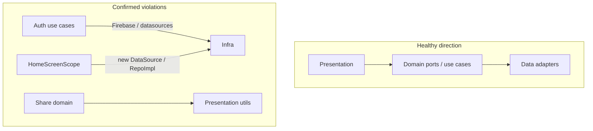

# Clean Architecture / SOLID Review — Findings and Fix Scope

Scope reviewed: `apps/tilawa/lib/features` (presentation + domain), with spot checks on DI and existing use-case tests. Bias: practical maintainability, not textbook purity. Cubit → single repository for thin CRUD is **acceptable** here and not flagged.

---

## Confirmed findings (ranked)

### Critical

**C1. Session validity use case talks to Firestore**
- [`check_session_validity_use_case.dart`](apps/tilawa/lib/features/auth/domain/usecases/check_session_validity_use_case.dart) — injects `FirebaseFirestore`, reads `users/{id}.session`, catches `FirebaseException`
- **Principle:** DIP / dependency rule
- **Why:** Session revocation rules untestable without Firebase; schema locked into domain. Existing test already uses a fake Firestore — port swap is natural.
- **Smallest fix:** `SessionValidityRepository` (or extend existing session port) returning server `{epoch, activeDeviceId}` / failures; keep comparison + unknown/stale logic in use case; Firestore impl in data.
- **Fix now:** yes (tests exist)

**C2. Delete account use case imports data datasource + CF exceptions**
- [`delete_account.dart`](apps/tilawa/lib/features/auth/domain/usecases/delete_account.dart) — `AccountDeletionRemoteDataSource`, `FirebaseFunctionsException` mapping
- **Principle:** Domain ↛ data; DIP
- **Why:** Deletion policy + CF error taxonomy hard to unit-test without CF; data API leaks upward. Tests already mock datasource.
- **Smallest fix:** Domain `AccountDeletionRepository.requestSelfAccountDeletion(...)` returning `Either<Failure, void>` (exception → Failure mapping stays in data). Use case keeps orchestration (guard, token, premium clear, signOut).
- **Fix now:** yes

**C3. Register active device use case wires data layer + CF**
- [`register_active_device_use_case.dart`](apps/tilawa/lib/features/auth/domain/usecases/register_active_device_use_case.dart) — `ActiveDeviceRemoteDataSource`, `DeviceIdentityService` (data), `FirebaseFunctionsException`
- **Principle:** Dependency rule; DIP
- **Why:** Device registration is a security path; domain coupled to callable + identity impl. Tests exist.
- **Smallest fix:** Domain `ActiveDeviceRepository` (+ thin `DeviceIdentityPort` if still needed for id/platform); map CF/App Check failures in data.
- **Fix now:** yes

---

### High (actionable)

**H1. Home composition root builds data graph in a widget**
- [`home_screen_scope.dart`](apps/tilawa/lib/features/home/presentation/widgets/home_screen_scope.dart) `_createHomeDashboardBloc` / `_createTodayPlanBloc` — `new HomeDashboardRepositoryImpl(...)`, `SharedPreferencesTodayPlanLocalDataSource(getIt<...>())`
- **Principle:** DIP / composition root belongs in DI
- **Why:** Presentation owns wiring; duplicates DI; widget tests need full GetIt + prefs.
- **Smallest fix:** Register factory providers for `HomeDashboardBloc` / `TodayPlanBloc` (or factory use-case + repo chain) in injectable modules; scope only `getIt<>()` / `BlocProvider(create: (_) => getIt())`.
- **Fix now:** yes (moderate risk — verify home + today-plan smoke/widget tests)

**H2. Domain → presentation (share)**
- [`prepare_share_range_use_case.dart`](apps/tilawa/lib/features/share/domain/usecases/prepare_share_range_use_case.dart), [`share_range_result.dart`](apps/tilawa/lib/features/share/domain/entities/share_range_result.dart) import `presentation/utils/video_page_specs.dart`
- **Principle:** Dependency rule (domain ↛ presentation)
- **Why:** Pure range/paging logic; presentation rename breaks domain. Utils already Flutter-foundation-only + `quran_qcf`.
- **Smallest fix:** Move `video_page_specs.dart` + `share_ayah_range_utils.dart` under `share/domain/` (or `share/domain/utils/`); fix imports. No behavior change.
- **Fix now:** yes (low risk)

**H3. Home dashboard use case imports concrete data cache**
- [`get_home_dashboard_use_case.dart`](apps/tilawa/lib/features/home/domain/usecases/get_home_dashboard_use_case.dart) — `HomeDashboardMemoryCache` from data
- **Principle:** Dependency rule
- **Why:** Cache policy stuck to one impl; awkward fakes.
- **Smallest fix:** Move cache write/read into `HomeDashboardRepository` impl, **or** tiny domain port `HomeDashboardCache` implemented in data. Prefer repo ownership (fewer types).
- **Fix now:** yes (low risk)

**H4. Daily ayah sheet persists via SharedPreferences in State**
- [`home_daily_ayah_sheet.dart`](apps/tilawa/lib/features/home/presentation/widgets/home_daily_ayah_sheet.dart) `_loadBookmarkState` / `_toggleBookmark`
- **Principle:** SRP / DIP
- **Why:** UI owns persistence keys + toggle rules; bypasses any bookmark domain; hard to widget-test.
- **Smallest fix:** Small `HomeDailyAyahBookmarkStore` (data) + thin use case or cubit; sheet only calls injectables / cubit. Keep key string in data.
- **Fix now:** yes (low risk; isolated UI)

**H5. FCM SDK type on domain use-case API**
- [`handle_fcm_notification_use_case.dart`](apps/tilawa/lib/features/notifications/domain/usecases/handle_fcm_notification_use_case.dart) — `call(RemoteMessage)`
- **Principle:** DIP
- **Why:** Only uses `message.data`; callers can pass `Map`.
- **Smallest fix:** Change signature to `Map<String, dynamic> data` (or domain payload); map `RemoteMessage` at call sites (data/bootstrap).
- **Fix now:** yes (tiny)

---

### High — leave as tech debt (higher regression or large blast radius)

| ID | Issue | Why debt |
|----|--------|----------|
| H6 | Playback/downloads domain builds `audio_service.MediaItem` | Hot path; large player surface |
| H7 | `AudioEntityMediaItemMapper` / playlist cache in domain | Same; migrate with next player work |
| H8 | Auth presentation imports data services (`GoogleSignInSessionTracker`, etc.) | Sign-in UX; needs device QA |
| H9 | Athkar + HomeAthkarCubit → `AthkarDailyProgressLocalDataSource` + duplicated rules | Date/timezone edge cases; needs dedicated test pass |
| H10 | Quran reader screens `getIt` use cases from State | Many call sites; do with reader changes |
| H11 | Sessions analytics helper → `TeacherProfileRepository` | Analytics-only |
| H12 | Prayer alerts nav encodes onboarding policy | Touch with permission flow work |
| H13 | DownloadItemCard `getIt` queue + stuck heuristic | Prefer with downloads polish |
| H14 | Theme `PrimaryColorPreset` → ui_kit `Color` | Stable; cosmetic purity |
| H15 | Tour `GlobalKey` registry in domain | Move when editing tours |
| H16 | `ImageSource` / microphone data service on domain ports | Tiny but low urgency vs C1–C3 |
| H17–H19 | God-files: Reciters (~2k), QuranReader (~1.8k), AudioPlayerBloc (~1k) | Split opportunistically |

**Medium/Low (recorded, not in fix wave):** learning prefs store under `presentation/services`, onboarding `getIt` use case, `TimeOfDay` in daily guidance prefs, QuranWord `@JsonKey` wire shapes, `MainScreenCubit` readiness fallback.

**Anti-finding (do not “fix”):** do not invent UseCases for every button; do not wrap every repository method in an interface for a single impl with no alternate; keep simple Cubit→Repo where logic is thin.

---

## Proposed implementation scope (approval gate)

**In scope — Critical + High, low–moderate risk only:**

1. **Auth ports (C1–C3)** — introduce repository ports; move Firestore/CF/datasource + exception mapping to data; update existing use-case tests to fake ports (keep behavior identical).
2. **Home DI (H1)** — move `HomeDashboardBloc` / `TodayPlanBloc` wiring into DI modules; thin `HomeScreenScope`.
3. **Home dashboard cache (H3)** — cache owned by repository (or domain port); remove data import from use case.
4. **Share move (H2)** — relocate pure utils into `share/domain/`; fix imports.
5. **FCM signature (H5)** — `Map` (or payload) at domain boundary.
6. **Daily ayah bookmarks (H4)** — data store + thin API; sheet stops touching prefs.

**Out of scope this wave:** H6–H19 and all Medium/Low.

**Verify (after approval, from workspace root / `apps/tilawa`):**
- `dart run melos run fix:format`
- Targeted: `flutter test test/features/auth/domain/usecases/`
- Home/share/notifications smoke: existing home/share/notification tests if present; `dart analyze` on touched packages

**Assumption:** Fix wave stays surgical — no new “architecture framework,” no repo-wide rewrite, no MediaItem / AudioPlayerBloc extraction.
