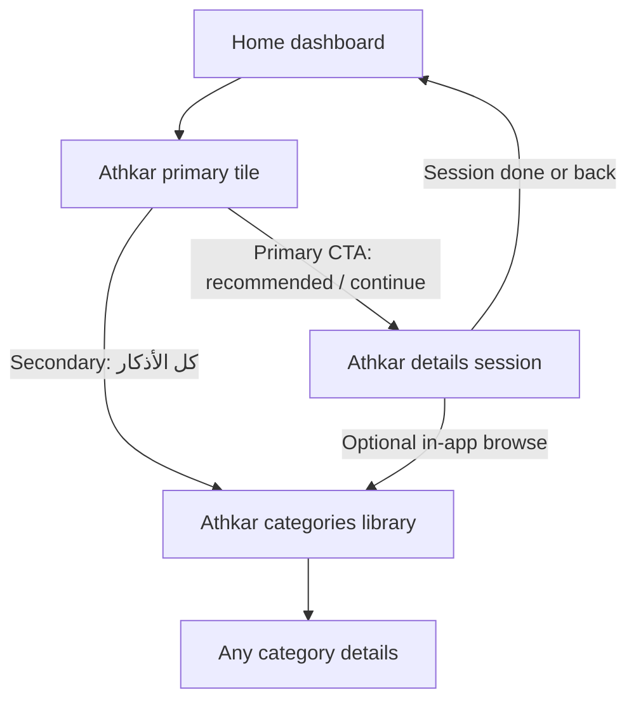
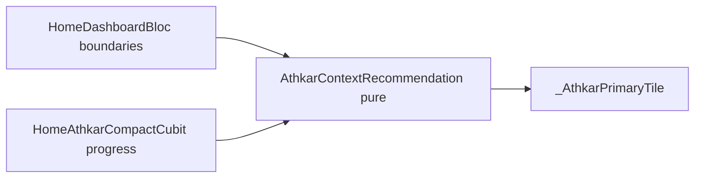

# Contextual Athkar Experience — Design Proposal

**Scope:** analysis + recommended design for next release. **No implementation until approved.**

**Product name in UI:** MeMuslim / تلاوة. Internal code stays `tilawa` / `athkar`.

---

## 1. Audit of the existing experience

### Home entry (live)

Approved Home stack ([home-dashboard-patterns.md](.agents/skills/tilawa-apply-ui-principles/references/home-dashboard-patterns.md)):

1. Prayer hero (`HomeNextPrayerTime`) — already time-of-day atmospheric
2. **`HomePrimaryActionsSection`** — equal Quran + Athkar tiles
3. Learn / tools / deferred sections

Live Athkar path ([home_primary_actions_section.dart](apps/tilawa/lib/features/home/presentation/widgets/home_primary_actions_section.dart)):

| Aspect | Current behavior |
|--------|------------------|
| Label | Always `homeQuickAthkar` → «الأذكار» |
| Icon | Fixed `Icons.brightness_5_outlined` |
| Subtitle | Urgent category title + `خلصت` / `متبقٍ N` / bare title |
| Tap | Opens **details** for urgent category (`source: home_primary`), else `/athkar` |
| Progress bar | Quran tile has one; Athkar tile does **not** |
| Library | No always-visible secondary CTA on the tile |

Data behind the tile: [`HomeAthkarCompactCubit`](apps/tilawa/lib/features/home/presentation/cubit/home_athkar_compact_cubit.dart) loads categories **1, 2, 3** (morning / evening / sleep), daily remaining counts via `AthkarDailyProgressLocalDataSource`, reorders with crude hour rule.

### Athkar library & content

| ID | Category | Items |
|----|----------|------:|
| 1 | أذكار الصباح | ~25 |
| 2 | أذكار المساء | ~23 |
| 3 | أذكار النوم | ~10 |
| 4 | أذكار الاستيقاظ | ~4 |
| 5 | أذكار بعد الصلاة | ~11 |
| 6 | أذكار متنوعة | ~13 |

Routes: `/athkar`, `/athkar/:categoryId`, `/athkar/tasbeeh`. Catalog UI is calm (`AthkarCategoriesScreen` + pastel accents).

### Progress / personalization already present

- **Daily progress** (remaining counts per item, date-keyed) — yes
- **Pinned favorites** (max 4) — yes, but `PinnedAthkarHomeSection` **not** on approved Home
- **Completion history / recent** — no multi-day history
- **Analytics** — `logAthkarReadStart`, notification open

### Prayer timing available to reuse

- On-device `PrayerTimeEntity` + Home snapshot: `HomePrayerDayBoundaries` (fajr, sunrise, maghrib, isha) + five-slot strip
- Hero already phases: day / preDawn / dusk / night ([`HomeHeroGradientResolver`](apps/tilawa/lib/features/home/domain/home_hero_gradient_resolver.dart))
- No location → empty prayer fields; hero falls back to day tokens; Athkar still works offline from local JSON + SharedPrefs

### Existing “recommendation” logic (fragmented)

| Surface | Rule | Cutover |
|---------|------|---------|
| Home reorder / `contextualAthkarCategory` | Icon buckets; morning vs evening | **hour &lt; 17** |
| Android / Dart athkar widget | Morning vs evening period | **04:00–14:59 / 15:00–03:59** |
| Notifications | Morning after Fajr, evening after Asr | **+1 hour** (CHANGELOG) |
| Sleep / waking | Both mapped to **evening** via icon | Misleading for bedtime |

`HomeFeaturedRitualCard` + pinned section exist on disk but are **stale / not approved Home targets**. Patterns doc: extend approved widgets; do **not** re-wire `PinnedAthkarHomeSection` as a new Home section.

### Religious content note

**No Friday-specific Athkar category** in `athkar.json`. Friday review exists only in Learn/Quran Sessions — out of Athkar scope unless content is added later.

---

## 2. Main UX problems and opportunities

**Problems**

1. **Static chrome, weak context** — tile always says «الأذكار» with a sun icon even at night.
2. **Library path competing with / buried by deep-link** — primary tap skips catalog; «كل الأذكار» not discoverable from Home.
3. **Clock cutover ≠ prayer reality** — 17:00 and widget 15:00 ignore Fajr/Asr/Isha the hero already knows.
4. **Sleep under-served** — bedtime lumped with evening; after Isha user often still sees evening.
5. **Completion feels cold** — «خلصت» is fine but no warm “done for this window” → explore path.
6. **Inconsistent engines** — Home / widget / notifications disagree → trust leak over time.

**Opportunities**

1. Make Athkar tile the **companion to the prayer hero** (same day rhythm, quieter body treatment).
2. Reuse **daily progress** for continue / done without new storage.
3. Keep **two clear paths**: “relevant now” + “full library”.
4. Unify recommendation in **one pure domain function** (testable), feed Home first; align widget later.

---

## 3. Design directions (focused)

### Direction A — Contextual primary tile (enhance in place)

Evolve `_AthkarPrimaryTile` only: contextual title, icon, mood wash, progress, secondary «كل الأذكار».

- Pros: respects approved Home; KISS; matches Quran resume pattern; small diff
- Cons: less “hero moment” than a dedicated card; limited vertical space for copy

### Direction B — Featured ritual card above the primary pair

Reintroduce something like `HomeFeaturedRitualCard` as a full-width “الآن” card.

- Pros: stronger identity, room for atmosphere + CTA
- Cons: **Home redesign** (new body layer); competes with Quran equality; patterns discourage stale rewires

### Direction C — Asymmetric Athkar strip (replace equal tiles)

Full-width Athkar context; Quran demoted or nested.

- Pros: maximum Athkar presence
- Cons: breaks approved equal worship pair; highest product risk

---

## 4. Recommended direction

**Direction A — Contextual Athkar primary tile**, with prayer-aware domain rules.

Why it suits MeMuslim:

- Home is already a **calm daily dashboard**, not a launcher ([home_screen_design_artifacts.md](docs/design/home_screen_design_artifacts.md))
- Prayer hero owns time atmosphere; Athkar should **echo**, not duplicate
- Equal Quran/Athkar tiles are approved; upgrade Athkar **content**, not layout
- Leverages existing cubit progress + dashboard boundaries — no new package, no new Home section
- Distinctiveness comes from **warm Arabic-first copy + prayer windows + continue/done states**, not another shortcut grid

**Identity cue:** Athkar tile feels like a soft invitation timed with the day; Quran tile stays resume-of-text. Same visual family, different job.

---

## 5. User flow



- **≤2 taps** to start relevant dhikr from Home
- **≤2 taps** to open full library from Home (secondary never hidden)
- No popups, no forced navigation, no streak pressure

---

## 6. Proposed recommendation rules

**Pure domain API** (new file under athkar domain, e.g. `athkar_context_recommendation.dart`) — no Flutter, deterministic, inject `now` + optional boundaries + completion snapshots.

### Inputs

- `DateTime now` (local)
- `HomePrayerDayBoundaries?` (fajr, sunrise, maghrib, isha) — when null, clock fallback
- Completion for categories **1, 2, 3** (and optionally **5** later): `notStarted | inProgress | done`
- `weekday` (Friday reserved for future content — **no-op today**)

### Output

```text
AthkarContextRecommendation {
  categoryId,          // primary target or null
  window,              // morning | evening | sleep | neutral
  intent,              // start | continue | completedWindow | explore
  confidence,          // high | soft  (drives copy strength, not UI chrome)
}
```

### Prayer-aware windows (when boundaries present)

Framed as **suitable now**, not obligatory timing claims:

| Window | Prefer | Active when |
|--------|--------|-------------|
| Morning | ID 1 | `now ∈ [fajr, asr)` — if asr missing, use midday heuristic from fajr↔maghrib |
| Evening | ID 2 | `now ∈ [asr, isha)` |
| Sleep | ID 3 | `now ∈ [isha, fajr+1d)` |
| Neutral | none | Ambiguous gaps only if calc incomplete |

**Asr on Home strip:** available via `todayPrayers`; if only `HomePrayerDayBoundaries` is passed in, resolve Asr from `todayPrayers` or treat afternoon half of fajr→maghrib as evening start when Asr absent.

### Priority inside a window

1. If preferred category **inProgress** → `continue` (same category)
2. Else if preferred **notStarted** → `start`
3. Else if preferred **done** → `completedWindow`: soft secondary suggestion (next incomplete among {1,2,3} in gentle order) **or** `explore` if all three done
4. **Post-prayer (ID 5):** **not** primary in v1 — only optional future soft boost ≤45 min after a salah when preferred daily set is already done. Avoid nagging after every prayer.

### Clock fallback (no location / no prayer data)

Align with notification spirit + widget (document as **approximate**, not fiqh):

| Local hour | Window |
|------------|--------|
| 04:00–14:59 | Morning → 1 |
| 15:00–21:59 | Evening → 2 |
| 22:00–03:59 | Sleep → 3 |

### Suppression (anti-annoyance)

- Never keep pushing a **done** category as primary CTA in its window → switch to continue-other or explore
- No auto-navigation; no modal
- Copy stays invitational; never “you missed…” / streak guilt
- Friday: **no special Athkar** until content exists

### Edge cases

| Case | Behavior |
|------|----------|
| Categories load fail | Static tile → library only |
| Progress empty | `start` for window category |
| All 1–2–3 done | `explore` — warm completion + library CTA as primary |
| Midnight crossing | Sleep window uses tonight’s isha → tomorrow fajr |
| DST / timezone | Use device local `now`; prayer entity already local |

---

## 7. Arabic-first microcopy (proposed)

Tone: calm, warm, non-preachy (brand: no exclamation marketing). EN pairs for l10n parity.

| State | Title (AR) | Supporting (AR) | EN title |
|-------|------------|-----------------|----------|
| Morning · start | ابدأ يومك بذكر الله | أذكار الصباح | Begin your day with dhikr |
| Morning · continue | تابع أذكار الصباح | متبقٍ {count} | Continue morning athkar |
| Morning · done | أحسنت في أذكار الصباح | يمكنك تصفح بقية الأذكار | Morning athkar complete |
| Evening · start | حان وقت أذكار المساء | أذكار المساء | Time for evening athkar |
| Evening · continue | تابع أذكار المساء | متبقٍ {count} | Continue evening athkar |
| Evening · done | أتممت أذكار المساء | تصفح الأذكار متى شئت | Evening athkar complete |
| Sleep · start | اختم يومك بذكر الله | أذكار النوم | Close your day with dhikr |
| Sleep · continue | تابع أذكار النوم | متبقٍ {count} | Continue bedtime athkar |
| Sleep · done | نام على ذكر الله | كل الأذكار بين يديك | Rest with remembrance |
| Neutral / explore | تابع ذكرك | استكشف كل الأذكار | Continue your athkar |
| All done today | ما شاء الله | أكملت أذكارك لليوم | Well done today |

**Secondary CTA (always):** «كل الأذكار» / «All athkar»

**Avoid:** «يجب»، guilt, countdown pressure, fake fiqh phrases like «ورد واجب الآن».

Replace cold «خلصت» on Home with warmer done lines above; keep short progress form inside details if needed.

---

## 8. Textual wireframe (component hierarchy)

```text
HomePrimaryActionsSection  (unchanged Row: Quran | Athkar)
└── _AthkarPrimaryTile  (evolved)
    ├── HomePrimaryActionTile  (reuse)
    │   ├── IconWell → category icon (sun / dusk / bedtime)  [priority: visual context]
    │   ├── Title → contextual microcopy (not static «الأذكار»)  [PRIMARY copy]
    │   ├── Subtitle → category name · remaining | done line
    │   └── Progress bar (like Quran) when inProgress
    └── Secondary affordance (must stay visible)
        └── Text button / semantic link: «كل الأذكار»
            → AthkarCategoriesRoute (source: home_primary_library)

Action priority:
  1. Tap tile body → recommended details (or library if explore)
  2. Tap «كل الأذكار» → full library (never obscured)
```

**Visual mood (subtle, token-only):** soft wash from existing `HomeFeaturePastel` / category accent; optional sync with hero phase alpha — **no** new animation beyond short crossfade on window change (`durationFast`). Dark mode + RTL preserved via existing tile.

**Tablet:** same pair; secondary link wraps under subtitle if height constrained — do not hide.

---

## 9. Minimal implementation plan (after approval)

Mapped to current architecture — **surgical**, no Home reorder.

1. **Domain** — `AthkarContextRecommendation` + pure resolver + unit tests (`package:checks`). Deprecate hour&lt;17 as Home’s source of truth; keep old helpers only if pinned UI still needs them or migrate callers.
2. **Home state** — Extend `HomeAthkarCompactCubit` (or thin selector) to emit recommendation using `now` + `prayerBoundaries`/`todayPrayers` from `HomeDashboardBloc` (read in presentation or pass into `load`).
3. **UI** — Evolve `_AthkarPrimaryTile` + optionally `HomePrimaryActionTile` for secondary action slot / progress wiring. Sources: `home_primary`, `home_primary_library`.
4. **l10n** — New AR/EN keys; run `melos run gen`.
5. **Docs** — Update home design artifacts + patterns: “Athkar tile is contextual; library secondary required.” Still **no** wiring of stale pinned section.
6. **Verify** — `melos run fix:format`; `dart analyze`; `flutter test` for athkar domain + home presentation.
7. **Later (out of v1)** — Align widget cutover + notification windows to same resolver; optional post-prayer soft boost; Friday content only if added to `athkar.json`.



---

## 10. Analytics and success metrics

**Events** (extend existing analytics service; mirror `logAthkarReadStart` pattern):

| Event | Params |
|-------|--------|
| `athkar_context_impression` | `window`, `intent`, `category_id`, `has_prayer_bounds` |
| `athkar_context_primary_tap` | same + `source=home_primary` |
| `athkar_context_library_tap` | `source=home_primary_library` |
| existing `athkar_read_start` | keep; ensure source distinguishes context vs library |

**Success (2–4 weeks):**

- ↑ Home → Athkar details opens that match recommended window
- ↑ Share of sessions that **complete** recommended category same day
- Secondary library taps remain healthy (library not cannibalized to ~0)
- No spike in Athkar-related support/confusion; qualitative: copy feels inviting

**Guardrail:** if library taps collapse, secondary CTA contrast/placement failed.

---

## 11. Religious-content assumptions to verify

| Assumption | Status | Action before ship |
|------------|--------|--------------------|
| Morning athkar after Fajr / into day | Common practice; content is «أذكار الصباح» | Confirm with content owner; copy must say suitability not obligation |
| Evening athkar after Asr | Matches app notifications (+1h Asr) | Confirm window end (Maghrib vs Isha) with product/Islamic review |
| Sleep athkar after Isha / before bed | Matches category «أذكار النوم» | Confirm; waking (ID 4) stays library-only in v1 |
| Post-prayer after each salah | Content exists (ID 5) | **Defer primary recommend** until copy/rules approved |
| Friday special athkar | **No content** | Do not surface; optional future category |
| Clock fallback hours | Approximate only | Disclose in code comments; never in UI as sharīʿah claim |
| Unifying Home vs widget 15:00 vs 17:00 | Product consistency | Prefer prayer-aware; fallback table above |

---

## What we are explicitly not doing in v1

- Full Home redesign or new Athkar Home section
- Re-mounting `PinnedAthkarHomeSection` / compact 3-row card
- New packages, onboarding, settings, streaks, popups
- Hiding `/athkar` behind the recommendation
- Strict fiqh countdown language

---

## Approval ask

Confirm Direction A + prayer-aware windows (morning→1, evening→2, sleep→3) + always-visible «كل الأذكار». After approval, implement per §9 only.