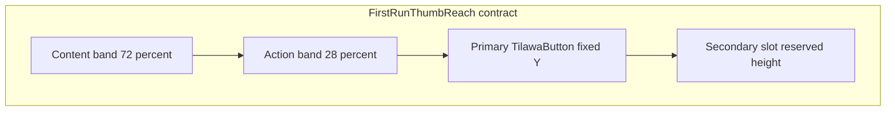

# First-run flow layout stability

## Doc review ([Setproduct: UI kit foundation](https://www.setproduct.com/blog/how-to-design-a-ui-kit-foundation))

Relevant rules mapped onto this Tilawa task (not a full kit redesign):

| Doc principle | Implication for this work |
|---|---|
| **Interface grammar before one-off screens** | Reuse existing [`MeMuslimDesignTokens`](packages/ui_kit/lib/src/foundation/design_tokens.dart) spacing / `minInteractiveDimension` / type roles — no new magic sizes |
| **Layout stability in contracts** | “Messaging/content must not change control height” → reserved text slots + reserved secondary button footprint |
| **Button contract** | Label baseline / control height constant across loading / locale / optional secondary |
| **Patterns for repeated compositions** | Same chrome on **3 screens** → promote a **pattern**, not three divergent footers (doc threshold: ≥3 screens or ≥2 components) |
| **No token for one-offs** | Do **not** invent new design tokens; if shared chrome, extract a **pattern widget**, not `space.onboardingFooter` |
| **Edge-case test strings** | Verify with AR + EN welcome/onboarding/permission copy (and loading on Allow) |

Out of scope from the article for this pass: Figma library restructure, density presets, full state-matrix docs for every kit atom, new semantic color ramps.

## Problem (today)

All three already use [`TilawaThumbReachLayout`](packages/ui_kit/lib/src/foundation/tilawa_thumb_reach_layout.dart), but chrome differs:

| | Welcome | Onboarding | PrayerAlerts |
|---|---|---|---|
| `useSafeArea` | `true` | **false** | `true` |
| Action stack | primary only | **dots → primary → Back?** | primary → Skip |
| Content align | centered | centered | **top / start** |
| Text slots | 2-line title reserved | variable | variable per step |

Result: primary CTA Y differs (Onboarding dots sit *above* primary), Onboarding ignores safe area, PrayerAlerts content hierarchy feels like a different product surface.

## Pattern contract (dev-ready)

Treat first-run chrome as a **pattern** (article: Patterns layer), not screen-local invention.

**Anatomy / slots**
- Shell: `TilawaThumbReachLayout(useSafeArea: true)` + default `TilawaBottomActionInset`
- Content band: hero/copy (and Onboarding dots pinned at **bottom of content**, not in actions)
- Action band stack (top → bottom): **primary** → **secondary?**

**Layout stability rules**
- Primary top-edge Y is identical across Welcome / Onboarding / PrayerAlerts on the same viewport
- Secondary visibility must not move primary (`Visibility.maintainSize` / always-present Skip)
- Title/body length (AR/EN, permission step) must not move action band widgets — use fixed line slots (`maxLines` + height from style × scaler + `StrutStyle`)
- Loading on Allow must not change primary control height (rely on existing `TilawaButton` min height)

**Content rules**
- Welcome headline: already 2-line reserved
- Onboarding title/description: reserved line budgets
- PrayerAlerts title: 2 lines; body: fixed `maxLines` + reserved height; content centered in `TilawaContentKind.form`

**Tokens (only existing)**
- Spacing: `spaceLarge`, `spaceMedium`, `spaceExtraLarge`, thumb-reach insets
- Control: `minInteractiveDimension` / `TilawaButton`
- Type: `headlineLarge` / `headlineSmall` / `bodyLarge` / `bodyMedium` via theme — no hard-coded px

**Where the shared pattern lives**

Promote a thin shared action column so Onboarding + PrayerAlerts do not drift:

- Preferred: small widget under `packages/ui_kit` next to thumb-reach (e.g. `TilawaThumbReachActions`) — primary + optional secondary with reserved footprint, token spacing
- Or: `apps/tilawa/lib/shared/widgets/` if we want to avoid ui_kit API surface this pass

Chosen default: **ui_kit widget** if the API stays ≤ primary/secondary/spacing props; otherwise app-shared helper. Welcome stays primary-only (no blank ghost under Next).

## Approach (implementation)

1. **Primary CTA alignment:** Move [`OnboardingPageIndicator`](apps/tilawa/lib/features/onboarding/presentation/widgets/onboarding_page_indicator.dart) into the **bottom of the content band** (below `PageView`). Footers start with primary.
2. **Secondary slot stability:** Onboarding Back always in tree with `maintainSize`; PrayerAlerts keeps Skip; Welcome primary-only.
3. **Shell unity:** `useSafeArea: true` on Onboarding.
4. **Content stability:** Welcome-style reserved slots on Onboarding + PrayerAlerts; center PrayerAlerts content.
5. **Contract test:** Widget test locking primary Y vs. action-band start (+ Back maintainSize / locale copy if cheap).

## Files to change

- [`language_welcome_screen.dart`](apps/tilawa/lib/features/onboarding/presentation/screens/language_welcome_screen.dart) — confirm shell matches contract.
- [`onboarding_screen.dart`](apps/tilawa/lib/features/onboarding/presentation/screens/onboarding_screen.dart) — `useSafeArea: true`; content = `Column(Expanded(PageView), indicator)`.
- [`onboarding_footer_bar.dart`](apps/tilawa/lib/features/onboarding/presentation/widgets/onboarding_footer_bar.dart) — primary-first; Back `maintainSize`; drop indicator.
- [`onboarding_page.dart`](apps/tilawa/lib/features/onboarding/presentation/widgets/onboarding_page.dart) / [`onboarding_title_block.dart`](apps/tilawa/lib/features/onboarding/presentation/widgets/onboarding_title_block.dart) — reserved title/description slots.
- [`prayer_alerts_permission_flow.dart`](apps/tilawa/lib/features/prayer_times/presentation/widgets/prayer_alerts_permission_flow.dart) — centered content; reserved title/body; use shared action stack if extracted.
- ui_kit (if extracted): new thin actions helper + export + unit/widget coverage beside [`tilawa_thumb_reach_layout_test.dart`](packages/ui_kit/test/foundation/tilawa_thumb_reach_layout_test.dart).

## Verify

- `dart run melos run fix:format`
- `dart analyze` on touched paths
- Widget test: primary Y near `TilawaThumbReachLayout.actionBandStartFraction`; Back maintainSize does not shift primary; AR/EN smoke if feasible

## Success criteria

- Locale flip (AR/EN) does not move primary CTA on Welcome.
- Advancing Onboarding pages does not move primary CTA.
- Changing PrayerAlerts step / loading does not move primary/Skip.
- Next / Allow / Continue share the same thumb-band vertical position on a phone-sized viewport.
- No new design tokens; only pattern + existing grammar.
