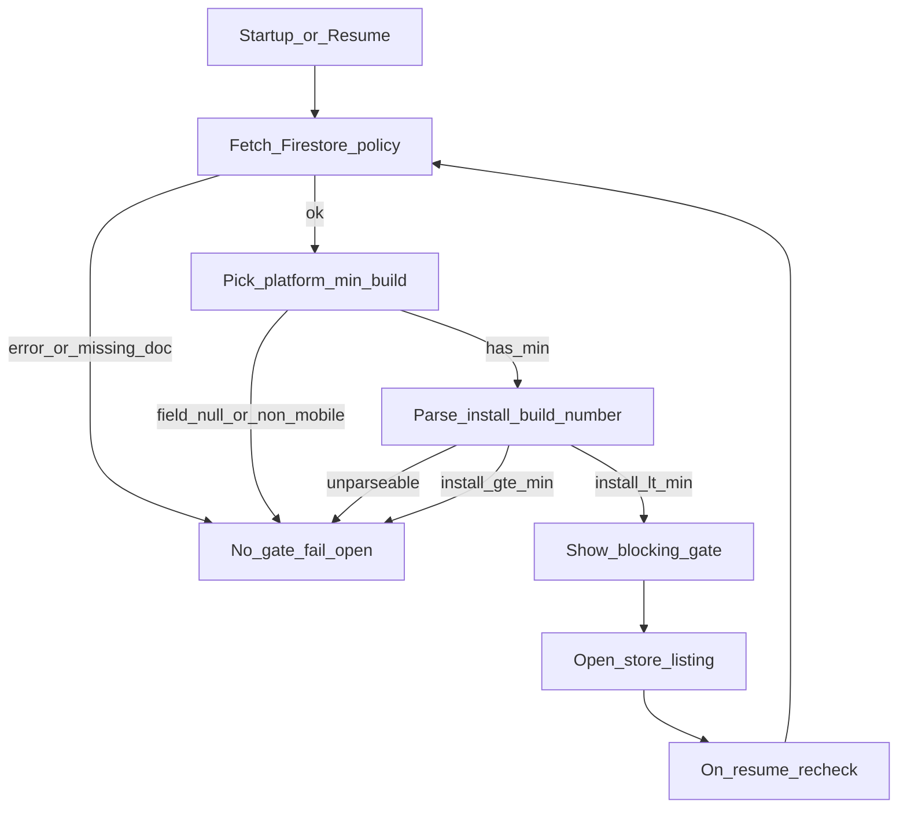

# Forced update gate (replace Play IAU)

## Goal

Ship **force-only** update enforcement:

- Source of truth: Firestore `android_min_build_number` / `ios_min_build_number`
- Compare to installed **build number** only (monotonic int; no semver)
- If installed &lt; platform min → non-dismissible full-screen gate → open store
- Fail open on remote-config/network failure
- Remove Play In-App Update package, flexible/immediate flows, and soft optional toasts

## Decision flow

## Remote config

Keep document path [`app_config/in_app_update`](firestore.rules) (public read, client write denied). Replace `force_update: bool` with:

| Field | Type | Meaning |
| --- | --- | --- |
| `android_min_build_number` | int | Gate Android when `installBuild < value` |
| `ios_min_build_number` | int | Gate iOS when `installBuild < value` |
| `updated_at` | timestamp | ops metadata (optional) |

Fail-open rules in domain:

- Fetch/parse error → no gate
- Missing platform field → no gate for that platform
- Non-mobile platforms (web/desktop) → no gate
- Unparseable local `buildNumber` → no gate (log only)

Update [`scripts/seed_in_app_update_config.mjs`](scripts/seed_in_app_update_config.mjs) to seed the two ints (e.g. `--android=78 --ios=78`).

## Feature reshape

Evolve [`apps/tilawa/lib/features/in_app_update/`](apps/tilawa/lib/features/in_app_update/) into **`forced_update`** (rename folder + types so naming matches behavior).

**Keep / rewrite:**

| Layer | Piece |
| --- | --- |
| Domain | `ForcedUpdatePolicy` (`androidMinBuildNumber`, `iosMinBuildNumber`) |
| Domain | Pure `ForcedUpdateEvaluator` — picks platform min via `TargetPlatform`, compares ints |
| Domain | `EvaluateForcedUpdateUseCase` — policy + `AppInfoService.buildNumber` → `required` \| `none` |
| Data | Firestore remote DS reading the two fields (fail-open catch) |
| Data | Repo: get policy + open store (no Play availability) |
| Presentation | `ForcedUpdateCoordinator` — same startup/resume hooks from [`tilawa_app.dart`](apps/tilawa/lib/tilawa_app.dart) |
| Presentation | Non-dismissible full-screen gate (`PopScope(canPop: false)`, `barrierDismissible: false`) with one CTA |

**Delete:**

- Play platform DS + availability entity + strategy resolver flex/immediate paths
- Flexible complete / start / optional-immediate actions
- Snackbar/`TilawaFeedback` soft prompts for optional/flexible
- Dependency on path package [`packages/in_app_update`](packages/in_app_update/) (remove from [`apps/tilawa/pubspec.yaml`](apps/tilawa/pubspec.yaml) + workspace [`pubspec.yaml`](pubspec.yaml) package list; delete package tree)

**Reuse (do not reimplement store open):**

- [`OpenAppStoreListingUseCase`](apps/tilawa/lib/features/app_review/domain/usecases/open_app_store_listing_use_case.dart) + existing `AppReviewStoreConfig` / `TILAWA_APP_STORE_ID`
- [`AppInfoService`](packages/core/lib/services/interfaces/app_info_service.dart) for `buildNumber`

## Gate UX

- Full-screen root overlay/dialog (covers shell, cannot back-dismiss)
- Copy: adapt existing required-update l10n; drop flexible/optional strings from ARB if unused
- Primary button → `OpenAppStoreListingUseCase`
- On app resume while gated: re-evaluate; if build now ≥ min, dismiss gate automatically
- No throttle skip when result is `required` (always surface gate if still behind)

## Cleanup

- Slim or rename [`InAppUpdateFailure`](packages/core/lib/errors/failures.dart) — Play-specific reasons unused; keep store-open errors via existing `AppReviewFailure` or a minimal `ForcedUpdateFailure` only if needed
- Strip Play IAU comments in [`google_sign_in_session_tracker.dart`](apps/tilawa/lib/features/auth/data/services/google_sign_in_session_tracker.dart) if they only exist for that deferral (keep deferral itself if still useful for any modal timing)
- Regenerate injectable after DI renames
- Update tests under [`apps/tilawa/test/features/in_app_update/`](apps/tilawa/test/features/in_app_update/) → `forced_update/` (evaluator pure tests + Firestore fail-open + coordinator gate show/dismiss + widget gate non-dismissible)

## Verification

From workspace / `apps/tilawa`:

1. `dart run melos run fix:format`
2. `dart analyze` (app)
3. `flutter test test/features/forced_update/`
4. Manual: seed mins above current `+N` build → gate; below → no gate; offline Firestore → app usable

## Out of scope (v1)

- Optional soft “update available” prompts
- Semver / marketing-version comparison
- Admin UI for editing mins (seed script + Firebase console only)