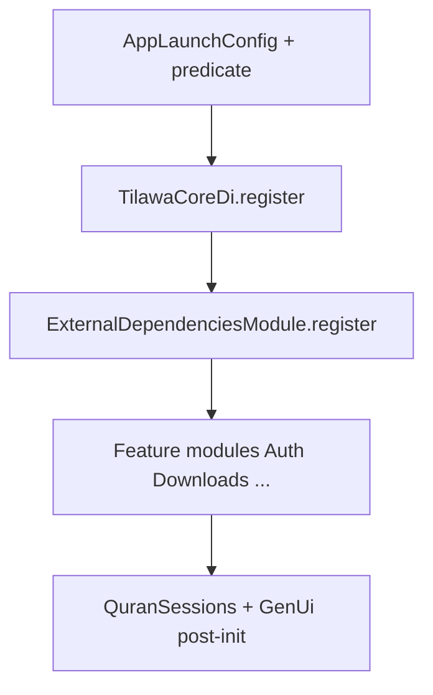

# Remove Injectable — manual get_it migration

## Verdict: removal is appropriate

Injectable is **not** solving important runtime complexity here.

| Injectable capability | Used? |
| --- | --- |
| `@Environment` / env filters | No (flavor gating is `AppLaunchConfig` + post-init modules) |
| `@Named` | No |
| `@preResolve` / async init | No |
| Micro-packages | Only tiny `TilawaCorePackageModule` (3 types) |
| What it *does* provide | Codegen for ~490 `get_it` registrations + ~128 `as:` interface bindings |

**Already-manual hybrid** proves the target style: [`QuranSessionsMvpModule`](apps/tilawa/lib/features/quran_sessions/di/quran_sessions_mvp_module.dart), [`GenUiAssistantModule`](apps/tilawa/lib/features/genui_assistant/di/genui_assistant_module.dart), [`quran_image`](packages/quran_image/lib/core/di/dependency_injection.dart), plus helpers in [`get_it_idempotent.dart`](apps/tilawa/lib/core/di/get_it_idempotent.dart).

### Risks (scale, not exotic DI)

- **~444 annotated files / ~490 registrations** — easy to drop a ctor dep or wrong lifecycle.
- **~128 `as:` bindings** must register against the **interface** type.
- **Cross-feature ctor graphs** (e.g. AuthBloc ~14 deps) — order matters.
- **Partial-init / reset** logic in [`configureDependencies`](apps/tilawa/lib/core/di/injection.dart) must keep working.
- **External SDK singletons** (Firebase, Dio, AudioHandler) still need careful manual wiring.

Mitigation: **mechanical port from local generated** [`injection.config.dart`](apps/tilawa/lib/core/di/injection.config.dart) (~3442 lines, gitignored) so lifecycles and ctor graphs stay byte-faithful, then split by feature. Do **not** redesign the graph.



## Target shape

Keep `GetIt getIt` and `configureDependencies({AppLaunchConfig?})` public API.

Replace `await getIt.init()` with explicit module calls:

```dart
TilawaCoreDi.register(getIt);
ExternalDependenciesModule.register(getIt);
AdhanModule.register(getIt);
AuthDi.register(getIt);
// ... one register() per feature
await _registerQuranSessionsPlatformConfig(config);
_registerQuranSessionsIfNeeded(config);
GenUiAssistantModule.register(getIt, config: config);
```

**Module convention** (match GenUi / QuranSessions):

- `static void register(GetIt sl)` (or `register(GetIt sl, {AppLaunchConfig?})` only where needed).
- Use `registerLazySingletonIfAbsent` / `registerFactoryIfAbsent` / `registerSingletonOnce`.
- Map: `@lazySingleton` → lazySingleton · `@injectable` → factory · `@singleton` → singleton.
- Interface binding: `sl.registerLazySingletonIfAbsent<Iface>(() => Impl(...))`.

**File layout** (feature-scoped, not one giant file):

- [`packages/core`](packages/core/lib/di/) → replace micro-package with `TilawaCoreDi.register` (KeepAwakeService, NetworkInfo, InternetStatusBloc).
- [`apps/tilawa/lib/core/di/`](apps/tilawa/lib/core/di/) → convert `ExternalDependenciesModule` / `AdhanModule` from `@module` to `register(GetIt)`.
- Each feature: `features/<feature>/di/<feature>_di.dart` (or extend existing `*_module.dart` for AppReview, Downloads, Home, Settings, RecitationPractice).
- Thin orchestrator stays in [`injection.dart`](apps/tilawa/lib/core/di/injection.dart); call modules in the **same order** as current `injection.config.dart` `init()` body so cross-feature deps resolve.

**Leave alone:** [`apps/tilawa/frozen/`](apps/tilawa/frozen/) (not compiled into app). Update frozen README FFmpeg restore note to manual `registerLazySingletonIfAbsent<FFmpegRunner>` if it still says injectable.

## Implementation steps

1. **Snapshot source of truth** — use current `injection.config.dart` as the registration checklist (lifetimes + ctor args). Do not regenerate mid-migration.
2. **`packages/core`** — manual `TilawaCoreDi.register`; delete `@InjectableInit.microPackage`, annotations on the 3 types; remove `injectable` / `injectable_generator` from [`packages/core/pubspec.yaml`](packages/core/pubspec.yaml); replace tracked [`injection.module.dart`](packages/core/lib/di/injection.module.dart).
3. **Convert `@module` classes** to `register(GetIt)` first (External, Adhan, Downloads, Home, AppReview(+Policy), RecitationPractice, Settings).
4. **Add feature `*Di.register` modules** by translating `gh.*` blocks from the config, largest first if needed for reviewability: auth, downloads, audio_player, prayer_times, athkar, then remaining features + `core/services`.
5. **Wire orchestrator** — `configureDependencies` calls manual modules; remove `@InjectableInit`, `injection.config.dart` import, and `getIt.init()`.
6. **Strip annotations** — remove all `package:injectable` imports / `@lazySingleton` / `@Singleton(as:)` / etc. under `apps/tilawa/lib` (not frozen).
7. **Drop deps** — remove `injectable` + `injectable_generator` from [`apps/tilawa/pubspec.yaml`](apps/tilawa/pubspec.yaml); keep `get_it`. `melos run gen` still needed for freezed / json_serializable / go_router_builder.
8. **Docs** — update any CLAUDE/AGENTS mentions that imply injectable codegen for DI (surgical only).

## Tests

- Replace stub [`packages/core/test/di/injection.config_test.dart`](packages/core/test/di/injection.config_test.dart) with real tests: given pre-registered `Connectivity`, `TilawaCoreDi.register` resolves `NetworkInfo`, `KeepAwakeService`, `InternetStatusBloc` with correct factory/lazy lifecycles.
- Add `apps/tilawa/test/core/di/` smoke tests:
  - Idempotent re-entry of `configureDependencies` when graph already ready (no throw / no double-register crash).
  - After registering a minimal stub set (or calling feature `register` with a clean `GetIt` + stubbed externals), assert representative interface→impl resolution and factory vs singleton identity for a few critical types (`SettingsCubit`, `NetworkInfo`, one auth + one downloads binding).
- Avoid full Firebase-initialized graph in unit tests if SDK init is required; prefer module-level tests with stubs for Firebase/Dio where needed.

## Verification (success criteria)

```sh
dart run melos run fix:format
dart run melos run analyze
# from apps/tilawa:
flutter test test/core/di/
# from packages/core:
dart test test/di/
# plus any feature tests broken by annotation/import removal
flutter test
```

Confirm: no `package:injectable` under `apps/tilawa/lib` or `packages/core/lib`; no `injectable` in those pubspecs; app still boots via same `configureDependencies` call sites.

## Out of scope

- New DI package / custom container.
- Redesigning lifecycles or constructor graphs.
- Touching frozen share code beyond a restore-doc note.
- Changing flavor/`AppLaunchConfig` semantics.