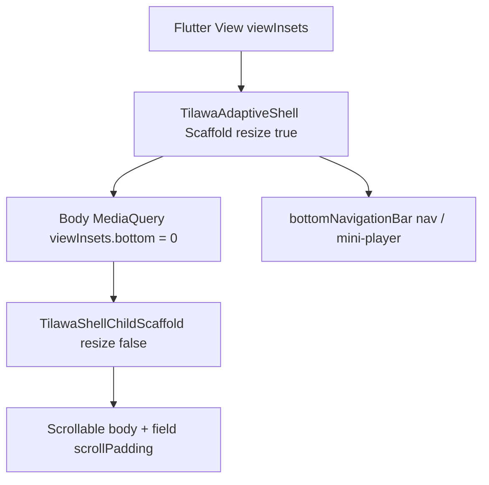

# Shell keyboard inset ownership

## Verdict (before code)

**`resizeToAvoidBottomInset: false` on nested shell screens is the correct long-term contract**, not a local workaround — *provided* the outer [`TilawaAdaptiveShell`](packages/ui_kit/lib/src/organisms/tilawa_adaptive_shell.dart) Scaffold remains the exclusive owner of keyboard geometry (`resizeToAvoidBottomInset: true`).

Why not flip ownership to feature screens?

- Shell hosts shared chrome (`bottomNavigationBar`: nav + optional mini-player). That chrome must move with the IME as one unit.
- Flipping shell to `false` forces every shell child to own scroll/FAB/reach padding and rework chrome positioning — high regression risk, little gain.
- Codebase already converges on this: Bookmarks, Reciters search/details, Smart Khatma, form sticky footers (`TilawaFormScreenScaffold` uses `keyboardAware: false`).

Nuance (document accurately): Flutter’s outer Scaffold already zeroes body `MediaQuery.viewInsets` when it resizes, so nested `true` is often a MediaQuery no-op. The failure mode is still real under this architecture: shell chrome height + nested AppBar/fill layouts + accidental re-padding via `effectiveKeyboardInset` / `View.viewInsets` produce white gaps, crushed lists, or fields that look “overlaid.” Single ownership + nested `false` prevents that class of bugs.

**Exclusive owner:** `TilawaAdaptiveShell` Scaffold.  
**Children under shell:** never resize; scroll/focus instead.  
**Outside shell** (auth, athkar immersive, reader, `/player`, quran_sessions standalone): feature Scaffold may keep `resize: true`.

Out of scope (preserve nav): do **not** hide bottom nav when keyboard opens.

---

## Implementation

### 1. Make shell ownership explicit

In [`tilawa_adaptive_shell.dart`](packages/ui_kit/lib/src/organisms/tilawa_adaptive_shell.dart):

- Set `resizeToAvoidBottomInset: true` explicitly on the shell Scaffold.
- Expand dartdoc: shell owns IME; host feature screens with `TilawaShellChildScaffold` (or equivalent `false`).

### 2. Add reusable `TilawaShellChildScaffold`

New widget in `packages/ui_kit` (foundation or organisms; export from kit barrel):

- Thin `Scaffold` pass-through (`appBar`, `body`, `floatingActionButton`, etc.).
- **Default** `resizeToAvoidBottomInset: false` (override allowed for rare cases, documented).
- Dartdoc: use only under `TilawaAdaptiveShell`; outside shell use Material `Scaffold` with default resize.

This is the primary guard against future regressions (cheap, enforceable by API). Skip a custom `tilawa_lints` rule for now — high cost / low payoff vs widget default.

### 3. Migrate shell-hosted screens

Replace nested `Scaffold(... resizeToAvoidBottomInset: false ...)` with `TilawaShellChildScaffold` (behavior-preserving):

| Screen | Notes |
|--------|--------|
| [`smart_khatma_hub_screen.dart`](apps/tilawa/lib/features/smart_khatma/presentation/screens/smart_khatma_hub_screen.dart) | Already `false`; adopt helper; polish empty-body `ListView` with `keyboardDismissBehavior: onDrag` |
| [`bookmarks_screen.dart`](apps/tilawa/lib/features/bookmarks/presentation/screens/bookmarks_screen.dart) | Pattern reference for search `scrollPadding` |
| [`reciters_search_screen.dart`](apps/tilawa/lib/features/reciters/presentation/screens/reciters_search_screen.dart) | Same |
| [`reciter_details_screen.dart`](apps/tilawa/lib/features/reciters/presentation/screens/reciter_details_screen.dart) + loader | Same |
| [`reciters_screen.dart`](apps/tilawa/lib/features/reciters/presentation/screens/reciters_screen.dart) | Both scaffolds |
| [`history_screen.dart`](apps/tilawa/lib/features/history/presentation/screens/history_screen.dart) | **Only remaining prod screen with text input + default `true` under shell** — must adopt helper; align search `scrollPadding` / list bottom pad with Bookmarks (use `keyboardInset` after shell consume + small token buffer; when keyboard open avoid full `effectiveKeyboardInset` stack) |
| `_MainShellPlaceholderScaffold` | Optional; keep `false` via helper if cheap |

Do **not** mass-change no-input shell screens unless tests show a gap.

### 4. Focused-field visibility contract (no white gap)

Under shell ownership:

- Body is already above IME → keep scrollables (`ListView` / `CustomScrollView`), not `Column`+`Expanded` for field lists.
- Prefer `ScrollViewKeyboardDismissBehavior.onDrag`.
- Field `scrollPadding`: MediaQuery `keyboardInset` (often 0 under shell) + small buffer (Bookmarks: `keyboardInset + 24`). Do **not** pad again with full `effectiveKeyboardInset` on already-resized parents; sticky footers already use `TilawaComfortableReachPadding(..., keyboardAware: false)`.

### 5. Documentation

- Short ADR: [`docs/adr/`](docs/adr/) — “Shell owns keyboard resize; shell children use `TilawaShellChildScaffold`.”
- Pointer in [`packages/ui_kit/docs/design_system.md`](packages/ui_kit/docs/design_system.md) (shell section) + one line in [`CLAUDE.md`](CLAUDE.md) / navigation architecture if a shell/chrome section exists.
- Soften misleading comments that claim nested Scaffold “double-applies viewInsets” — reword to “shell already owns IME layout; nested resize is forbidden.”

### 6. Tests (CI-validatable stand-in for device matrix)

Widget tests cover small/tall sizes, RTL/LTR, text scale, synthetic keyboard insets:

- **ui_kit:** pump shell Scaffold with `viewInsets.bottom > 0` + nested `TilawaShellChildScaffold` → assert child `resizeToAvoidBottomInset == false`; assert child body max height is shell-shrunk (no second shrink); assert focused `TextField` remains hittable (not zero-height).
- **App:** keep/extend Smart Khatma scaffold assertion; add History equivalent; lightly assert Bookmarks/Reciters search still `false` via helper type where practical.
- Existing [`safe_area_ext_test`](packages/ui_kit/test/foundation/safe_area_ext_test.dart) / form scaffold keyboard cases remain the reach-padding contract.

Manual / Maestro (post-implement smoke, not blocking CI): Smart Khatma page fields, History/Bookmarks search, Reciters search — short+tall Android, LTR+RTL, number vs text keyboard, large text scale.

---

## Success criteria

1. Architecture docs + API make shell the single `viewInsets` resize owner.
2. Smart Khatma + all other known shell+input screens use `TilawaShellChildScaffold`.
3. No white gap / crushed AppBar / zero-height body under synthetic keyboard inset in tests.
4. Bottom nav, safe areas, mini-player hide-on-keyboard, scrolling, a11y focus remain unchanged.
5. `dart run melos run fix:format`; targeted `flutter test` for ui_kit shell/child + affected app features.
