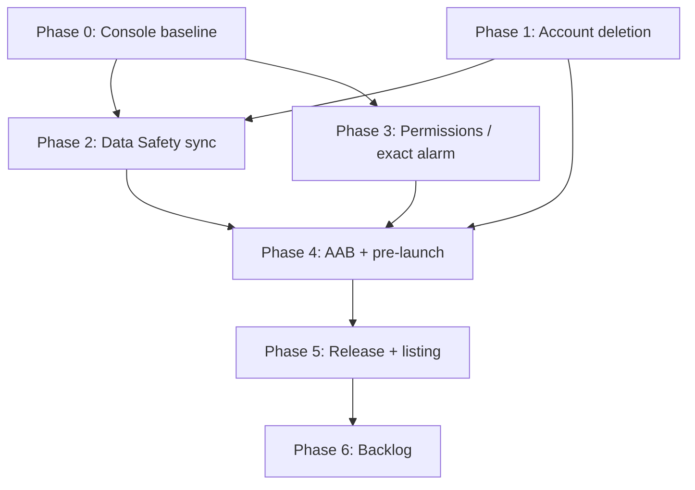

# Google Play compliance plan

Phased fix plan for Tilawa Android update submissions. Derived from a
repository audit (May 2026) and a Play-reviewer-style validation pass.

**Related docs:**

- [google_play_release_checklist.md](google_play_release_checklist.md) — upload
  checklist
- [release_notes.md](release_notes.md) — Play “What’s new” copy
- [support_play_products.md](support_play_products.md) — Support Tilawa IAP
- [specs/003-prayer-times-notifications/walkthrough.md](../specs/003-prayer-times-notifications/walkthrough.md) —
  exact-alarm fallback
- [specs/016-support-tilawa/spec.md](../specs/016-support-tilawa/spec.md) —
  support monetization rules

**Baseline at audit time:**

| Field | Value |
|-------|--------|
| Production (documented) | **1.0.5+32** |
| Pending in repo | **1.0.5+37** (`apps/tilawa/pubspec.yaml`) |
| Target / compile SDK | **36** |
| Account creation | **Yes** — Google Sign-In (Firebase Auth + Firestore) |

---

## Audit summary

| Classification | Count | Notes |
|----------------|-------|--------|
| **Confirmed blocker (repo)** | 1 | Missing in-app account deletion |
| **Manual verification (Console)** | 12 | Data Safety, privacy URL, vitals, etc. |
| **Review risk** | 4 | Exact alarm, `ACCESS_MEDIA_LOCATION`, listing copy |
| **Informational** | 5 | Release notes drift, Shorebird, target API, signing |

**Submission readiness from repo alone:** one confirmed policy gap (account
deletion). **Final readiness cannot be determined without Play Console checks.**

---

## Phase overview

| Phase | Focus | Blocks submission? | Est. effort |
|-------|--------|-------------------|-------------|
| **0** | Console baseline audit | Can reveal blockers | 0.5–1 day |
| **1** | Account deletion | **Yes** | 2–4 days |
| **2** | Play Console declarations sync | **Can** | 1 day |
| **3** | Permission & manifest cleanup | Review risk | 0.5–1 day |
| **4** | Build validation (AAB, 16 KB, vitals) | **Can** | 1 day |
| **5** | Release ops & listing | Process / listing risk | 0.5 day |
| **6** | Post-release & Aug 2026 prep | No (now) | Backlog |

Phases **0** and **1** can start in parallel. **2** depends on **1** (deletion
URLs and Data Safety answers). **4** depends on **1–3** being code-complete.

---

## Phase 0 — Console baseline audit (Batch 0)

**Purpose:** Separate confirmed repo gaps from items already OK in Console.

**Cannot be verified from repository — verify in Play Console:**

| # | Check | Where in Console | Pass criteria |
|---|--------|------------------|---------------|
| 0.1 | Policy status clean | **Policy status** | No active violations / holds |
| 0.2 | Production `versionCode` | **Release → Production** | Confirm live code; next upload must increment |
| 0.3 | Privacy policy URL | **App content → Privacy policy** | URL live, matches Tilawa branding |
| 0.4 | Data deletion web URL | **Data safety → Data deletion** | URL exists and works |
| 0.5 | Data Safety form | **App content → Data safety** | Matches SDKs (auth, location, analytics, crash, IAP) |
| 0.6 | Exact alarm declaration | **App content → Exact alarms** | Declared; matches prayer/Adhan use case |
| 0.7 | FGS declaration | **App content → Foreground services** | `mediaPlayback` for audio + Adhan |
| 0.8 | Permission declarations | **App content → App permissions** | Location, notifications, camera aligned with manifest |
| 0.9 | Ads declaration | **App content → Ads** | “No ads” consistent with `AD_ID` removal in manifest |
| 0.10 | Android Vitals | **Android vitals** | Crash **< 1.09%**, ANR **< 0.47%** (overall) |
| 0.11 | Store listing | **Main store listing** | Title/icon/screenshots say **Tilawa** |
| 0.12 | Support products | **Monetize → Products** | `support_once_*` consumables active |

**Deliverable:** Console Baseline Sheet (pass/fail per row).

**Policy references:**

- [User Data policy](https://support.google.com/googleplay/android-developer/answer/10144311)
- [Account deletion requirements](https://support.google.com/googleplay/android-developer/answer/13327111)
- [Android vitals](https://developer.android.com/topic/performance/vitals)

---

## Phase 1 — Account deletion (Batch 1) — confirmed blocker

**Evidence (repo):** Google Sign-In creates/persists accounts (Firebase Auth +
Firestore `users/{uid}`). Settings exposes **Logout** only; no delete-account
flow in source.

**Policy references:**

- [User Data — Account Deletion](https://support.google.com/googleplay/android-developer/answer/10144311)
- [Account deletion requirements](https://support.google.com/googleplay/android-developer/answer/13327111)

### Batch 1A — Domain & backend

| Task | Detail |
|------|--------|
| 1A.1 | Add `DeleteAccountUseCase` — delete Firebase Auth user; Firestore `users/{uid}` and subcollections (`fcm_tokens`); support ledger if tied to uid |
| 1A.2 | Cloud Function (optional, safer): server-side cleanup; idempotent delete on partial failure |
| 1A.3 | Define retention exceptions (e.g. anonymized purchase ledger for fraud/replay); document in privacy policy |
| 1A.4 | Ensure delete ≠ logout; delete must remove remote user data per policy |

**Verify:** Unit tests for use case; manual test with Firebase test account.

### Batch 1B — In-app UX

| Task | Detail |
|------|--------|
| 1B.1 | Settings → **Your account** → **Delete account** (below Logout) |
| 1B.2 | Confirmation sheet: what is deleted, what may be retained, irreversible |
| 1B.3 | Re-auth if required (Google recent login) before delete |
| 1B.4 | Post-delete: sign out → login or onboarding; clear user-scoped local caches |
| 1B.5 | l10n **en + ar** for all strings |

**Verify:** Widget test for settings tile + confirmation; manual E2E on device.

### Batch 1C — Web deletion resource

| Task | Detail |
|------|--------|
| 1C.1 | Publish web page (Firebase Hosting or form): request deletion by email or signed-in flow |
| 1C.2 | Enter URL in **Data safety → Data deletion** |
| 1C.3 | Link from privacy policy |

**Verify:** URL returns 200; request path tested; behavior matches in-app delete.

### Phase 1 exit criteria

- [ ] In-app delete works end-to-end on staging Firebase project
- [ ] Web deletion URL live and entered in Console
- [ ] Privacy policy updated with deletion + retention language

---

## Phase 2 — Play Console declarations sync (Batch 2)

**Depends on:** Phase 1 (deletion answers), Phase 0 baseline.

| Task | Data Safety / declaration action |
|------|----------------------------------|
| 2.1 | **Personal info** — name, email, user IDs (Google Sign-In, Firebase) |
| 2.2 | **Location** — approximate/precise for prayer times & qibla |
| 2.3 | **Photos** — optional camera/gallery for player background |
| 2.4 | **Financial info** — purchase history (Support Tilawa consumables) |
| 2.5 | **App activity / Diagnostics** — Firebase Analytics, Crashlytics (release) |
| 2.6 | **Device/other IDs** — FCM token; **Advertising ID = No** (`AD_ID` stripped in manifest) |
| 2.7 | **Data deletion** — Yes; in-app + web URL from Phase 1 |
| 2.8 | **Exact alarms** — Prayer/Adhan reminders; align with `setAlarmClock` usage |
| 2.9 | **FGS** — Media playback for Quran audio + Adhan |
| 2.10 | Re-submit Data Safety if Console prompts for update |

**Verify:** Console preview matches store listing; no new policy warnings after save.

---

## Phase 3 — Permission & manifest cleanup (Batch 3)

**Classification:** Review risk — reduces declaration friction; not all items
block upload.

### Batch 3A — Audit permissions vs usage

| Permission | Action |
|------------|--------|
| `ACCESS_MEDIA_LOCATION` | **Remove** if player background does not need EXIF GPS; else document in Data Safety |
| `READ/WRITE_EXTERNAL_STORAGE` (maxSdk 32) | Keep if downloads require; confirm still needed |
| `USE_EXACT_ALARM` | **Keep** if Phase 0 shows declaration approved and prior build shipped with it; else fallback below |
| `CAMERA` | Keep; runtime request only when user picks camera |
| Location | Keep; in-app rationale before prompt (prayer/qibla) |

Manifest source: `apps/tilawa/android/app/src/main/AndroidManifest.xml`

### Batch 3B — Exact alarm fallback (only if needed)

If Console warns or review rejects `USE_EXACT_ALARM`:

1. Replace `USE_EXACT_ALARM` with `SCHEDULE_EXACT_ALARM` (see walkthrough spec)
2. Use existing `canScheduleExact()` / permission request flow
3. Fallback to inexact local notifications if denied
4. Update Exact alarm declaration in Console

**Verify:** `dart analyze`; `./gradlew test` under `apps/tilawa/android`; manual
Adhan alarm on API 34–36 device.

---

## Phase 4 — Build validation (Batch 4)

**Depends on:** Phases 1–3 merged.

### Batch 4A — Production artifact

```bash
cd apps/tilawa
shorebird release android --flutter-version=3.44.0
```

Native/Kotlin changes require **Shorebird release**, not `shorebird patch`.
See [shorebird.md](shorebird.md).

| Check | How |
|-------|-----|
| AAB exists | `build/app/outputs/bundle/release/app-release.aab` |
| Release signed | Not debug; `android/key.properties` valid |
| `versionCode` | Greater than production |

### Batch 4B — Pre-launch & 16 KB

| Check | How |
|-------|-----|
| Upload to **Internal testing** | Play Console |
| Pre-launch report | Crashes, permissions, 16 KB warnings |
| 16 KB alignment | Bundle explorer / pre-launch report |
| Smoke device matrix | API 26, 30, 34, 36 — cold start, login, delete account, prayer notification, support purchase |

**Reference:** [16 KB page sizes](https://developer.android.com/guide/practices/page-sizes)

### Batch 4C — Quality gates (repo)

```bash
cd apps/tilawa
dart analyze
flutter test test/features/auth/
flutter test test/features/settings/
flutter test
```

### Phase 4 exit criteria

- [ ] Pre-launch report: no must-fix failures
- [ ] No 16 KB blocker on uploaded AAB
- [ ] Account deletion E2E passes on internal track

---

## Phase 5 — Release ops & listing (Batch 5)

| Task | Detail |
|------|--------|
| 5.1 | Bump `apps/tilawa/pubspec.yaml` if needed after compliance work |
| 5.2 | Update [CHANGELOG.md](../CHANGELOG.md) and [release_notes.md](release_notes.md) (en + ar, ≤500 chars) |
| 5.3 | Tag release (e.g. `v1.0.5+XX`) |
| 5.4 | Refresh Play screenshots if branding changed — [google_play_screenshot_readiness.md](google_play_screenshot_readiness.md) |
| 5.5 | Align store copy with mandatory Google sign-in (not only “sign in to sync”) |
| 5.6 | Staged rollout: 5% → 20% → 50% → 100% |
| 5.7 | Monitor Crashlytics + vitals first 48h |

---

## Phase 6 — Backlog (Batch 6)

Not blocking immediate update; schedule before deadlines.

| Item | Deadline | Action |
|------|----------|--------|
| Play Billing Library 8+ | **Aug 31, 2026** | Upgrade `in_app_purchase`; verify PBL 8+ in dependency tree |
| Target API 36 behavior | Ongoing | Edge-to-edge, back gesture, FGS on Android 16 |
| Optional guest mode | Product decision | Reduces account-deletion scope if login becomes optional |
| Prayer notification device gate | Before Adhan reliance | [walkthrough.md](../specs/003-prayer-times-notifications/walkthrough.md) |
| Excessive partial wake locks | Monitor | Android vitals after Adhan/watchdog changes |

**Billing reference:** [PBL deprecation FAQ](https://developer.android.com/google/play/billing/deprecation-faq) — v7 supported until Aug 31, 2026.

---

## Suggested timeline

```
Week 1
├── Day 1–2: Phase 0 (Console baseline) + Phase 1A/1B in parallel
├── Day 3–4: Phase 1B/1C complete + tests
└── Day 5:   Phase 2 (Data Safety) + Phase 3A (permission trim)

Week 2
├── Day 1:   Phase 3B only if exact-alarm issue found
├── Day 2:   Phase 4A–4B (Shorebird build + internal upload)
├── Day 3:   Phase 4C + fix pre-launch findings
└── Day 4–5: Phase 5 closed → staged production
```

---

## Dependency graph



---

## Risk-weighted decision matrix

| Finding | Confidence | Repo evidence | Console verification | Blocking probability |
|---------|------------|---------------|----------------------|----------------------|
| Missing in-app account deletion | High | Yes | Web URL + Data deletion answers | **High** |
| Web account-deletion URL | Low (missing) | No | Yes | Medium if Console URL missing |
| Data Safety accuracy | Low | Partial | Yes | Medium on data changes |
| Privacy policy URL | Low | No | Yes | Low (live app likely has one) |
| `USE_EXACT_ALARM` eligibility | Medium | Yes (manifest + Kotlin) | Yes | Low–Medium (same as shipped build) |
| 16 KB page size | Medium | Partial | Pre-launch report | Low–Medium |
| Android Vitals | N/A | No | Yes | Low for upload block |
| Release notes doc drift | High | Yes | No | None |
| Shorebird vs patch | High | Yes | No | None (process) |
| Mandatory login | High | Yes | Listing copy | Low alone |
| Permission declarations | High | Yes | Yes | Low on unchanged update |
| `ACCESS_MEDIA_LOCATION` | Medium | Yes | Optional | Low |
| Billing / PBL 7.1.1 | High | Yes | Products in Console | Low now; Medium after Aug 2026 |
| Target API 36 | High | Yes | No | None |
| Store listing rebrand | Medium | Partial | Yes | Low–Medium |
| Crashlytics vs Data Safety | High | Yes | Yes | Low |
| Ads / Families / IARC | Medium | Partial | Yes | Low if unchanged |

---

## Repository limitations and Console-only checks

| Item | Why not verifiable from repo | Where to verify | Can block publishing? |
|------|------------------------------|-----------------|----------------------|
| Android Vitals | Metrics in Play backend | **Android vitals** | Rarely; affects visibility |
| Data Safety answers | Console form | **App content → Data safety** | **Yes** |
| Privacy policy URL | Hosted URL in Console | **App content → Privacy policy** | **Yes** if missing/404 |
| Web account-deletion URL | External + Console field | **Data safety → Data deletion** | **Yes** if missing |
| Exact Alarm declaration | Console form | **App content → Exact alarms** | **Yes** if undeclared |
| FGS declarations | Console forms | **App content → Foreground services** | **Yes** if new/changed types undeclared |
| Permission declarations | Console forms | **App content → App permissions** | **Yes** if mismatch |
| Content rating (IARC) | Console questionnaire | **App content → Content rating** | **Yes** if expired |
| Ads declaration | Console | **App content → Ads** | **Yes** if inconsistent |
| Production `versionCode` | Console source of truth | **Release → Production** | **Yes** if not incremented |
| Policy status warnings | Console inbox | **Policy status** | **Yes** |
| Pre-launch report | Generated on upload | **Release → Pre-launch report** | **Yes** on hard failures |
| Play Billing products | Console merchant | **Monetize → Products** | **Yes** if billing ships without products |
| Store listing (rebrand) | Console assets | **Main store listing** | Sometimes |

---

## Submission-ready checklist

| Criterion | Required |
|-----------|----------|
| In-app account deletion shipped | **Yes** |
| Web deletion URL + Console Data deletion complete | **Yes** |
| Data Safety matches app behavior | **Yes** |
| Pre-launch report clean on uploaded AAB | **Yes** |
| `versionCode` incremented | **Yes** |
| Release notes / changelog updated | Recommended |
| Vitals below thresholds | Recommended before wide rollout |

---

## Minimum viable path (time-constrained)

1. **Phase 0** — know what Console already has
2. **Phase 1** — in-app + web account deletion
3. **Phase 2** — Data Safety update
4. **Phase 4** — build, upload internal, fix pre-launch
5. **Phase 5** — staged production
6. **Phase 3** — permission trim / exact-alarm fallback **only** if Console or pre-launch flags it
