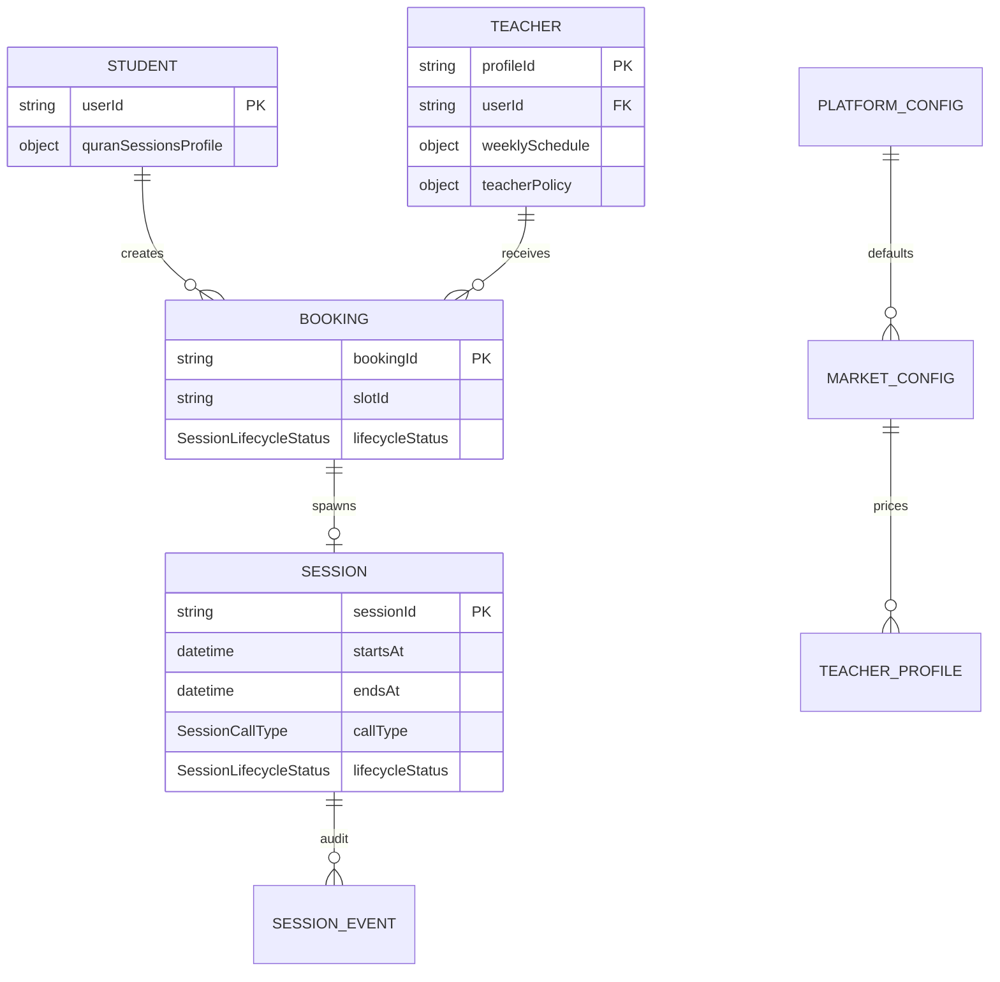

# Quran Sessions — Production Domain Model (Proposed)

**Status:** Approved — product sign-off 2026-07-03 ([questions.md](./questions.md))  
**Last updated:** 2026-07-03

---

## 1. Bounded context

**Quran Sessions** (Learn Quran) is a marketplace bounded context within MeMuslim:

- **Student** books 1:1 Quran tutoring sessions with **Teachers**.
- **Platform (Tilawa Admin)** configures markets, fees, policies, moderation.
- **System** runs lifecycle automation (expiry, reminders, no-show, compensation).

Out of scope for v1 production (explicit): group sessions, subscription checkout, bilateral mode change, ranking marketplace.

---

## 2. Core entities and ownership



| Entity | Owner writes | Source of truth |
|--------|--------------|-----------------|
| `UserProfile` / student | Student (profile fields); eligibility fields server-only | Firestore `users` |
| `TeacherProfile` | Teacher (bio, schedule); verification admin | Firestore `quran_teacher_profiles` |
| `QuranBooking` | **System only** (CF) | Firestore `quran_bookings` |
| `QuranSession` | **System only** (CF) | Firestore `quran_sessions` |
| `MarketConfig` | **Admin only** | Firestore `quran_session_market_configs/{country}` |
| `SessionPolicy` | **Admin only** | Platform + market + optional teacher overlay |
| `WalletLedger` | **System only** | Firestore (paid phase) |

**Rule:** Client never computes price, refund amount, or lifecycle transition — only displays server state and invokes allowed actions.

---

## 3. Session lifecycle

Canonical enum: `SessionLifecycleStatus` in `packages/quran_sessions/lib/src/domain/entities/session_lifecycle_status.dart`.

Phases:

| Phase | States |
|-------|--------|
| **Reservation** | `draft`, `pendingPayment`, `pendingTutorApproval` |
| **Active** | `scheduled`, `confirmed`, `inProgress`, `rescheduled` |
| **Terminal** | cancellations, no-shows, `completed`, `disputed`, `compensated`, `refunded`, `expired`, `rejectedByTutor`, `incomplete` |

**List visibility rules (non-negotiable for production UI):**

| List | Includes lifecycle states |
|------|---------------------------|
| **Upcoming (actionable)** | `scheduled`, `inProgress`, `rescheduled` (`confirmed` legacy alias) |
| **Pending** | `pendingTutorApproval`, `pendingPayment` |
| **Cancelled tab** | `cancelledBy*`, `rejectedByTutor` |
| **Past** | `completed`, no-shows, `incomplete`, `disputed`, `compensated`, `expired`, `refunded` |

Implemented in `SessionListClassifier` — must stay aligned with server list queries.

See [session-lifecycle.md](./session-lifecycle.md) for full transition table.

---

## 4. Booking rules (production target)

### 4.1 Eligibility chain (fixed logic, configurable inputs)

Order (from `ValidateBookingEligibilityUseCase`):

1. Student profile complete  
2. Account not blocked  
3. Market enabled (country + city)  
4. Teacher verified + publicly visible  
5. Pricing allowed in market (when paid enabled)  
6. Global safety + teacher eligibility policy  
7. Gender policy (if enabled for market)  
8. Age (if child: teacher must accept children)  
9. Concurrent upcoming cap  
10. Slot available + min notice + max horizon  

All thresholds from admin config — **no hardcoded minutes/amounts in Flutter**.

### 4.2 Booking creation paths (pending Q-BK-01)

| Path | Trigger | Initial lifecycle | Next state |
|------|---------|-------------------|------------|
| Free auto-confirm | Student confirms | `scheduled` | reminders |
| Free tutor approval | Student submits | `pendingTutorApproval` | accept → `scheduled` |
| Paid | Student pays | `pendingPayment` | capture → `scheduled` |

Server: `createSessionBooking` CF applies `QuranTutorBookingMode` + market `allowPaidBooking`.

**Default booking mode:** `requiresTutorApproval` (student submits → teacher accepts/rejects).

**Booking approval (decision 2026-07-04, updated):**

| Role | Scope |
|------|-------|
| **Teacher/tutor** | Accept or reject each booking request (`respondToBookingRequest`) |
| **System** | SLA expiry (`expirePendingReservations`) → `expired`, slot release |

Guardian/parent approval was removed from the product — minors and adults follow the same booking path (teacher approval only). Stale Firestore fields (`guardianId`, `guardianChildBookingApprovedAt`, `requireGuardianApprovalForChildren`) may remain in old documents but are no longer read.

### 4.3 Cancellation (pending Q-CN-*)

- Student cancel: policy evaluates hours-before-start → refund fraction + slot release.
- Teacher cancel: mandatory reason → auto student compensation per config.
- Admin cancel: compensation choice required.

Side effects: `TransitionSideEffect.applyCancellationPolicy`, `autoCompensateStudent`.

### 4.4 Rescheduling

- Max reschedules, min hours before, request expiry — all config-driven.
- Bilateral confirm via `RescheduleRequest` aggregate + CF.

---

## 5. Availability model

| Concept | Storage | Rules |
|---------|---------|-------|
| Weekly template | `weeklySchedule` on teacher profile | Validated by `WeeklyScheduleValidator` |
| Generated slots | Computed from template + market scheduling config | `SlotGenerator` |
| Booked locks | Derived from active lifecycle sessions | `BookedSlotLockRepository` |
| Overrides/blocks | Date-keyed override docs | Incremental updates (perf-first) |

**Slot blocking lifecycles:** `SessionLifecycleStatus.isSlotBlocking` — includes `pendingPayment`, `pendingTutorApproval`, and active phase.

---

## 6. Fee / admin configuration model

Hierarchy (from spec 031):

1. `quran_session_platform_config/global`
2. `quran_session_market_configs/{countryCode}`
3. `quran_teacher_profiles/{id}.teacherPolicy` (optional overlay)
4. Code fallback — **emergency only**, logged

**Price resolution at booking:**

```
displayPrice = serverQuote(bookingRequest)  // CF response field
```

Client displays `SessionPrice` / `ManualPaymentPrice` from teacher listing **only as preview**; confirmed amount on booking outcome from server.

**Admin panel must configure:**

- `minSessionPrice`, `maxSessionPrice`, `platformCommissionPercent` per market
- `allowFreeBooking`, `allowPaidBooking`
- Cancellation, no-show, compensation, refund policy blobs

---

## 7. Video-call-only integration plan

**Target (Q-VC-01 = A — in-app video only):**

| Layer | Production behavior |
|-------|---------------------|
| Booking UI | `SessionModePolicy.videoOnly` — single segment, no voice/external |
| Teacher profile | Hide external meeting URL field when video-only |
| Join | `SessionCallProvider` → LiveKit or Agora per server `callProviderKind` |
| Token | `CallTokenProvider` — short-lived, CF-minted |
| Fallback | **None** in video-only mode — show error + support, not external link |

**Boundaries (keep):**

```
JoinSessionUseCase
  → SessionRepository (session + join fields)
  → CallTokenProvider (server)
  → SessionCallProvider (RTC abstraction)
  → QuranSessionCallTelemetryCoordinator
```

**Do not embed SDK in domain package** — app wires `quran_sessions_rtc_sdk` / stub via `QuranSessionsRtcModule`.

---

## 8. Backend / persistence design

### Write path

```
Client UI → UseCase → SessionMutationGateway → CF callable
  → SessionLifecycleGuard.validate
  → Firestore transaction (session + booking + slot lock + events)
  → Side effect executors (notify, compensate, refund)
```

### Read path

```
Client UI → UseCase → Firestore repository (paginated queries)
  → Map DTO → domain entity (lifecycleStatus required)
  → SessionListClassifier for presentation buckets
```

### Idempotency

- Client sends `idempotencyKey` on booking create (Q-BK-04).
- CF stores key with outcome; retries return same booking.

### Fake backend (non-production)

- `QuranSessionsMvpModule` — local store only.
- Release builds: `QuranSessionsBackendMode.firebase` only.

---

## 9. Flutter architecture alignment

| Rule | Implementation |
|------|----------------|
| State management | `flutter_bloc` — Cubit/Bloc in package presentation |
| DI | `get_it` — `QuranSessionsFirebaseModule` / app feature modules |
| Routing | GoRouter — `quran_sessions_nav.dart`, typed routes |
| Errors | `Either<QuranSessionsFailure, T>` — no throw across layers |
| No BuildContext in domain/data | Enforced |
| Design tokens | `theme.tokens` in presentation — no hardcoded UI metrics |
| l10n | `context.quranSessionsL10n` |

Package structure:

```
packages/quran_sessions/lib/src/
  domain/       entities, use cases, policies, lifecycle
  application/  caching use cases
  data/         DTOs, mappers, repository impls (catalog)
  boundaries/   gateways (payment, call, audit)
  presentation/ screens, blocs, widgets
apps/tilawa/lib/features/quran_sessions/
  data/firebase/   Firestore datasources
  di/              module wiring
```

---

## 10. Decisions log

Product owner sign-off: 2026-07-03. Full checklist: [questions.md](./questions.md).

| ID | Decision | Key reason |
|----|----------|------------|
| Q-BK-01 | **C** Platform default from Admin Panel; overridable per market | Matches `QuranTutorBookingMode` + CF branching |
| Q-BK-02 | **A** Separate Pending tab | Keeps rejected/expired out of Upcoming |
| Q-BK-03 | **A** 15 min `pendingPayment` slot hold TTL | Platform default; wired in `PlatformSchedulingPolicy` |
| Q-BK-04 | **C** Client idempotency key + 24h server dedupe | Retry-safe booking; `BookingIdempotency` |
| Q-BK-05 | **C** Gender matching market-configurable | Safety varies by market |
| Q-TA-01 | **D** Admin-configurable SLA; default 24h | Market rollout flexibility |
| Q-TA-02 | **D** Post-v1; reject only | No counter-propose in v1 |
| Q-TA-03 | **A** Student cancel pending approval anytime | `cancelledByStudent` + slot release |
| Q-AV-01 | **C** Market-configurable slot duration; 60 min fallback | No hardcoded app minutes |
| Q-AV-02 | **B** Block creates override doc | Perf-first incremental delete |
| Q-AV-03 | **C** Market-configurable visibility window; 3 default | Admin-driven caps |
| Q-CN-01 | **C** Market-configurable tiers only | `ConfigurableCancellationPolicy` |
| Q-CN-02 | **D** Market-configurable cancel cutoff; 60 min fallback | Server-authoritative |
| Q-CN-03 | **A** Auto session credit restore | Wallet compensation later for paid |
| Q-FE-01 | **B** Fixed per-session from admin market config | `MarketSessionPricePolicy` |
| Q-FE-02 | **A** Admin market config only | No teacher/client price defaults |
| Q-FE-03 | **C** Remove pilot manual payment before production | Manual payment UI disabled |
| Q-FE-04 | **B** Deduct commission at teacher payout | Defers capture-time ledger |
| Q-AD-01 | **C** Versioned policy docs with effective date | Rollback-safe admin |
| Q-AD-02 | **C** Country + teacher whitelist during rollout | Soft launch granularity |
| Q-AD-03 | **A** Tilawa Admin Panel exclusively | No client fee defaults |
| Q-VC-01 | **A** In-app video only | `SessionModePolicy.videoOnly` wiring |
| Q-VC-02 | **C** Provider-agnostic; server picks | `SessionCallProviderKind` + CF |
| Q-VC-03 | **B** Join 15 min before `startsAt` until `endsAt` | `SessionJoinWindowPolicy` |
| Q-VC-04 | **B** Keep external URL hidden when video-only | Profile data retained, UI hidden |
| Q-SL-01 | **B** Dual-write until backfill | Migration safety |
| Q-SL-02 | **B** No separate `confirmed`; use `scheduled` | v1 friction reduction |
| Q-SL-03 | **D** `inProgress` at `startsAt` only if join logged | `SessionInProgressTransitionPolicy` |
| Q-SL-04 | **C** `bothNoShow` + **A** `incomplete` | Terminal attendance rules |
| Q-NT-01 | **A** FCM only | Single push gateway v1 |
| Q-NT-02 | **C** Admin-configurable reminders; 24h+1h default | No hardcoded schedule |
| Q-BE-01 | **D** Hybrid reads Firestore / writes CF | Security + UX |
| Q-BE-02 | **C** Fake MVP requires explicit dart-define | `USE_QURAN_SESSIONS_MVP_FAKE=true` |
| Q-BE-03 | **A** Separate bookings + sessions collections | Current schema |
| Q-SR-01 | **A** App Check staging first | 2-week prod soak |
| Q-SR-02 | **C** Server returns allowed actions list | `SessionAllowedActions` type |
| Q-EC-01 | **Removed** — no guardian gate; child age uses `canTeachChildren` only | Child student gate |
| Q-EC-02 | **B** Suspended teacher: existing run; no new | Admin mass-cancel tool |
| Q-EC-03 | **A** Slots UTC; display market TZ | Server authoritative |
| Q-TD-01 | **A** Pending approvals top of dashboard | Time-sensitive UX |
| Q-TD-02 | **B** Teacher no-show manual action admin/system v1 | Fairness + disputes |
| Q-ST-01 | **B** Upcoming / Pending / Past / Cancelled | Four-tab IA |
| Q-ST-02 | **B** Review window admin-configurable | No hardcoded 7-day |
| Q-ST-03 | **B** Soft launch read-only hub | Browse teachers, no book CTA |

---

## 11. Implementation sequence (post-decisions)

1. **P0:** Backfill `lifecycleStatus`; server list filters; video-only policy wiring  
2. **P1:** Tutor approval UX + pending tab; cancellation policy from admin  
3. **P2:** Paid booking + wallet; RTC SDK in production binary  
4. **P3:** Admin policy editor; disputes/reports queues  

Each phase gated by answered questions in corresponding section.

**Backend enforcement (2026-07-03):** see [backend-enforcement-summary.md](./backend-enforcement-summary.md).
