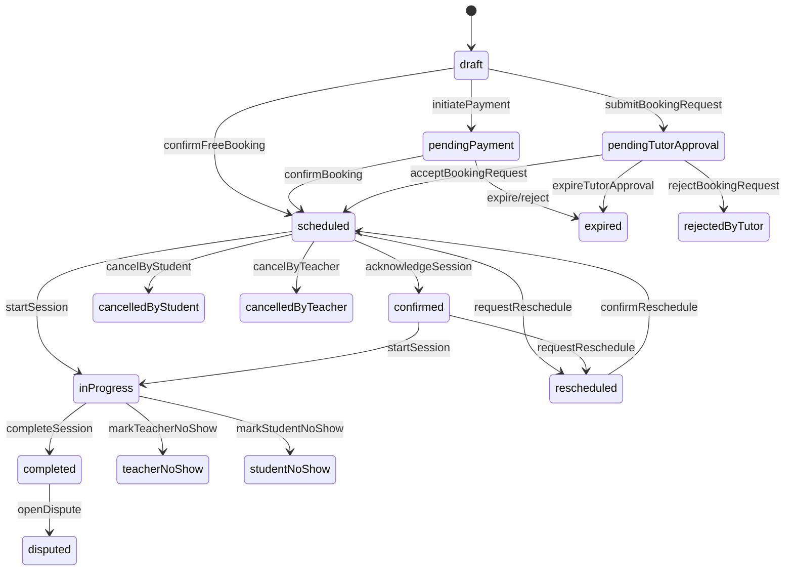

# Session Lifecycle — Status Transitions

**Canonical enum:** `SessionLifecycleStatus`  
**Guard:** `SessionLifecycleGuard` (Dart + TypeScript)  
**Table source:** `packages/quran_sessions/lib/src/domain/lifecycle/session_transition_table.dart`

---

## Phase overview

| Phase | States | Slot blocks? | Can join call? |
|-------|--------|--------------|----------------|
| Reservation | `draft`, `pendingPayment`, `pendingTutorApproval` | Payment + approval yes | No |
| Active | `scheduled`, `inProgress`, `rescheduled` (`confirmed` legacy alias) | Yes | Yes (active only) |
| Terminal | all others | No | No |

---

## Student list buckets (Q-ST-01)

| Tab | Lifecycle states |
|-----|------------------|
| **Upcoming** | `scheduled`, `inProgress`, `rescheduled` |
| **Pending** | `pendingTutorApproval`, `pendingPayment` |
| **Cancelled** | `cancelledBy*`, `rejectedByTutor` |
| **Past** | `completed`, no-shows, `incomplete`, `disputed`, `compensated`, `expired`, `refunded` |

Classifier: `SessionListClassifier`.

## Upcoming list eligibility (teacher dashboard)

**Included in Upcoming (student + teacher dashboard):**

- `scheduled`
- `inProgress`
- `rescheduled`

**Never in Upcoming:**

- All terminal states including `cancelledBy*`, `rejectedByTutor`, `expired`, no-shows, `completed`, `refunded`
- Reservation states: `pendingPayment`, `pendingTutorApproval` → **Pending tab**

Classifier: `SessionListClassifier.isActionableUpcomingLifecycle`.

---

## Booking approval (teacher-only)

1. Student submits booking → `pendingTutorApproval`
2. Teacher accepts → `scheduled` (upcoming)
3. Teacher rejects → `rejectedByTutor` (cancelled tab), slot released
4. SLA expiry → `expired`, slot released
5. No guardian/parent approval — teacher-only booking approval (product decision 2026-07-04)

Callable: `respondToBookingRequest` — **teacher actor only**.

---

## Transition table

| # | From state(s) | Action | Actor | To state | Side effects |
|---|---------------|--------|-------|----------|--------------|
| 1 | ∅ | `createDraft` | student | `draft` | — |
| 2 | `draft` | `initiatePayment` | student | `pendingPayment` | softHoldSlotTtl |
| 3 | `pendingPayment` | `confirmBooking` | system | `scheduled` | capturePayment, hardLockSlot, createSessionDocument, notifyBothParties |
| 4 | `draft` | `confirmFreeBooking` | student, system | `scheduled` | hardLockSlot, createSessionDocument, notifyBothParties |
| 5 | `draft` | `submitBookingRequest` | student, system | `pendingTutorApproval` | hardLockSlot, createSessionDocument, notifyBothParties |
| 6 | `pendingTutorApproval` | `acceptBookingRequest` | teacher | `scheduled` | notifyBothParties |
| 7 | `pendingTutorApproval` | `rejectBookingRequest` | teacher | `rejectedByTutor` | releaseSlot, notifyCounterparty |
| 8 | `pendingTutorApproval` | `expireTutorApproval` | system | `expired` | releaseSlot |
| 9 | `scheduled` | `acknowledgeSession` | student, teacher | `confirmed` | scheduleReminder |
| 10 | `scheduled` | `startSession` | system | `inProgress` | requires join event at/after `startsAt` (Q-SL-03) |
| 11 | `inProgress` | `completeSession` | system, teacher, student | `completed` | promptReview |
| 12 | `scheduled`, `confirmed` | `requestReschedule` | student, teacher | `rescheduled` | notifyCounterparty (reason required) |
| 13 | `rescheduled` | `confirmReschedule` | student, teacher, system | `scheduled` | swapSlotAtomically, releaseOldSlot, lockNewSlot |
| 14 | `scheduled`, `confirmed` | `adminForceReschedule` | admin | `scheduled` | appendAuditTrail, notifyBothParties |
| 15 | `scheduled`, `confirmed`, `pendingPayment`, `pendingTutorApproval` | `cancelByStudent` | student | `cancelledByStudent` | applyCancellationPolicy |
| 16 | `scheduled`, `confirmed` | `cancelByTeacher` | teacher | `cancelledByTeacher` | autoCompensateStudent |
| 17 | many active/reservation | `cancelByAdmin` | admin | `cancelledByAdmin` | adminChooseCompensation |
| 18 | `scheduled`, `confirmed`, `inProgress` | `markTeacherNoShow` | admin, system | `teacherNoShow` | autoCompensateStudent |
| 19 | `scheduled`, `confirmed`, `inProgress` | `markStudentNoShow` | admin, system, teacher | `studentNoShow` | applyCancellationPolicy |
| 20 | `scheduled`, `confirmed`, `inProgress` | `markBothNoShow` | system | `bothNoShow` | markAttendanceFromJoinLogs |
| 21 | `inProgress` | `markIncomplete` | system | `incomplete` | — |
| 22 | terminal eligible | `openDispute` | student, teacher, admin | `disputed` | openManualReviewCase |
| 23 | disputed/cancel/no-show | `issueCompensation` | admin, system | `compensated` | executeCompensationPolicy |
| 24 | any | `issueRefund` | admin, system | `refunded` | executePaymentRefund |
| 25 | `draft`, `pendingPayment` | `expireReservation` | system | `expired` | releaseSlot |
| 26 | `pendingPayment` | `rejectBooking` | system | `expired` | voidPayment |

---

## Legacy mapping (migration)

| Legacy `QuranSessionStatus` | Maps to `SessionLifecycleStatus` |
|----------------------------|----------------------------------|
| `scheduled` | `scheduled` |
| `inProgress` | `inProgress` |
| `completed` | `completed` |
| `cancelledByStudent` | `cancelledByStudent` |
| `cancelledByTeacher` | `cancelledByTeacher` |
| `noShow` | `bothNoShow` ⚠️ lossy |

| Legacy `BookingStatus` | Maps to (fallback) |
|------------------------|-------------------|
| `pending` | `pendingPayment` ⚠️ |
| `confirmed` | `scheduled` |
| `rejected` | `expired` |
| `cancelled` | `cancelledByStudent` (default actor) |

**Production target:** All reads/writes use explicit `lifecycleStatus`; retire legacy fields after backfill.

---

## State diagram (simplified)

Full diagram: `specs/031-quran-session-blueprint/session-state-machine.md`.

---

## Who triggers what (production)

| Actor | Allowed actions |
|-------|-----------------|
| **Student** | createDraft, initiatePayment, confirmFreeBooking, submitBookingRequest, cancelByStudent (eligible states), requestReschedule, completeSession (optional), openDispute |
| **Teacher** | accept/reject booking, cancelByTeacher, requestReschedule, confirmReschedule, startSession, markStudentNoShow (after grace), openDispute |
| **Admin** | cancelByAdmin, adminForceReschedule, mark no-shows, issueCompensation, issueRefund, openDispute |
| **System** | confirmBooking, expire*, startSession (auto), markBothNoShow, markIncomplete, side effect execution |

All transitions validated server-side; client sends action intent only.
