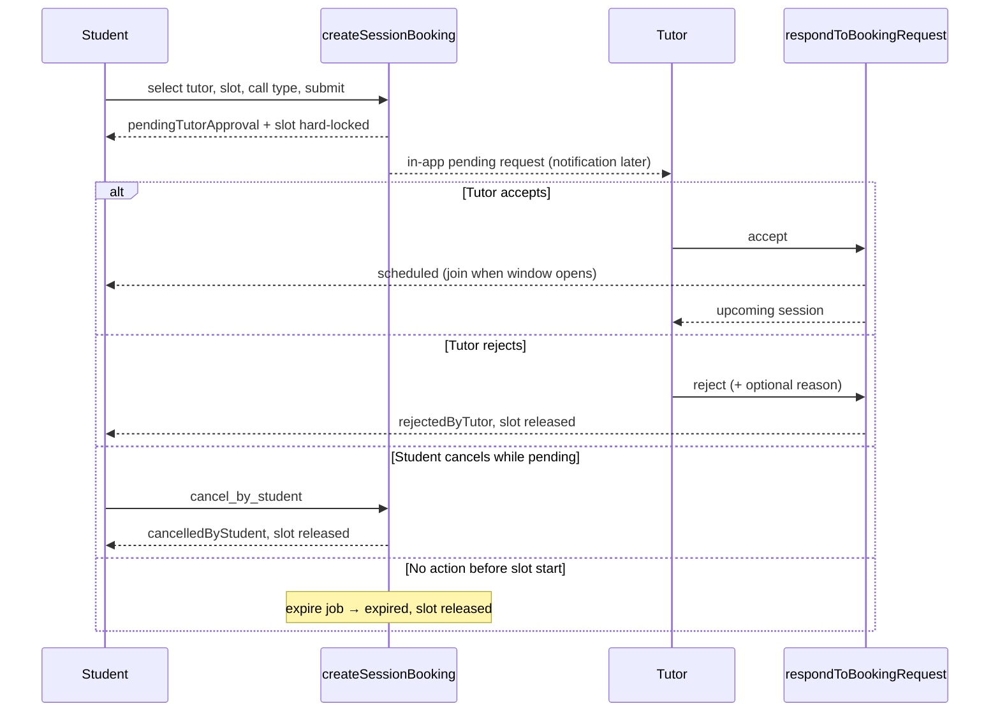
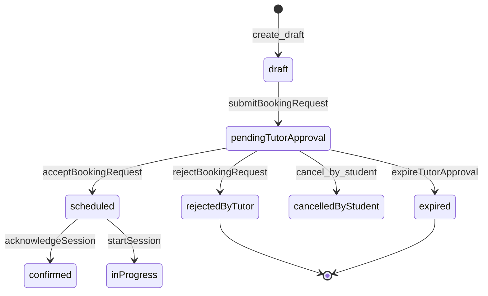

# QuranTutor — Teacher approval spec & implementation plan

**Status:** Draft for product/engineering review (no implementation yet)  
**Last updated:** 2026-06-26  
**Related:** [release_readiness_report.md](./release_readiness_report.md) · [ops_qa_runbook.md](./ops_qa_runbook.md) · [production_config.md](./production_config.md)

---

## Executive summary

Today, free Beta booking lands in **`scheduled`** immediately via `confirm_free_booking` in `createSessionBooking`. There is **no** tutor accept/reject gate in domain, Cloud Functions, or mobile UI. Production GA requires a **config-driven** two-sided flow: student request → **`pendingTutorApproval`** → tutor accept/reject → **`scheduled`** (or **`rejectedByTutor`**).

Staging may keep **`autoConfirm`** for smoke tests; production must default to **`requiresTutorApproval`**.

---

## Product decision

### Production flow (default: `requiresTutorApproval`)



1. Student selects tutor.
2. Student selects available slot.
3. Student selects voice/video (or external meeting).
4. Student sends **booking request** (not “confirmed booking” copy in approval mode).
5. Lifecycle becomes **`pendingTutorApproval`**.
6. Tutor **accepts** or **rejects** (in-app; not Firestore Console for GA).
7. Accept → **`scheduled`** (see §1 for why not `confirmed`).
8. Reject → **`rejectedByTutor`**.
9. Student sees clear feedback at each step.
10. **Join** only when lifecycle allows (`scheduled` / `confirmed` / `inProgress` / `rescheduled` within join window).

### Staging flow (`autoConfirm`)

Unchanged from today: `createSessionBooking` → `confirm_free_booking` → **`scheduled`** immediately, `bookingConfirmed` toast, hard slot lock, `bookingConfirmed` notification outbox entry.

---

## Config: `quranTutorBookingMode`

| Value | Behavior |
|-------|----------|
| `autoConfirm` | Current Free Beta path: booking → `scheduled` on create. |
| `requiresTutorApproval` | Booking → `pendingTutorApproval`; tutor must accept before `scheduled`. |

### Where config lives

| Layer | Key | Purpose |
|-------|-----|---------|
| **Authoritative (ops)** | `quran_session_platform_config/global.quranTutorBookingMode` | Production/staging policy; read by Cloud Functions at booking time. |
| **Client hint (optional)** | `--dart-define=TILAWA_LAUNCH_QURAN_TUTOR_BOOKING_MODE=autoConfirm\|requiresTutorApproval` | Dev/QA override for UI copy and pre-submit expectations; **must not** be sole authority (server decides final status). |
| **Distribution default** | `TILAWA_DISTRIBUTION` | When Firestore field missing: `play_production` → `requiresTutorApproval`; else → `autoConfirm` (matches `quranSessionsStagingFlagsDefaultEnabled()` pattern in `app_launch_config.dart`). |

### Resolution order (server)

1. Read `quran_session_platform_config/global.quranTutorBookingMode`.
2. If missing or invalid → apply distribution default above.
3. Log `booking_mode_fallback` audit metadata when falling back.

### Resolution order (client UI)

1. Dart-define override (debug/staging builds only; ignored on `play_production`).
2. Cached platform config snapshot (existing `FirestoreSessionPolicyDataSource` / policy load path).
3. Same distribution default as server for offline-first copy (with refresh on policy fetch).

### Ops seed examples

**Staging smoke (auto-confirm):**

```json
{
  "quranTutorBookingMode": "autoConfirm",
  "enabledCallProviders": ["external", "mock"]
}
```

**Production GA:**

```json
{
  "quranTutorBookingMode": "requiresTutorApproval",
  "enabledCallProviders": ["external", "agora"]
}
```

---

## 1. Domain / status model

### Current state (verified in repo)

`SessionLifecycleStatus` (`packages/quran_sessions/lib/src/domain/entities/session_lifecycle_status.dart`):

| Status | Phase | Exists | Notes |
|--------|-------|--------|-------|
| `draft`, `pendingPayment` | reservation | ✅ | Paid path + soft lock (10 min) |
| `scheduled`, `confirmed`, `inProgress`, `rescheduled` | active | ✅ | `canJoinSession` true for first four |
| `cancelledByStudent`, `cancelledByTeacher`, `cancelledByAdmin` | terminal | ✅ | |
| `teacherNoShow`, `studentNoShow`, `bothNoShow`, `incomplete` | terminal | ✅ | |
| `completed`, `disputed`, `compensated`, `refunded`, `expired` | terminal | ✅ | |
| **`pendingTutorApproval`** | — | ❌ | **Add** |
| **`rejectedByTutor`** | — | ❌ | **Add** |

`SessionAction` today has `rejectBooking` but it only transitions **`pendingPayment` → `expired`** by **`system`** (payment void), not tutor rejection.

Free booking today (`createSessionBooking.ts`):

```text
create_draft → confirm_free_booking → scheduled
```

Slot lock: **`hard`** when `lifecycleStatus === "scheduled"`; **`soft`** (10 min TTL) for `pending_payment`.

### Recommended naming

| Layer | Pending | Rejected by tutor |
|-------|---------|-------------------|
| Dart enum | `pendingTutorApproval` | `rejectedByTutor` |
| Firestore / CF | `pending_tutor_approval` | `rejected_by_tutor` |
| Legacy `status` field | `pending` | `rejected` (reuse existing legacy bucket; distinct from payment-expired `expired` → `rejected` mapping — see risk §8) |

**Rationale:** Matches product language (“tutor” / محفظ) and user-approved names. Domain already uses `cancelledByTeacher` for actor-based terminal states; `rejectedByTutor` is parallel (tutor actor, non-cancellation terminal).

### Post-accept state: use `scheduled`, not `confirmed`

**Recommendation:** Tutor **accept** → **`scheduled`**.

| Reason | Detail |
|--------|--------|
| Existing transition | `acknowledgeSession`: `scheduled` → `confirmed` (student or teacher). |
| Current booking | Free Beta already creates **`scheduled`** on confirm. |
| Semantics | Accept = tutor commits to time slot; **confirmed** = optional mutual acknowledgment before session. |
| Join | `canJoinSession` already true for `scheduled`. |

Optional: auto-call `acknowledge_session` on tutor accept → `confirmed` — **not recommended** for v1 (skips intentional acknowledgment step, changes reminder side effects).

### New lifecycle actions (proposed)

| Action | From | To | Actor | Side effects |
|--------|------|-----|-------|--------------|
| `submitBookingRequest` | `draft` | `pendingTutorApproval` | student | hard lock slot, create session doc, notify tutor |
| `acceptBookingRequest` | `pendingTutorApproval` | `scheduled` | teacher | notify student, `bookingConfirmed` metrics |
| `rejectBookingRequest` | `pendingTutorApproval` | `rejectedByTutor` | teacher | release slot, notify student |
| `expireTutorApproval` | `pendingTutorApproval` | `expired` | system | release slot (slot time passed / TTL) |

**Extend existing:**

| Action | Change |
|--------|--------|
| `confirmFreeBooking` | Only when `quranTutorBookingMode === autoConfirm`. |
| `cancelByStudent` | Add `pendingTutorApproval` to `from` set. |
| `cancelByAdmin` | Add `pendingTutorApproval` to `from` set. |

**Do not reuse** `rejectBooking` for tutor reject (payment-system semantics).

### Phase / join / slot-blocking updates

```dart
// pendingTutorApproval — proposed
SessionLifecyclePhase.reservation  // or new sub-phase "pendingApproval"
isSlotBlocking => true
canJoinSession => false
```

Extend `isSlotBlocking` to include `pendingTutorApproval` (slot reserved).

Mirror changes in:

- `packages/quran_sessions/.../session_transition_table.dart`
- `functions/src/quranSessions/sessionLifecycleGuard.ts`
- `session_lifecycle_status.dart` (`phase`, `isSlotBlocking`, `canJoinSession`)
- `legacy_status_lifecycle_mapper.dart` + `sessionLifecycleService.legacyStatusForLifecycle`

---

## 2. Student UX

### Arabic copy (exact — product-provided)

| Moment | Arabic |
|--------|--------|
| After request | **تم إرسال طلب الحجز** |
| After request (subtitle) | **في انتظار موافقة المحفظ** |
| Accepted | **تم قبول الحصة** |
| Accepted (subtitle) | **يمكنك الانضمام في موعد الحصة** |
| Rejected | **اعتذر المحفظ عن قبول الحصة** |
| Rejected (subtitle) | **يمكنك اختيار موعد آخر** |

Add matching English keys in `intl_en.arb` for parity (not product-critical for GA if app is Arabic-first).

### Screens & behavior

| Surface | Current | Required change |
|---------|---------|-----------------|
| `BookingScreen` | Toast `bookingConfirmed` / `تم تأكيد الحجز!` on success | Branch on mode: approval → request-sent copy above; autoConfirm → keep current |
| `MySessionsScreen` | Upcoming list; join/cancel on all upcoming | Pending: status chip, **no join**, cancel allowed; rejected: move to past/history with message |
| `SessionDetailScreen` | Join via `canJoin` + `resolveSessionJoinUiState` | Pending/rejected: hide join footer; show status banner with Arabic copy |
| `SessionCard` | `_StatusBadge` maps coarse `QuranSessionStatus` | Add pending/rejected lifecycle badges via `lifecycleStatus` |
| `session_detail_cancel_policy.dart` | Cancel only `scheduled` / `confirmed` / `rescheduled` | Include `pendingTutorApproval` (no late-notice guard for pending) |
| `session_join_ui_state.dart` | Non-joinable → `ended` when `!canJoinSession` | Treat `pendingTutorApproval` / `rejectedByTutor` explicitly (banner vs generic “ended”) |

### Rules

- Pending appears in **My Sessions → upcoming** (time-based partition unchanged).
- Join hidden/disabled for pending and rejected.
- Cancel available while pending (student-initiated).
- Copy must state booking is **not confirmed** until tutor accepts.

---

## 3. Tutor UX

### Recommendation: extend `TeacherDashboardScreen`

Existing dashboard already has **upcoming sessions** + availability. **Minimum GA-safe addition:**

1. **New section:** “طلبات قيد الانتظار” / incoming requests (`pendingTutorApproval` for this `teacherId`).
2. **Per request card:** student display name (or id fallback), slot time, call type, **Accept** / **Reject** (reject → optional reason sheet).
3. **Upcoming:** only `scheduled`+ (existing list; exclude pending).
4. **Join:** wire join on upcoming cards (parity with student — today teacher dashboard `SessionCard` has no join/cancel actions).
5. **Cancel accepted session:** wire existing `TeacherSessionCancelled` bloc event to UI (handler exists in `teacher_dashboard_bloc.dart`; **no UI today**).

### New bloc events (proposed)

| Event | Action |
|-------|--------|
| `TeacherDashboardLoadRequested` | Also fetch `pendingBookingRequests` |
| `TeacherBookingRequestAccepted` | CF `acceptBookingRequest` |
| `TeacherBookingRequestRejected` | CF `rejectBookingRequest` |
| `TeacherSessionCancelled` | Already implemented — add cancel button on upcoming cards |

### Not acceptable for GA

- Tutor approval only via Firestore Console / admin scripts.
- “Teacher sees notification but must ask ops to flip status.”

### Optional v2 (out of scope for GA slice)

- Dedicated `TeacherIncomingRequestsScreen` if dashboard gets crowded.
- Rejected/cancelled history tab for tutor.

---

## 4. Booking rules

User preference: **pending request reserves the slot.** Adopted below.

| Question | Decision | Rationale |
|----------|----------|-----------|
| Multiple students request same slot while pending? | **No** | One `quran_slot_locks/{slotId}` doc per slot; `createSessionBooking` already throws `already-exists` if lock present. |
| Pending reserves slot? | **Yes — hard lock** | Set `lockType: "hard"`, `expiresAt` = min(tutor response deadline, `startsAt`). Aligns with user preference and existing hard-lock path for `scheduled`. |
| Tutor rejects? | **`rejectedByTutor`**, delete slot lock | Slot returns to availability; student sees reject copy. |
| Student cancels while pending? | **`cancelledByStudent`**, release lock | Extend `cancel_by_student` from-set; reason required (existing). |
| Slot time passes while still pending? | **`expired`** (system), release lock | Tutor did not accept in time; student sees expired / request lapsed copy. |
| Auto-expire pending? | **Yes** | Extend `expirePendingReservations` (or sibling job) to query `pending_tutor_approval` where `startsAt <= now` (or `approvalExpiresAt <= now`). |
| Double booking after accept? | **Prevented** | Lock remains through accept → `scheduled`; accept is transactional re-check of lock + status. Second accept on same booking idempotent via existing `runIdempotentOperation`. |

### Tutor response SLA (proposed)

- **`approvalExpiresAt`**: `startsAt` (cannot accept after slot start).
- Optional v1.1: `min(startsAt, createdAt + 48h)` for long-lead bookings — defer unless product asks.

### Paid bookings (future)

When paid path ships: `draft` → `pendingPayment` → (payment) → `pendingTutorApproval` or `scheduled` depending on mode. **Out of Free Beta scope** but transition table should leave room.

---

## 5. Firestore / data model

### Booking + session documents (additions)

| Field | Type | When set |
|-------|------|----------|
| `lifecycleStatus` | string | `pending_tutor_approval` / `rejected_by_tutor` |
| `status` | string | legacy map via `legacyStatusForLifecycle` |
| `approvalRequestedAt` | timestamp | create |
| `approvalExpiresAt` | timestamp | create (= slot start or policy TTL) |
| `acceptedAt` | timestamp | tutor accept |
| `acceptedByTeacherUserId` | string | tutor accept |
| `rejectedAt` | timestamp | tutor reject |
| `rejectedByTeacherUserId` | string | tutor reject |
| `rejectionReason` | string? | tutor reject (optional) |
| `bookingModeAtCreation` | string | audit: `autoConfirm` \| `requiresTutorApproval` |

Existing fields unchanged: `studentId`, `teacherId`, `teacherUserId`, `slotId`, `startsAt`, `endsAt`, `callType`, `callProvider`, etc.

### Slot lock (`quran_slot_locks/{slotId}`)

| `lockType` | `expiresAt` |
|------------|-------------|
| `hard` | `approvalExpiresAt` or far-future for `scheduled` |

`aggregateId` = `bookingId` (unchanged).

### Audit (`quran_session_events`)

Append on: `submit_booking_request`, `accept_booking_request`, `reject_booking_request`, `expire_tutor_approval` with `previousStatus` / `newStatus` / `actorRole`.

### Firestore rules

**No participant write rule changes required** — all mutations stay CF-only. Reads already allow teacher via `ownsTeacherProfile(resource.data.teacherId)` on `quran_bookings` and `quran_sessions`.

Verify after implementation:

- Teacher can read pending requests for own profile.
- Student cannot patch `lifecycleStatus` client-side (still denied).

### Indexes (add to `firestore.indexes.json`)

| Collection | Fields | Use |
|------------|--------|-----|
| `quran_bookings` | `teacherId` ASC, `lifecycleStatus` ASC, `startsAt` ASC | Tutor incoming + expire job |
| `quran_bookings` | `lifecycleStatus` ASC, `approvalExpiresAt` ASC | Expire pending approval job |
| `quran_bookings` | `studentId` ASC, `lifecycleStatus` ASC, `startsAt` DESC | Student pending in my sessions (if filtered server-side later) |

Deploy: `firebase deploy --only firestore:indexes`.

### New Cloud Functions (proposed)

| Callable | Purpose |
|----------|---------|
| `respondToBookingRequest` | `accept` \| `reject` with `bookingId`, `reason?` |
| (modify) `createSessionBooking` | Branch on `quranTutorBookingMode` |
| (modify) `expirePendingReservations` | Include `pending_tutor_approval` |

Export from `functions/src/index.ts`; add integration tests alongside `createSessionBooking.integration.test.ts`.

---

## 6. Notifications

### v1 (GA slice): in-app state required

- Pending/accepted/rejected visible on dashboard and My Sessions without push.
- Pull-to-refresh + bloc reload after accept/reject.

### v2: outbox kinds (implement enqueue now, delivery later)

Extend `SessionNotificationKind` in `notificationOutboxService.ts`:

| Kind | Recipients | When |
|------|------------|------|
| `bookingRequestReceived` | tutor `teacherUserId` | create pending |
| `bookingRequestAccepted` | student | accept |
| `bookingRequestRejected` | student | reject |
| `bookingRequestExpired` | student (+ tutor optional) | expire job |

`actionType` strings for future FCM/deep link:

- `quran_session_booking_request_received`
- `quran_session_booking_request_accepted`
- `quran_session_booking_request_rejected`
- `quran_session_booking_request_expired`

Copy can reuse Arabic product strings in `buildNotificationCopy`.

---

## 7. Tests plan

### Student

| ID | Scenario |
|----|----------|
| S-01 | `requiresTutorApproval` → booking creates `pendingTutorApproval` |
| S-02 | Pending appears in My Sessions upcoming |
| S-03 | Join not available while pending (bloc + widget) |
| S-04 | After tutor accept → join available in window |
| S-05 | After tutor reject → join disabled + reject copy |
| S-06 | `autoConfirm` still lands `scheduled` immediately |
| S-07 | Student can cancel pending → `cancelledByStudent`, lock released |
| S-08 | Booking success UI shows request-sent copy in approval mode |

### Tutor

| ID | Scenario |
|----|----------|
| T-01 | Tutor sees incoming pending request |
| T-02 | Tutor accepts → student sees `scheduled` |
| T-03 | Tutor rejects → student sees `rejectedByTutor` |
| T-04 | Accept updates student My Sessions (integration / emulator) |
| T-05 | Reject updates student My Sessions |
| T-06 | Tutor cannot accept/reject another teacher’s booking (auth) |
| T-07 | Double booking: second student same slot → `already-exists` |
| T-08 | `TeacherSessionCancelled` wired from UI (widget test) |

### Config

| ID | Scenario |
|----|----------|
| C-01 | `autoConfirm` → immediate `scheduled` |
| C-02 | `requiresTutorApproval` → pending |
| C-03 | Missing/invalid Firestore value → distribution default |
| C-04 | Dart-define override on staging only (client copy) |

### Backend (CF)

| ID | Scenario |
|----|----------|
| CF-01 | Transition guard matrix for new actions |
| CF-02 | Accept releases no lock; reject/expire delete lock |
| CF-03 | Idempotent accept/reject |
| CF-04 | `expirePendingReservations` handles `pending_tutor_approval` |

### Test locations

- `packages/quran_sessions/test/domain/lifecycle/`
- `packages/quran_sessions/test/presentation/blocs/`
- `packages/quran_sessions/test/presentation/screens/`
- `functions/test/quranSessions/`
- `functions/test-integration/createSessionBooking.integration.test.ts`

---

## 8. Production readiness

### 1. Recommended status naming

- **`pendingTutorApproval`** / **`rejectedByTutor`** (Dart); snake_case in Firestore.
- Post-accept: **`scheduled`**; optional later **`confirmed`** via `acknowledgeSession`.

### 2. Booking mode config design

- Authoritative: `quran_session_platform_config/global.quranTutorBookingMode`.
- Optional dev override: `TILAWA_LAUNCH_QURAN_TUTOR_BOOKING_MODE`.
- Fallback: `play_production` → `requiresTutorApproval`; else `autoConfirm`.

### 3. Student changes

- Booking success branching, My Sessions pending UI, join gating, cancel pending, session detail banners, l10n.

### 4. Tutor changes

- Dashboard pending section, accept/reject, join + cancel on upcoming, new CF wiring.

### 5. Firestore / rules / indexes

- New fields, two lifecycle values, indexes above, CF-only writes unchanged.

### 6. Tests needed

- See §7 (blocking for merge).

### 7. Risks

| Risk | Mitigation |
|------|------------|
| Legacy `status: rejected` used for both payment `expired` and tutor `rejectedByTutor` | Prefer `lifecycleStatus` in all new UI; migrate mapper to distinguish |
| Tutor slow to respond → student frustration | Clear pending copy + expire job + cancel anytime while pending |
| Staging forgets to set mode → false GA confidence | Document in ops runbook; seed script sets explicit mode per env |
| Client/server mode mismatch | Server always wins on status; client shows server response after book |
| Paid booking + approval interaction | Defer; document chain in transition table comments |
| Teacher dashboard query perf | Indexed `teacherId` + `lifecycleStatus`; paginate if >50 pending |

### 8. Implementation phases (estimates)

| Phase | Scope | Est. |
|-------|-------|------|
| **P0** | Spec sign-off (this doc) | 0.5 d |
| **P1** | Domain + transition tables (Dart + TS guards) | 2 d |
| **P2** | `createSessionBooking` branch + slot lock for pending | 2 d |
| **P3** | `respondToBookingRequest` CF + audit + outbox enqueue | 2 d |
| **P4** | Expire job for `pending_tutor_approval` | 1 d |
| **P5** | Platform config read + dart-define + policy datasource | 1 d |
| **P6** | Student UX (booking, my sessions, detail, l10n) | 2–3 d |
| **P7** | Tutor UX (dashboard pending, accept/reject, cancel/join wire-up) | 2–3 d |
| **P8** | Tests (domain, CF integration, widget/bloc) | 2–3 d |
| **P9** | Ops seed, indexes deploy, staging two-device QA | 1–2 d |

**Total:** ~15–19 engineering days (one senior Flutter + CF engineer; parallelizable P6/P7 after P3).

### 9. Staging can test before this slice

| Flow | Ready? |
|------|--------|
| Browse teachers, availability, auto-confirm book/join | ✅ with `autoConfirm` |
| Voice/video/external join lifecycle | ✅ |
| Student cancel scheduled | ✅ |
| Teacher availability CRUD | ✅ |
| Teacher accept/reject booking | ❌ |
| Production-shaped approval UX | ❌ |

### 10. GA blockers until slice done

- `quranTutorBookingMode: requiresTutorApproval` in production Firestore without CF/UI support → **broken bookings**.
- Public Play release with booking enabled but no tutor request UI → **unsafe two-sided product**.
- Manual Console approval as only tutor path → **not GA** (explicit non-goal).

---

## Implementation plan table

| Phase | Scope | Files / packages touched | Depends on | Verify |
|-------|-------|--------------------------|------------|--------|
| P1 | Lifecycle enum, actions, transition tables, mappers | `session_lifecycle_status.dart`, `session_action.dart`, `session_transition_table.dart`, `sessionLifecycleGuard.ts`, `sessionLifecycleService.ts`, `legacy_status_lifecycle_mapper.dart`, lifecycle tests | P0 | `flutter test packages/quran_sessions/test/domain/lifecycle/`; `cd functions && npm test -- sessionLifecycleGuard` |
| P2 | Booking create branch + hard lock | `createSessionBooking.ts`, `bookingEligibilityService.ts` (if needed), integration test | P1 | `npm run test:integration` booking cases |
| P3 | Accept/reject callable | `respondToBookingRequest.ts` (new), `aggregateWriteService.ts`, `notificationOutboxService.ts`, `index.ts` | P1, P2 | CF unit + integration; rules tests green |
| P4 | Expire pending approval | `expirePendingReservations.ts` or `expirePendingTutorApprovals.ts` | P1 | Scheduler unit test |
| P5 | Config resolution | `quran_session_platform_config` seed docs, `FirestoreSessionPolicyDataSource`, `quran_sessions_launch_policy.dart`, `app_launch_config.dart` | P0 | Policy unit test; manual Firestore read |
| P6 | Student UI | `booking_screen.dart`, `booking_bloc.dart`, `my_sessions_*`, `session_detail_*`, `session_card.dart`, `session_join_*`, `intl_*.arb` | P2, P5 | Widget/bloc tests S-01–S-08 |
| P7 | Tutor UI | `teacher_dashboard_screen.dart`, `teacher_dashboard_bloc.dart`, `teacher_dashboard_event.dart`, host nav | P3 | Widget tests T-01–T-08 |
| P8 | Full regression | Test files listed §7 | P6, P7 | `melos run analyze`; targeted `flutter test`; `functions` test + rules |
| P9 | Ops | `seedStagingTeachers.ts`, `ops_qa_runbook.md`, `firestore.indexes.json`, `production_config.md` | P8 | Two-device script new Part: approval flow |

---

## Appendix A — Current code anchors

| Concern | Location |
|---------|----------|
| Lifecycle enum | `packages/quran_sessions/lib/src/domain/entities/session_lifecycle_status.dart` |
| Transition table | `packages/quran_sessions/lib/src/domain/lifecycle/session_transition_table.dart` |
| CF transitions | `functions/src/quranSessions/sessionLifecycleGuard.ts` |
| Create booking | `functions/src/quranSessions/createSessionBooking.ts` |
| Cancel booking | `functions/src/quranSessions/cancelSessionBooking.ts` |
| Slot locks | `quran_slot_locks` in create + cancel |
| Join gating | `canJoinSession`, `session_join_ui_state.dart`, `session_detail_state.dart` |
| Teacher dashboard | `teacher_dashboard_screen.dart`, `teacher_dashboard_bloc.dart` |
| Platform config | `quran_session_platform_config/global` |
| Rules | `firestore.rules` (`quran_bookings`, `quran_sessions`) |
| Notifications outbox | `functions/src/quranSessions/notificationOutboxService.ts` |
| Launch defines | `apps/tilawa/lib/core/bootstrap/app_launch_config.dart` |

## Appendix B — State diagram (approval mode)



---

**Next step:** Product/engineering review → approve → implement P1–P9 in order.

---

## P2 implemented (2026-06-26)

Tutor UX slice for production approval mode:

| Item | Status | Notes |
|------|--------|-------|
| **P2.1** Reject confirmation sheet | ✅ | `showTutorRejectBookingSheet`; optional `reason` → `respondToBookingRequest` CF → `rejectionReason` on booking |
| **P2.1** Student rejected state | ✅ | `rejectedByTutor` join hidden; title/subtitle + safe reason on session detail |
| **P2.2** Dashboard card cancel | ✅ | Overflow **⋮** on scheduled/confirmed upcoming cards; reuses `showTutorCancelSessionDialog` + `TeacherSessionCancelled` |
| Tests | ✅ | `tutor_reject_booking_sheet_test`, `teacher_dashboard_reject_cancel_test`, `teacher_dashboard_reject_bloc_test`, session detail rejected copy |

**Data:** `SessionAggregate.rejectionReason` mapped from Firestore `rejectionReason` (`session_firestore_mapper.dart`).

**Out of scope (unchanged):** home, payment, new notification kinds beyond existing outbox enqueue on reject.
