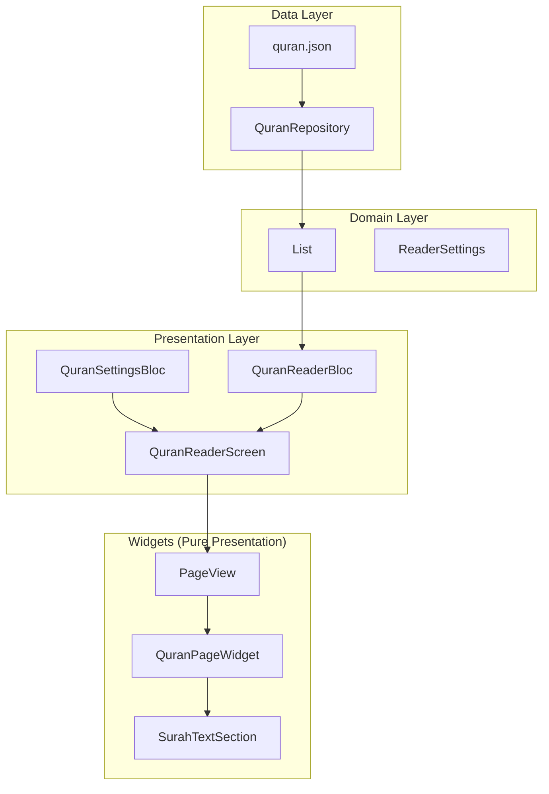

# Quran Reader Refactoring Plan

## Problem Statement

The current Quran reader has several issues:
1. **Logic embedded in widgets** - [SurahTextSection](file:///Users/mohammadkamel/tilawa/lib/features/quran_reader/presentation/widgets/surah_text_section.dart#16-31) and [QuranPageWidget](file:///Users/mohammadkamel/tilawa/lib/features/quran_reader/presentation/widgets/quran_page_widget.dart#13-21) contain business logic
2. **Multiple re-renders** - Each page/state change causes unnecessary rebuilds
3. **Async loading in PageView** - Pages load from API during scroll, causing "init vs loaded" flicker
4. **Complex font selection logic** - QCF fonts require `codeV1` from API, adding coupling

## Goals

1. **Pure presentation widgets** - All widgets receive data as parameters, no BlocBuilders inside page content
2. **Offline-first with [quran.json](file:///Users/mohammadkamel/tilawa/assets/data/quran.json)** - All 604 pages pre-computed at app start
3. **Smooth PageView scrolling** - No async loading, no state-related re-renders during scroll
4. **Single source of truth** - Settings applied at top level, passed down as immutable data

---

## Proposed Architecture



---

## Proposed Changes

### Data Layer

#### [MODIFY] [quran_repository.dart](file:///Users/mohammadkamel/tilawa/lib/features/quran_reader/data/repositories/quran_repository.dart)

Add method to parse and return all pages from [quran.json](file:///Users/mohammadkamel/tilawa/assets/data/quran.json):
- `Future<List<QuranPageData>> getAllPagesFromJson()` - Parses JSON once, returns all 604 pages
- Called at app startup, cached in memory

---

#### [NEW] [quran_page_data.dart](file:///Users/mohammadkamel/tilawa/lib/features/quran_reader/domain/entities/quran_page_data.dart)

Immutable data class for a fully-rendered page:
```dart
class QuranPageData {
  final int pageNumber;
  final int juzNumber;
  final int hizbNumber;
  final List<SurahSection> surahSections;
}

class SurahSection {
  final int surahNumber;
  final String surahNameArabic;
  final String surahNameEnglish;
  final bool isStartOfSurah;
  final List<AyahData> ayahs;
}

class AyahData {
  final int ayahNumber;
  final String text; // Arabic text from quran.json
}
```

---

### Presentation Layer

#### [MODIFY] [quran_reader_bloc.dart](file:///Users/mohammadkamel/tilawa/lib/features/quran_reader/presentation/bloc/quran_reader_bloc.dart)

Simplify to only handle navigation:
- Remove async page loading
- Receive pre-computed `List<QuranPageData>` at construction
- Only track `currentPageIndex`

---

#### [MODIFY] [quran_reader_screen.dart](file:///Users/mohammadkamel/tilawa/lib/features/quran_reader/presentation/screens/quran_reader_screen.dart)

- Single `BlocBuilder` at the root for settings
- Pass computed font/size down to children
- No BlocBuilders in child widgets

---

### Widgets (Pure Presentation)

#### [MODIFY] [quran_page_widget.dart](file:///Users/mohammadkamel/tilawa/lib/features/quran_reader/presentation/widgets/quran_page_widget.dart)

- Remove ALL BlocBuilders
- Receive `QuranPageData`, `fontFamily`, `fontSize` as parameters
- Pure build method, no logic

```dart
class QuranPageWidget extends StatelessWidget {
  final QuranPageData pageData;
  final String fontFamily;
  final double fontSize;
  
  // Pure build - just layout
}
```

---

#### [MODIFY] [surah_text_section.dart](file:///Users/mohammadkamel/tilawa/lib/features/quran_reader/presentation/widgets/surah_text_section.dart)

- Remove ALL BlocBuilders
- Receive `SurahSection`, `fontFamily`, `fontSize` as parameters
- No state, pure `StatelessWidget`

```dart
class SurahTextSection extends StatelessWidget {
  final SurahSection section;
  final String fontFamily;
  final double fontSize;
  
  // Pure build - just RichText
}
```

---

### Word-by-Word Audio (Separate Concern)

> [!IMPORTANT]
> Word-by-word audio requires word-level data not present in [quran.json](file:///Users/mohammadkamel/tilawa/assets/data/quran.json). 
> 
> **Options:**
> 1. **Remove feature** - Simplest, offline-only app
> 2. **Lazy load words** - Load word data only when user taps "play" for an ayah
> 3. **Keep separate API** - Audio stays online, reading is offline
> 
> **Recommendation:** Option 2 - Lazy load words only when audio is requested. This keeps reading smooth while preserving audio functionality.

---

## PageView Optimization

To ensure smooth scrolling:

1. **Pre-build all 604 pages** at app start (parsed from JSON)
2. **Use `const` widgets** where possible
3. **No BlocBuilders inside PageView children**
4. **Settings changes trigger single rebuild at root** - children receive new props

```dart
// QuranReaderScreen (root)
BlocBuilder<QuranSettingsBloc, QuranSettingsState>(
  builder: (context, settings) {
    // Single rebuild point for settings
    return PageView.builder(
      itemCount: 604,
      itemBuilder: (context, index) {
        // Pass data as parameters - no blocs inside
        return QuranPageWidget(
          pageData: pages[index],
          fontFamily: settings.fontFamily,
          fontSize: settings.fontSize,
        );
      },
    );
  },
);
```

---

## Verification Plan

### Automated Tests
- Unit test `QuranRepository.getAllPagesFromJson()` - verify all 604 pages parse correctly
- Widget test [QuranPageWidget](file:///Users/mohammadkamel/tilawa/lib/features/quran_reader/presentation/widgets/quran_page_widget.dart#13-21) - verify it renders with given parameters
- Widget test [SurahTextSection](file:///Users/mohammadkamel/tilawa/lib/features/quran_reader/presentation/widgets/surah_text_section.dart#16-31) - verify text renders correctly

### Manual Verification
- Smooth scroll through all 604 pages without jank
- Change font size - verify instant update without flicker
- Change font type - verify instant update without flicker
- Navigate to specific page - verify correct content

---

## Migration Steps

1. Create `QuranPageData` entity
2. Add `getAllPagesFromJson()` to repository
3. Parse and cache pages at app startup (in [AppProviders](file:///Users/mohammadkamel/tilawa/lib/core/providers/app_providers.dart#22-91) or `main.dart`)
4. Refactor [QuranPageWidget](file:///Users/mohammadkamel/tilawa/lib/features/quran_reader/presentation/widgets/quran_page_widget.dart#13-21) to be pure presentation (StatelessWidget)
5. Refactor [SurahTextSection](file:///Users/mohammadkamel/tilawa/lib/features/quran_reader/presentation/widgets/surah_text_section.dart#16-31) to be pure presentation (StatelessWidget)
6. Simplify [QuranReaderBloc](file:///Users/mohammadkamel/tilawa/lib/features/quran_reader/presentation/bloc/quran_reader_bloc.dart#15-380) to only handle navigation
7. Update [QuranReaderScreen](file:///Users/mohammadkamel/tilawa/lib/features/quran_reader/presentation/screens/quran_reader_screen.dart#13-26) to have single BlocBuilder at root
8. Update tests
9. Remove unused API-dependent code (can keep for audio feature)
