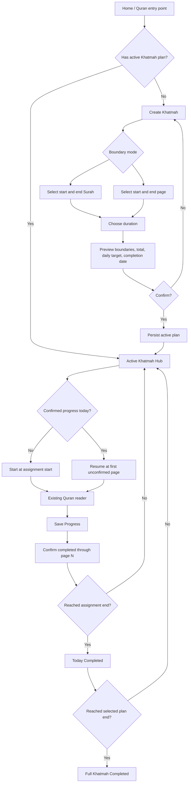

# Amendment: Al-Khatmah release-now MVP

**Status:** normative and implemented; final release verdict depends on tests
and production App Bundle validation.

## Canonical release UX

1. Home/Quran exposes one contextual Al-Khatmah entry.
2. No Plan shows one **Create Khatmah** action.
3. Create Plan asks for exactly one boundary mode:
   - Surah start + Surah end; or
   - Page start + Page end.
4. After valid ordered boundaries, the user chooses 7, 15, 30, or 60 days.
5. Preview shows start, end, total pages, daily target, and expected completion
   date. Nothing is persisted before Confirm.
6. Active Hub shows today’s frozen range, assigned/confirmed/remaining pages,
   overall progress, and expected completion date.
7. Start opens today’s start page; Resume opens the first unconfirmed page.
8. Reader navigation never changes progress. Save Progress opens one editable
   “completed through page N” confirmation bounded to today’s assignment.
9. Reaching today’s end shows a calm Today Completed state without changing the
   frozen range.
10. Reaching the plan’s selected end shows Full Khatmah Completed with Start
    another and Return to Quran actions.
11. Malformed/error state offers Retry and confirmed Reset without crashing or
    overwriting raw data.

The full flow-to-code status is maintained in
`flow-to-implementation-map.md`; ordered delivery tasks are in `tasks.md`.

## Canonical states

1. No Plan — one Create Khatmah action.
2. Create Plan — boundary mode, start/end, duration, preview, confirm/cancel.
3. Active Plan / No Progress Today — exact range and Start today’s Wird.
4. Active Plan / Partial Progress — counts and Resume today’s Wird.
5. Today Completed — calm completion with the frozen range retained.
6. Full Khatmah Completed — Start another / Return to Quran.
7. Recoverable Error / Malformed Data — Retry / confirmed Reset.

No additional release state or competing creation/progress flow is permitted.



## Release scope

- One local active linear, page-based Khatmah with explicit user-selected start
  and end boundaries.
- Boundary selection by ordered Surah range or ordered page range.
- Duration presets: 7, 15, 30, 60 days.
- Review-before-save with start, target, daily pages, and completion date.
- One nullable contiguous user-confirmed progress boundary.
- Frozen daily start/end assignment and derived confirmed/remaining counts.
- Plan-owned Start/Resume route into the existing Quran reader.
- Editable explicit confirmation after returning from the reading flow.
- Calm daily and full-completion states.
- Extension changes duration; ineffective catch-up is hidden.
- One Home card; the duplicate More-list entry and hub FAB are removed.
- Arabic/English, RTL/LTR, dynamic layout, semantics, loading/error/empty,
  active/daily-completed/full-completed states.
- v2 local persistence; malformed data is preserved and surfaced as error.

Navigation is never completion evidence. The general Quran reader has no Smart
Khatma progress dependency. Only `UpdateKhatmaProgressUseCase` called from the
explicit confirmation event writes the boundary.

## Release flags

- Smart Khatma core: enabled for the production candidate after gates pass.
- Today Plan: default off until Khatma-backed tasks cannot be manually toggled.
- Android Wird widget: default off until v2 payload/device reconciliation.
- Reminder, adherence, listening: absent/default off.

## Spec 041 dependency

The widget is optional and cannot block the Flutter release. Native Android may
only decode/render a Flutter presentation snapshot. It must not calculate plan,
assignment, catch-up, migration, or completion. Default-off remains mandatory.

## Immediate dependency order

```text
confirmed progress correctness
→ stable daily assignment
→ Khatmah reader entry
→ confirmation UX
→ Home integration
→ release validation
```

Widget rollout, reminders, adherence, listening, detailed history, advanced
migration, and architecture refactoring are post-release.

## Task status

- [x] Replace navigation progress with explicit confirmation.
- [x] Freeze today’s assignment in the v2 plan.
- [ ] Add Surah/page boundary-mode selectors and remove fixed-page-604 creation.
- [ ] Complete preview/confirmation for arbitrary selected boundaries.
- [x] Add plan-owned reader page and editable confirmation.
- [x] Add one contextual Home card; remove duplicate entry/action.
- [x] Hide ineffective catch-up; retain real extension.
- [x] Keep Today Plan and Android widget default-off.
- [x] Scrub page/range/plan identifiers from changed Khatma analytics.
- [x] Add release-critical domain, persistence, summary, and Home tests.
- [ ] Complete active facts, in-flow Save Progress, Return to Quran, and error
  reset actions.
- [ ] Pass final analyzer, affected regressions, Spec Kit validator, and AAB.
- [ ] Complete physical-device validation before external widget activation.
