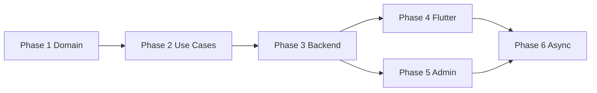

# Implementation Plan: Quran Sessions Business Domain

**Branch**: `030-quran-sessions-domain`  
**Spec**: [spec.md](./spec.md)  
**Status**: In progress (Phase 1 + Phase 2 implemented)

---

## Phase 1 — Domain state machine + tests

**Goal**: Pure domain lifecycle with exhaustive tests. Zero Firebase, zero UI.

### Tasks

1. **Entities**
   - [x] `SessionLifecycleStatus` enum + phase helpers
   - [x] `SessionAction`, `ActorRole`, `ActionSource` value objects
   - [x] `SessionAggregate` (or extend existing entities with lifecycle field)
   - [ ] `SessionAuditEvent`, `CompensationRecord`, `RescheduleRequest`,
         `SessionAttendance`

2. **Lifecycle engine**
   - [x] `SessionTransition` + `SessionTransitionTable` (declarative)
   - [x] `SessionLifecycleGuard.canTransition(...)` → `Either<Failure, Transition>`
   - [x] `SessionLifecycleGuard.applyTransition(...)` → updated aggregate

3. **Policies** (move/refactor from `boundaries/`)
   - [x] `ConfigurableCancellationPolicy` reads policy config object
   - [x] `ConfigurableCompensationPolicy`
   - [x] `ConfigurableReschedulePolicy`
   - [x] `NoShowPolicy`
   - [x] `BookingIntegrityValidator` (pure; accepts injected snapshots)

4. **Gateway interfaces** (no impl)
   - [x] `SessionCommandGateway`
   - [x] `CompensationGateway`
   - [x] `SessionNotificationGateway`
   - [x] `AuditRepository`

5. **Tests** (target 95–100% on lifecycle + policies)
   - [x] Every valid transition (parametrized)
   - [x] Every invalid transition
   - [x] Policy edge cases (timezone boundaries, exactly 24h, etc.)

### Verify

```sh
cd packages/quran_sessions
dart analyze
flutter test test/domain/lifecycle/
flutter test test/domain/policies/
```

---

## Phase 2 — Use cases + tests

**Goal**: Orchestration layer calling guard + policies + gateway interfaces.

### Tasks

1. **Use cases**
   - [x] `CreateSessionBookingUseCase`
   - [x] `CancelSessionUseCase` (actor-aware)
   - [x] `RequestRescheduleUseCase`
   - [x] `ConfirmRescheduleUseCase`
   - [x] `MarkNoShowUseCase`
   - [x] `CompleteSessionUseCase`
   - [x] `IssueCompensationUseCase`
   - [x] `GetSessionTimelineUseCase`
   - [x] `ExpirePendingReservationsUseCase` (system)

2. **Repository**
   - [x] `SessionAggregateRepository` interface
   - [x] Fake impl for tests

3. **Deprecate paths** (mark `@Deprecated`, do not delete yet)
   - [ ] Direct `CancelBookingUseCase` without actor
   - [ ] Client-side-only `CreateBookingUseCase` slot check as sole validator

4. **Tests**
   - [x] Use case tests with fake repos/gateways
   - [x] Failure scenarios: payment ok + booking fail, booking ok + notify fail
   - [ ] Concurrent booking attempts (fake repo simulates race)

### Verify

```sh
flutter test test/domain/usecases/session_*
```

---

## Phase 3 — Backend persistence + Cloud Functions

**Goal**: Server-authoritative writes; fix rules/code conflict.

### Tasks

1. **Firestore**
   - [x] Add collections + indexes (`firestore.indexes.json`)
   - [x] Update rules (all new collections CF-only write)
   - [x] Migration script: backfill `lifecycleStatus`
   - [ ] TTL on `quran_slot_locks.expiresAt`

2. **Cloud Functions** (`functions/src/quranSessions/`)
   - [x] `createSessionBooking.ts` — transactional slot lock + aggregate create
   - [x] `cancelSessionBooking.ts`
   - [x] `requestSessionReschedule.ts` / `confirmSessionReschedule.ts`
   - [x] `markSessionNoShow.ts`
   - [x] `completeSession.ts`
   - [x] `issueSessionCompensation.ts`
   - [ ] Shared: `sessionLifecycleService.ts`, `auditService.ts`,
         `slotLockService.ts`, `bookingValidator.ts`

3. **Scheduled functions**
   - [x] `expirePendingReservations` (every 5 min)
   - [ ] `sessionReminders` (hourly)
   - [ ] `autoNoShowDetection` (every 15 min post-session-start)

4. **App infrastructure**
   - [x] `FirebaseSessionCommandGateway` implements domain interface
   - [ ] Remove direct writes from `FirestoreBookingDataSource`,
         `FirestoreSessionDataSource`
   - [ ] `FakeMvpSessionCommandGateway` for local dev

5. **Tests**
   - [x] CF unit tests (node:test) for lifecycle service
   - [ ] Firestore emulator integration tests for transactions

### Verify

```sh
cd functions && npm test
firebase emulators:exec --only firestore,functions 'npm run test:integration'
cd apps/tilawa && flutter test test/features/quran_sessions/
```

---

## Phase 4 — Flutter UX integration

**Goal**: User flows call command gateway; show policy copy before destructive actions.

### Tasks

1. **Blocs**
   - [x] Refactor `BookingBloc` → use `SubmitSessionBookingUseCase` + `SessionMutationGateway`
   - [x] `MySessionsBloc` / `TeacherDashboardBloc` — cancel with reason + actor
   - [x] New `RescheduleBloc` + `SessionDetailBloc`
   - [x] Cancellation confirmation sheet with policy `describe()`

2. **Screens**
   - [x] Cancel reason field (required)
   - [x] Reschedule flow with pending/accept states
   - [x] Session detail timeline (read audit via query)

3. **L10n**
   - [x] All new strings in `intl_en.arb` / `intl_ar.arb`

4. **Feature flag**
   - [ ] Enable `quranSessionsBookingEnabled` only after Phase 3 deployed

### Verify

```sh
flutter test test/presentation/blocs/
flutter test test/features/quran_sessions/
dart analyze
```

---

## Phase 5 — Admin panel

**Goal**: Operational control without unsafe Firestore writes.

### Tasks

1. **Domain (admin app)**
   - [x] Entities: `AdminSessionSummary`, `SessionTimelineEvent`
   - [x] `SessionModerationGateway` interface
   - [x] `FirebaseSessionModerationGateway` → callable CFs

2. **UI**
   - [x] `/quran-sessions/sessions` list with filters
   - [x] `/quran-sessions/sessions/:id` detail + timeline
   - [x] Action dialogs: cancel, no-show, compensation, refund approve

3. **CF extensions**
   - [x] Admin-only auth on session CFs (partial — `approveSessionRefund` stub)
   - [ ] `quran_admin_actions` audit on each admin mutation

### Verify

- Manual QA checklist in spec
- Admin unit tests for gateway + mappers

---

## Phase 6 — Notifications, analytics, observability

**Goal**: Backend-driven comms + teacher/student quality metrics.

### Tasks

1. [x] Notification delivery worker (push first; email stub)
2. [x] Metrics aggregation on terminal transitions
3. [ ] Sentry breadcrumbs for CF lifecycle errors
4. [ ] Admin metrics widgets (cancellation rate, no-show rate)
5. [ ] Dispute workflow UI (optional v1.1)

---

## Dependency graph



Phases 4 and 5 may run in parallel after Phase 3.

---

## Risk register

| Risk | Mitigation |
|------|------------|
| Legacy data ambiguous status | Manual review queue in migration script |
| Double-booking under load | Hard slot lock + transaction retry |
| Compensation gateway failure | Idempotent retry; pending compensation records |
| Timezone edge cases | All storage UTC; policy eval uses market timezone |
| Scope creep | Strict phase gates; no UI before Phase 3 |

---

## Estimated effort (engineering days, rough)

| Phase | Days |
|-------|------|
| 1 | 3–4 |
| 2 | 4–5 |
| 3 | 5–7 |
| 4 | 3–4 |
| 5 | 4–5 |
| 6 | 3–4 |
| **Total** | **22–29** |
