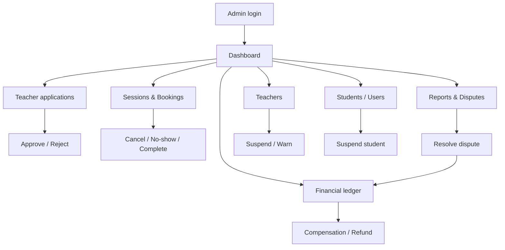

# Admin Flow — Quran Sessions

**Actor:** Admin / Moderator (custom claim `admin` or `moderator`)  
**Surface:** `apps/tilawa_admin` Angular panel + Cloud Functions + MVO scripts  
**Principle:** All mutations via **callable CF** — never direct Firestore writes from panel.

---

## Operations overview

---

## Access & permissions

| Role | Capabilities |
|------|--------------|
| **admin** | Full: applications, sessions, disputes, refunds, suspend, policy edit |
| **moderator** | Applications, reports, session read, mark no-show; no financial approve |
| **support** `[Future]` | Read-only + manual notes |

**Auth:** Firebase custom claims; re-validated in every CF (`context.auth.token.admin`).

**Audit:** Every admin mutation → `quran_session_events` + `quran_admin_actions`.

---

## Phase 1 — Teacher application review

### A1.1 Queue `[Beta]`

| Step | UI | Backend |
|------|-----|---------|
| List pending applications | `teacher-applications.component` | Query `quran_teacher_applications` status=pending |
| Open detail | `teacher-application-detail.component` | Read application + user profile |
| Review checklist | Inline checklist (this doc) | — |

**Checklist (operator):**
- [ ] Phone format valid (not OTP-verified in Beta)
- [ ] Bio appropriate (no contact info in public fields)
- [ ] Specializations plausible
- [ ] No duplicate account (same phone/user)
- [ ] Gender declared for eligibility matching
- [ ] Rejection reason filled if rejecting

### A1.2 Approve / Reject `[Beta]`

| Action | Callable | Result |
|--------|----------|--------|
| Approve | `reviewTeacherApplication` | Creates `quran_teacher_profiles`; status=approved |
| Reject | Same CF | status=rejected + cooldown |
| Request info | `[Future]` | status=needs_info |

**MVO fallback:** `functions/scripts/reviewTeacherApplicationAdmin.ts` for CLI ops.

**Gap vs ideal:** No in-panel bulk approve; no SLA dashboard.

---

## Phase 2 — Teacher management

### A2.1 Teacher list `[Beta]`

| Screen | Filters |
|--------|---------|
| `teachers.component` | verification status, visibility, market, suspended |

### A2.2 Teacher detail actions `[Beta]`

| Action | CF / use case | Fields |
|--------|---------------|--------|
| Suspend bookings | `moderateTeacherProfile` | `acceptBookings: false` |
| Hide profile | Same | `isPubliclyVisible: false` |
| Full suspend | `SuspendTeacherProfileUseCase` via gateway | application + profile status |
| Revoke permanently | Admin script + domain | no re-application |
| Edit eligibility policy | `[Partial]` `UpdateTeacherEligibilityPolicyUseCase` | allowed genders, canTeachChildren |
| Warning note | Admin action log | metadata only |

**Metrics visible:** `quran_teacher_metrics` — cancellation rate, no-show count.

---

## Phase 3 — Student / user management

### A3.1 User list `[Beta]`

**Screen:** `quran-sessions-users.component`

| Filter | Field |
|--------|-------|
| Account status | `quranSessionsProfile.accountStatus` |
| Market | countryCode, cityId |
| Role | student (teachers are profiles linked to userId) |

### A3.2 Suspend student `[Beta]`

| Action | CF | Effect |
|--------|-----|--------|
| Suspend | `moderateQuranSessionsUser` | accountStatus=suspended; blocks new bookings |
| Block | Same | accountStatus=blocked; stronger restriction |
| Unblock | Admin only | Rules prevent self-unblock (P0 fix) |

**Restriction reasons:** `AccountRestrictionReason` enum — must be set on block.

---

## Phase 4 — Sessions & bookings oversight

### A4.1 Session list `[Beta]`

**Screen:** `sessions.component`

| Filter | Index |
|--------|-------|
| lifecycleStatus | composite index |
| teacherId, studentId | — |
| Date range (startsAt) | — |
| countryCode, cityId | admin denormalized fields |
| disputed only | quick filter |

**Facade:** `sessions.facade.ts` → `firebase-session-read.repository.ts`.

### A4.2 Session detail `[Beta]`

**Screen:** `session-detail.component`

| Panel | Content |
|-------|---------|
| Header | Status badge, participants, slot time |
| Timeline | `quran_session_events` ordered ASC |
| Attendance | Join timestamps, classification |
| Compensation history | `quran_session_compensations` |
| Actions toolbar | See A4.3 |

### A4.3 Session actions `[Beta]`

| Action | Callable | Preconditions |
|--------|----------|---------------|
| Cancel (admin) | `cancelSessionBooking` actor=admin | Reason + compensation choice |
| Mark teacher no-show | `markSessionNoShow` | scheduled/confirmed/inProgress |
| Mark student no-show | Same | After grace |
| Mark both no-show | Same | System usually; admin override |
| Force complete | `completeSession` | inProgress or admin override |
| Force reschedule | `confirmSessionReschedule` admin path | New slot validated |

**Mapper:** `session-admin.mapper.ts` — must stay aligned with domain lifecycle enum.

---

## Phase 5 — Reports & disputes

### A5.1 Safety reports `[Beta fix]`

| Source | Queue | Admin action |
|--------|-------|--------------|
| Student `reportSessionConcern` | Reports list `[UI TBD]` | Investigate → suspend / dismiss |
| Teacher report | Same | — |

**CF:** `reportSessionConcern`, `resolveSessionReport`.

### A5.2 Disputes `[Beta]`

| Step | Admin UI | CF |
|------|----------|-----|
| List open disputes | Filter lifecycleStatus=disputed | — |
| Review evidence | Timeline + report links | — |
| Resolve | Resolution form | `resolveSessionDispute` |

**Resolution options:**
- favor_student → compensation and/or refund ledger
- favor_teacher → close dispute, no compensation
- with_compensation → explicit compensation type
- dismiss → return to prior terminal with note

**Integration test:** `resolveSessionDispute.integration.test.ts` — ledger `manual_pending`.

---

## Phase 6 — Financial ledger

### A6.1 Compensation `[Beta manual / Paid auto]`

| Step | Callable | Record |
|------|----------|--------|
| Issue compensation | `issueSessionCompensation` | `quran_session_compensations` |
| Types | restoreSessionCredit, wallet, manual review | Config-driven |

**Beta:** Most compensations = session credit (no money movement).

### A6.2 Refund / manual pending `[Paid]`

| Step | Callable | Record |
|------|----------|--------|
| Approve refund | `approveSessionRefund` | `quran_session_refunds` |
| Idempotency | Same key → same doc | P0 smoke #6 |

**Admin UI:** Queue of `manual_pending` items for finance ops.

**Ledger service:** `financialLedgerService.ts` — shared helpers.

---

## Phase 7 — Monitoring & audit

### A7.1 Audit timeline `[Beta]`

**Collection:** `quran_session_events` — append-only.

Admin session detail renders full timeline; export `[Future]` CSV.

### A7.2 Metrics dashboards `[Post-Beta]`

| Metric | Source | Alert threshold |
|--------|--------|-----------------|
| Teacher cancellation rate 90d | `quran_teacher_metrics` | >15% → review |
| Student no-show rate | `quran_student_metrics` | >20% → policy review |
| Dispute rate | Aggregated from events | >5% → product review |
| Booking conversion | Analytics | — |

**CF:** `metricsAggregationService.ts` — partial implementation.

### A7.3 No-show / cancellation monitor `[Beta]`

Weekly ops report:
- Sessions marked no-show last 7d
- Teacher cancels last 7d
- Unresolved disputes > SLA (48h)

---

## Admin screen inventory

| Screen | Route | Status |
|--------|-------|--------|
| Quran sessions hub | `/quran-sessions` | ✅ sidebar entry |
| Teacher applications | `/quran-sessions/applications` | ✅ |
| Application detail | `/quran-sessions/applications/:id` | ✅ |
| Teachers | `/quran-sessions/teachers` | ✅ |
| Users | `/quran-sessions/users` | ✅ |
| Sessions | `/quran-sessions/sessions` | ✅ |
| Session detail | `/quran-sessions/sessions/:id` | ✅ |
| Reports queue | `/quran-sessions/reports` | `[Beta fix]` |
| Disputes queue | `/quran-sessions/disputes` | `[Beta fix]` |
| Financial ledger | `/quran-sessions/ledger` | `[Paid]` |
| Platform policy editor | `/quran-sessions/policy` | `[Post-Beta]` |
| Metrics dashboard | `/quran-sessions/metrics` | `[Post-Beta]` |

---

## Pre-Beta admin checklist

Consolidated from `docs/quran_sessions_admin_ops_checklist.md`:

**People:**
- [ ] Named review owner + SLA published
- [ ] Rejection reason policy enforced

**Technical:**
- [ ] Firestore rules deployed
- [ ] All session CFs deployed to staging
- [ ] Admin claims documented
- [ ] Composite indexes deployed
- [ ] Staging smoke 10/10 passed

**Verification:**
- [ ] Approve teacher → visible in student app
- [ ] Cancel session → audit event + notification outbox
- [ ] Resolve dispute → ledger entry
- [ ] Blocked user cannot self-unblock

---

## Implementation gaps (challenge existing)

| Gap | Current path | Required |
|-----|--------------|----------|
| Reports admin UI missing | CF only | List + resolve screen |
| Disputes queue not separate | Mixed in sessions filter | Dedicated queue |
| Financial ledger UI | CF + tests | Admin approve/refund UI |
| Policy editor | Domain interfaces only | Admin form → platform config |
| Bulk operations | None | `[Future]` export, bulk suspend |

---

## Beta vs Paid admin scope

| Operation | Beta | Paid |
|-----------|------|------|
| Application review | ✅ | ✅ |
| Session moderation | ✅ | ✅ |
| Manual compensation (credit) | ✅ | ✅ |
| Refund approval UI | manual_pending record only | Full PSP reconciliation |
| Payout to teachers | ❌ | ✅ ledger + export |
| Automated fraud rules | ❌ | `[Future]` |
