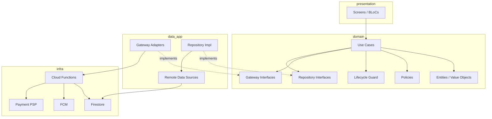

# Backend-Agnostic Architecture — Quran Sessions

**ADR:** [002-quran-sessions-backend-agnostic-architecture.md](../../docs/adr/002-quran-sessions-backend-agnostic-architecture.md)  
**Package:** `packages/quran_sessions/` — **no Firebase imports in domain**  
**App adapter:** `apps/tilawa/lib/features/quran_sessions/`

---

## Layer diagram



---

## Domain entities

| Entity | File | Responsibility |
|--------|------|----------------|
| `QuranSessionAggregate` | `session_aggregate.dart` | Aggregate root wrapper |
| `SessionLifecycleStatus` | `session_lifecycle_status.dart` | Canonical state enum |
| `QuranBooking` | `quran_booking.dart` | Commercial reservation view |
| `QuranSession` | `quran_session.dart` | Operational session view |
| `SessionAuditEvent` | `session_audit_event.dart` | Audit entry |
| `CompensationRecord` | `compensation_record.dart` | Remediation tracking |
| `RescheduleRequest` | `reschedule_request.dart` | Pending reschedule |
| `SessionAttendance` | `session_attendance.dart` | Join evidence |
| `UserProfile` | `user_profile.dart` | Student profile |
| `TeacherProfile` | `teacher_profile.dart` | Public teacher |
| `TeacherApplication` | `teacher_application.dart` | Private onboarding |
| `QuranTeacher` | `quran_teacher.dart` | Marketplace list item |
| `SessionPolicy` / safety | `session_policy.dart` | Safety + eligibility |
| `MarketConfig` | `market_config.dart` | Country/city pricing |

**Value objects:** `SessionAction`, `ActorRole`, `ActionSource`, `SessionSlot`, `SessionPrice`.

---

## Use cases (command + query)

### Commands (mutations via gateway)

| Use case | Gateway method | CF callable |
|----------|----------------|-------------|
| `CreateSessionBookingUseCase` | createBooking | createSessionBooking |
| `CancelSessionUseCase` | cancel | cancelSessionBooking |
| `RequestRescheduleUseCase` | requestReschedule | requestSessionReschedule |
| `ConfirmRescheduleUseCase` | confirmReschedule | confirmSessionReschedule |
| `RespondToRescheduleRequestUseCase` | accept/reject | confirmSessionReschedule |
| `MarkNoShowUseCase` | markNoShow | markSessionNoShow |
| `CompleteSessionUseCase` | complete | completeSession |
| `IssueCompensationUseCase` | issueCompensation | issueSessionCompensation |
| `ExpirePendingReservationsUseCase` | — (system) | expirePendingReservations |

### Queries (repositories)

| Use case | Repository |
|----------|------------|
| `GetStudentSessionsUseCase` | SessionRepository |
| `GetTeacherSessionsUseCase` | SessionRepository |
| `GetSessionTimelineUseCase` | AuditRepository |
| `GetTeachersUseCase` | TeacherRepository |
| `GetTeacherAvailabilityUseCase` | TeacherRepository + AvailabilityProvider |
| `ValidateBookingEligibilityUseCase` | Multiple read repos |
| `GetSessionPolicyUseCase` | SessionPolicyRepository |
| `GetMarketConfigUseCase` | MarketConfigRepository |

### Teacher lifecycle

| Use case | Repository |
|----------|------------|
| `SubmitTeacherApplicationUseCase` | TeacherApplicationRepository |
| `ApproveTeacherApplicationUseCase` | Admin gateway |
| `CompleteTeacherProfileUseCase` | TeacherProfileRepository |

---

## Repository interfaces

Path: `packages/quran_sessions/lib/src/domain/repositories/`

| Interface | Responsibility |
|-----------|----------------|
| `SessionAggregateRepository` | Load/save aggregate for mutations |
| `BookingRepository` | Legacy booking reads + reviews |
| `SessionRepository` | Session reads |
| `TeacherRepository` | Marketplace + slots + reviews |
| `TeacherProfileRepository` | Teacher public profile CRUD |
| `TeacherApplicationRepository` | Application lifecycle |
| `UserProfileRepository` | Student profile |
| `SessionPolicyRepository` | Safety + teacher eligibility policies |
| `MarketConfigRepository` | Country/city config |
| `MarketSchedulingConfigRepository` | Scheduling policy config |
| `ScheduleRepository` | Weekly schedule persistence |
| `AuditRepository` | Append-only events (read + append via gateway) |

---

## Gateway interfaces (infrastructure ports)

Path: `packages/quran_sessions/lib/src/domain/gateways/`

```dart
abstract interface class SessionCommandGateway {
  Future<Either<Failure, SessionCommandResult>> createBooking(...);
  Future<Either<Failure, Unit>> cancel(...);
  Future<Either<Failure, Unit>> requestReschedule(...);
  Future<Either<Failure, Unit>> confirmReschedule(...);
  Future<Either<Failure, Unit>> markNoShow(...);
  Future<Either<Failure, Unit>> complete(...);
  Future<Either<Failure, Unit>> openDispute(...);
  Future<Either<Failure, Unit>> reportConcern(...);
}

abstract interface class CompensationGateway {
  Future<Either<Failure, CompensationResult>> execute(...);
}

abstract interface class SessionNotificationGateway {
  Future<void> enqueue(SessionNotificationEvent event);
}
```

**App implementations:**
- `firebase_session_command_gateway.dart` — callable CF wrapper + idempotencyKey
- `firebase_session_notification_gateway.dart`
- Fake variants for MVP/tests

---

## Policy layer

Path: `packages/quran_sessions/lib/src/domain/policies/`

| Policy | Evaluates |
|--------|-----------|
| `ConfigurableCancellationPolicy` | Cancel timing → refund fraction, compensations |
| `ConfigurableCompensationPolicy` | Trigger → CompensationAction list |
| `ReschedulePolicy` | Count + window |
| `NoShowPolicy` | Grace, classification |
| `BookingIntegrityValidator` | Server-side booking checks |
| `SchedulingPolicyResolver` | Merges platform + market config |

**Boundaries (swap for infra):** `PaymentProvider`, `CallProvider`, `TeacherPayoutProvider`, `AvailabilityProvider`.

---

## Lifecycle engine

| Component | Role |
|-----------|------|
| `SessionTransitionTable` | Declarative transitions |
| `SessionLifecycleGuard` | Validates action + actor + from-state |
| `TransitionSideEffect` | Declares post-transition effects |
| `legacy_status_lifecycle_mapper.dart` | Migration bridge |

Pure Dart — 100% unit testable without Firebase.

---

## Adapters (app layer)

`apps/tilawa/lib/features/quran_sessions/`:

| Adapter | Purpose |
|---------|---------|
| `quran_sessions_firebase_module.dart` | DI wiring production |
| `quran_sessions_mvp_module.dart` | Fake MVP wiring |
| `firestore_*_repository.dart` | Firestore read repos |
| `firebase_session_command_gateway.dart` | CF callables |
| `disabled_payment_provider.dart` | Beta stub |
| `fake_mvp_*` | MVP fakes |

**DI:** get_it modules register interfaces → implementations per environment.

---

## Cloud Functions (domain mirror)

`functions/src/quranSessions/`:

| Module | Role |
|--------|------|
| `sessionLifecycleService.ts` | Transition execution |
| `bookingEligibilityService.ts` | Server eligibility |
| `idempotencyService.ts` | Dedup operations |
| `notificationOutboxService.ts` | Enqueue |
| `financialLedgerService.ts` | Refund/compensation ledger |
| `metricsAggregationService.ts` | Teacher/student metrics |

TS domain should stay aligned with Dart transition table (shared test vectors recommended).

---

## Presentation layer

| BLoC | Screens |
|------|---------|
| `BookingBloc` | BookingScreen |
| `MySessionsBloc` | MySessionsScreen |
| `TeacherListBloc` | TeacherListScreen, Home |
| `TeacherProfileBloc` | TeacherProfileScreen |
| `TeacherDashboardBloc` | TeacherDashboardScreen |
| `TeacherApplicationBloc` | Application screens |
| `SessionDetailBloc` | SessionDetailScreen |
| `AvailabilityCubit` | Weekly availability |
| `ProfileCompletionBloc` | ProfileCompletionScreen |

No `BuildContext` below presentation. Failures → `QuranSessionsFailure` + l10n.

---

## Feature flags (composition root)

`QuranSessionsFeatureConfig`:
- `quranSessionsEnabled`
- `teacherApplicationEnabled`
- `quranSessionsBookingEnabled`
- `teacherApplicationDiscoverability`

Resolved in app — injected into screens, not read from env in package.

---

## Testing strategy (architecture-level)

| Layer | Test type | Location |
|-------|-----------|----------|
| Lifecycle guard | Unit 100% | `test/domain/lifecycle/` |
| Policies | Unit | `test/domain/policies/` |
| Use cases | Unit + fakes | `test/domain/usecases/` |
| BLoCs | bloc_test | `test/presentation/blocs/` |
| CF | Jest + emulator | `functions/test-integration/` |
| Rules | rules unit | `functions/test-rules/` |

---

## Known architectural gaps

| Gap | Impact | Remediation |
|-----|--------|-------------|
| Split booking + session repos vs aggregate | Dual-write sync risk | Domain aggregate + CF transaction (partially done) |
| Some reads still legacy status | UI wrong state | Prefer lifecycleStatus in mappers |
| PaymentProvider disabled at DI | Paid blocked | Register real provider in paid module |
| Notification gateway no-op delivery | Silent users | App FCM handler + delivery worker |
| Admin uses mixed read/write paths | Security | Facades → CF only for writes |
| Reschedule split across 2 use cases | UX complexity | Single orchestration facade optional |

---

## Extension points (paid / future)

| Swap | Interface |
|------|-----------|
| Stripe/Tap | PaymentProvider |
| Agora | CallProvider |
| REST backend | SessionCommandGateway HTTP impl |
| Postgres | Repository impl behind same interfaces |
| Email channel | Notification delivery adapter |

Domain use cases unchanged per ADR-002.
