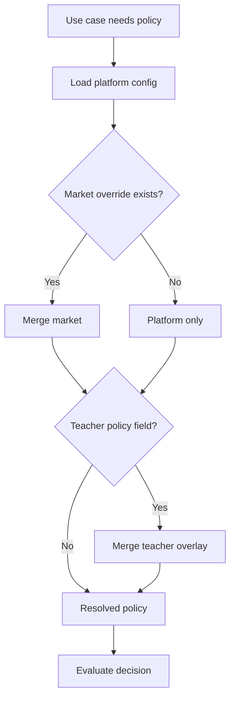

# Business Rules — Quran Sessions

**Principle:** No hardcoded money amounts or policy thresholds in app code. All rules resolve from **configuration hierarchy**:

1. `quran_session_platform_config/global` (platform default)
2. `quran_session_market_configs/{countryCode}` (market/country override)
3. `quran_teacher_profiles/{id}.teacherPolicy` (teacher policy overlay — optional)
4. Code fallback (`StandardCancellationPolicy`, etc.) — emergency only

**Implementation:** `ConfigurableCancellationPolicy`, `ConfigurableCompensationPolicy`, `SchedulingPolicyResolver` in `packages/quran_sessions/lib/src/domain/policies/`.

---

## Configuration schema (conceptual)

```json
{
  "bookingPolicy": {},
  "cancellationPolicy": {},
  "reschedulePolicy": {},
  "noShowPolicy": {},
  "compensationPolicy": {},
  "refundPolicy": {},
  "suspensionPolicy": {},
  "safetyPolicy": {},
  "pricingPolicy": {},
  "payoutPolicy": {},
  "subscriptionPolicy": {},
  "reminderPolicy": {}
}
```

See [data-model in spec 030](../030-quran-sessions-domain/data-model.md) for Firestore field names.

---

## 1. Booking rules

| Rule ID | Description | Platform default | Market override | Teacher override | Beta | Paid |
|---------|-------------|------------------|-----------------|------------------|------|------|
| BK-01 | minNoticeMinutes | 60 | yes | no | ✅ | ✅ |
| BK-02 | maxHorizonDays | 30 | yes | no | ✅ | ✅ |
| BK-03 | maxConcurrentUpcomingPerStudent | 3 | yes | no | ✅ | ✅ |
| BK-04 | maxDailyBookingsPerTeacher | 8 | yes | yes | ✅ | ✅ |
| BK-05 | pendingPaymentTtlMinutes | 15 | yes | no | N/A | ✅ |
| BK-06 | requireProfileComplete | true | — | — | ✅ | ✅ |
| BK-07 | allowFreeBooking | true | yes | — | ✅ | ✅ |
| BK-08 | allowPaidBooking | false | yes | — | ❌ | ✅ |
| BK-09 | slotDurationMinutes | 30,45,60 | yes | yes | ✅ | ✅ |
| BK-10 | idempotencyRequired | true | — | — | ✅ | ✅ |

**Eligibility chain (non-configurable logic, configurable inputs):**
Profile → account active → market enabled → teacher verified → pricing in market → global safety → teacher eligibility → gender → age/guardian.

Source: `ValidateBookingEligibilityUseCase`.

---

## 2. Cancellation rules

| Rule ID | Description | Config keys | Default |
|---------|-------------|-------------|---------|
| CN-01 | earlyCancellationHours | `earlyCancellationHours` | 24 |
| CN-02 | earlyRefundFraction | `earlyRefundFraction` | 1.0 |
| CN-03 | lateRefundFraction | `lateRefundFraction` | 0.0 |
| CN-04 | studentLateCountsAsUsed | `studentLateCountsAsUsed` | true |
| CN-05 | blockCancelWithinMinutes | `blockCancelWithinMinutes` | 60 |
| CN-06 | teacherCancelAlwaysCompensates | `teacherCancelCompensate` | true |
| CN-07 | cancelReasonMinLength | `cancelReasonMinLength` | 20 |
| CN-08 | teacherCancelCountsTowardMetric | always true | — |
| CN-09 | adminCancelRequiresCompensationChoice | always true | — |

**Teacher cancel:** Mandatory reason → immediate non-attendable → auto compensation list from `compensationPolicy.teacherCancel`.

**Student cancel:** Policy evaluates hours until `startsAt` → refund fraction + credit consumption.

**Challenge existing:** `StandardCancellationPolicy` in boundaries was unwired from use cases — must use `ConfigurableCancellationPolicy` via CF.

---

## 3. Rescheduling rules

| Rule ID | Description | Config | Default |
|---------|-------------|--------|---------|
| RS-01 | maxReschedulesPerSession | `maxReschedules` | 1 |
| RS-02 | minHoursBeforeSession | `minHoursBeforeSession` | 24 |
| RS-03 | requestExpiresHours | `requestExpiresHours` | 48 |
| RS-04 | autoAcceptIfSinglePartyMarket | `autoAcceptReschedule` | false |
| RS-05 | adminCanForceWithoutConsent | always true | — |
| RS-06 | rescheduleReasonMinLength | `rescheduleReasonMinLength` | 20 |

---

## 4. No-show rules

| Rule ID | Description | Config | Default |
|---------|-------------|--------|---------|
| NS-01 | gracePeriodMinutes | `gracePeriodMinutes` | 15 |
| NS-02 | autoMarkBothNoShowAfterMinutes | `autoMarkBothNoShowAfterMinutes` | 30 |
| NS-03 | teacherCanMarkStudentNoShow | `teacherCanMarkStudentNoShow` | true |
| NS-04 | teacherMarkRequiresGraceElapsed | always true | — |
| NS-05 | teacherNoShowAutoCompensates | uses compensationPolicy | true |
| NS-06 | studentNoShowConsumesCredit | `studentNoShowConsumesCredit` | true |
| NS-07 | evidenceRequiredForManualNoShow | `evidenceRequired` | false Beta, true Paid |

**Detection order:** Call webhook → scheduled job → manual (teacher/admin).

---

## 5. Compensation rules

| Trigger | Default actions (config array) | Executor |
|---------|--------------------------------|----------|
| teacherCancel | `restoreSessionCredit` | CompensationGateway |
| teacherNoShow | `restoreSessionCredit`, `issueWalletCredit` | Gateway |
| adminChoice | selectable list | Admin UI |
| dispute favor_student | admin selected | CF |

**Types (enum):** restoreSessionCredit, grantReplacementSession, extendSubscriptionPeriod, issueWalletCredit, createManualReviewCase, processPaymentRefund, none.

**Beta constraint:** Only non-monetary types enabled; monetary types create `manual_pending` ledger.

Source: `compensation_policy.dart`, `financialLedgerService.ts`.

---

## 6. Refund rules `[P]`

| Rule ID | Description | Config | Default |
|---------|-------------|--------|---------|
| RF-01 | autoRefundOnEarlyStudentCancel | `autoRefundEarlyCancel` | true |
| RF-02 | autoRefundOnTeacherCancel | `autoRefundTeacherCancel` | true |
| RF-03 | refundProcessingDays | `refundProcessingDays` | 7 |
| RF-04 | manualReviewThresholdAmount | market currency | admin sets |
| RF-05 | idempotentRefundKeys | always true | — |

**Beta:** All refunds → `manual_pending` record; no PSP call.

---

## 7. Suspension rules

| Rule ID | Description | Config | Default |
|---------|-------------|--------|---------|
| SU-01 | teacherCancelThreshold90d | `teacherCancelThreshold` | null Beta |
| SU-02 | studentNoShowThreshold90d | `studentNoShowThreshold` | null Beta |
| SU-03 | autoSuspendOnThreshold | `autoSuspendEnabled` | false Beta |
| SU-04 | suspensionDurationDays | `suspensionDurationDays` | 7 |
| SU-05 | restrictionReasonRequired | always true | — |

**Account statuses:** active, underReview, suspended, blocked.

**Restriction reasons:** falseIdentity, policyViolation, safetyConcern, abuseReport, repeatedNoShow, adminDecision.

---

## 8. Child / guardian rules

| Rule ID | Description | Config | Default |
|---------|-------------|--------|---------|
| CH-01 | childAgeThresholdYears | `childAgeThreshold` | 13 |
| CH-02 | requireGuardianForChildBooking | `requireGuardianApproval` | true |
| CH-03 | guardianCanCancelOnBehalf | `guardianCanCancel` | true |
| CH-04 | videoCallAllowedForChildren | `videoCallAllowedForChildren` | false |
| CH-05 | teacherCanTeachChildren | per teacher policy | admin set |

**Gap:** Guardian linking flow not built — rule CH-02 blocks but no remediation UI.

Source: `QuranSessionSafetyPolicy`, `TeacherEligibilityPolicy`.

---

## 9. Gender matching rules

| Rule ID | Description | Source |
|---------|-------------|--------|
| GN-01 | sameGenderOnly default | platform safety policy |
| GN-02 | teacher allowedGenders override | teacher eligibility policy |
| GN-03 | crossGenderRequiresGuardianPresent | `[Future]` config |

Evaluated in eligibility step 7 — never UI-only.

---

## 10. Free vs paid sessions

| Aspect | Free `[Beta]` | Paid `[P]` |
|--------|---------------|------------|
| pricingType | free | fixedPerSession / subscription |
| Booking path | confirmFreeBooking | pendingPayment → confirmBooking |
| Payment provider | DisabledPaymentProvider | Stripe/Tap/etc. |
| Refund | N/A (credit only) | PSP + ledger |
| Teacher payout | None | payoutPolicy |
| Commission | 0 | platformCommissionPercent per market |
| Price display | "مجاني" / PriceFormatter | Market-resolved SessionPrice |

**Market price bounds:** `minSessionPrice`, `maxSessionPrice` on market config — admin enforced.

---

## 11. Subscription rules `[Future / Paid]`

| Rule ID | Description |
|---------|-------------|
| SUB-01 | sessionsPerPeriod |
| SUB-02 | rolloverUnused |
| SUB-03 | cancelSubscriptionRefundPolicy |
| SUB-04 | extendPeriodOnTeacherCancel compensation type |

Entity support: `SessionPricingType.subscription` — not implemented end-to-end.

---

## 12. Teacher payout rules `[Paid]`

| Rule ID | Description | Config |
|---------|-------------|--------|
| PO-01 | payoutSchedule | weekly / monthly |
| PO-02 | platformCommissionPercent | market doc |
| PO-03 | holdPeriodDays | 7 |
| PO-04 | payoutMinAmount | market currency |
| PO-05 | forfeitOnStudentNoShow | teacher keeps % |

**Gateway:** `TeacherPayoutProvider` stub — swap for paid phase.

---

## 13. Reminder & notification rules

| Rule ID | Description | Default |
|---------|-------------|---------|
| NT-01 | reminderHoursBefore | [24, 1] |
| NT-02 | bookingConfirmedChannels | [push] |
| NT-03 | disputeAlertChannels | [push, email admin] |
| NT-04 | quietHoursRespectTimezone | true |

---

## Rule resolution algorithm



**Cache:** Market config cached in app session; invalidate on profile country change.

---

## Anti-patterns (challenge existing code)

| Anti-pattern | Location | Fix |
|--------------|----------|-----|
| Hardcoded 24h cancel in UI copy | booking/cancel sheets | Read from resolved policy |
| Fixed 1h min notice in BookingPolicy only | boundaries/scheduling | Inject from config repo |
| EGP assumed global | old MVP store | Market-derived currency only |
| Cancel always student actor | legacy cancel path | Actor-aware gateway |
| Payment amount in widget | none should exist | SessionPrice from repo |

---

## Beta vs Paid rule activation

| Policy block | Beta active keys | Paid adds |
|--------------|------------------|-----------|
| bookingPolicy | BK-01–04, 06–07, 10 | BK-05, 08 |
| cancellationPolicy | CN-01–09 (no money) | CN-02–03 monetary |
| compensationPolicy | credit types only | wallet, refund |
| refundPolicy | manual_pending only | RF-01–05 |
| payoutPolicy | disabled | all |
| subscriptionPolicy | disabled | SUB-* |
