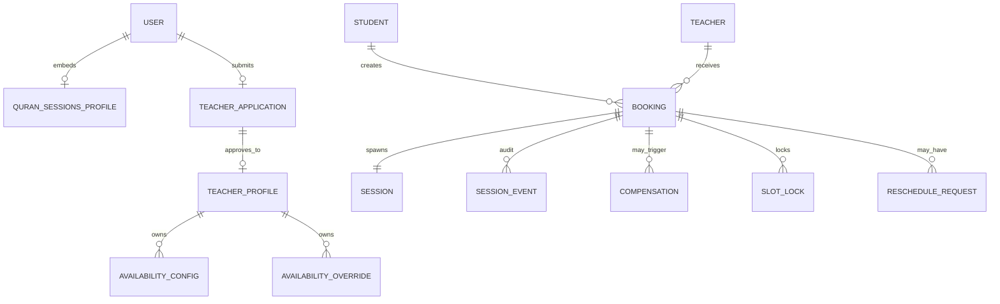
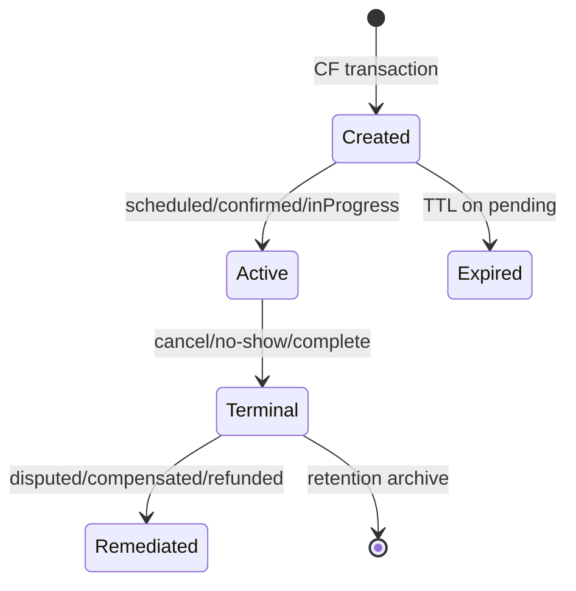

# Data Ownership, Security & Lifecycle — Quran Sessions

**Scope:** Firestore collections, read/write matrix, security rules implications, document lifecycle.  
**Reference:** [docs/quran_sessions_firestore_security_rules.md](../../docs/quran_sessions_firestore_security_rules.md), [spec 030 data-model](../030-quran-sessions-domain/data-model.md).

---

## Ownership model



**Aggregate ID** links booking + session + events + compensations.

---

## Collection ownership summary

| Collection | Owner (data controller) | Created by | Mutated by |
|------------|-------------------------|------------|------------|
| `users/{uid}.quranSessionsProfile` | User (student) | User on first entry | User (limited fields); admin CF (status) |
| `quran_teacher_applications/{id}` | Applicant user | Applicant | Applicant (draft→pending); admin CF (review) |
| `quran_teacher_profiles/{id}` | Platform + teacher | CF on approve | Teacher (limited); admin CF |
| `availability_config/{teacherId}` | Teacher | Teacher | Teacher |
| `availability_overrides/{teacherId}/...` | Teacher | Teacher | Teacher |
| `quran_bookings/{id}` | Student + teacher (participants) | CF createSessionBooking | **CF only** |
| `quran_sessions/{id}` | Participants | CF | **CF only** |
| `quran_session_events/{id}` | Platform audit | CF append | **Append-only CF** |
| `quran_session_compensations/{id}` | Platform | CF | CF status updates |
| `quran_session_notifications/{id}` | Platform | CF | Delivery workers |
| `quran_reschedule_requests/{id}` | Requester | CF | CF |
| `quran_slot_locks/{id}` | Platform | CF | CF / TTL |
| `quran_teacher_metrics/{id}` | Platform denorm | CF | CF |
| `quran_student_metrics/{id}` | Platform denorm | CF | CF |
| `quran_session_market_configs/{cc}` | Platform ops | Admin seed | Admin |
| `quran_session_platform_config/global` | Platform ops | Admin seed | Admin |
| `quran_session_refunds/{id}` | Platform finance | CF | CF / finance ops |
| `quran_admin_actions/{id}` | Platform | CF | Append-only |

---

## Read / write matrix (client vs server)

| Collection | Student read | Teacher read | Admin read | Client write | Server write |
|------------|----------------|--------------|------------|--------------|--------------|
| quranSessionsProfile (own) | own | own | all | own safe fields | moderation fields |
| quran_teacher_applications | own | own | all | own draft/submit | review |
| quran_teacher_profiles | public visible | own | all | own profile fields | moderate |
| availability_* | no | own | yes | own | — |
| quran_bookings | participant | participant | all | **deny** | CF |
| quran_sessions | participant | participant | all | **deny** | CF |
| quran_session_events | participant | participant | all | **deny** | CF append |
| quran_session_compensations | own related | own related | all | **deny** | CF |
| quran_slot_locks | deny | deny | admin | **deny** | CF |
| market_configs | enabled markets | enabled | all | deny | admin |
| platform_config | deny | deny | admin | deny | admin |

**Critical P0:** `accountStatus` and `restrictionReason` on profile are **owner-immutable** (rules test in `usersModeration.rules.test.ts`).

---

## Security rules implications

### Principle: server-authoritative session mutations

```
match /quran_bookings/{id} {
  allow read: if isParticipant() || isAdmin();
  allow write: if false;  // CF Admin SDK only
}
```

Same pattern for `quran_sessions`, events, compensations, slot locks.

### Teacher application rules

- Applicant can create/update own application while status in `draft`.
- Submit transition draft→pending: validated fields only.
- Phone number readable by applicant + admin only — never on public profile.

Source: ADR-003, Firestore rules.

### Availability rules

- Teacher can write own `availability_config` and overrides.
- **Must not** allow teacher to mutate `isBooked` on legacy slot docs if still present — booking state comes from aggregates.

### Admin reads

Admin panel uses Firebase Admin SDK in CF OR authenticated reads with `isAdmin()` custom claim.

**Anti-pattern blocked:** Angular panel direct Firestore writes to bookings — use facades → CF only.

---

## Document lifecycle

### Booking + session (paired)



**Retention:** Active records indefinite; audit events indefinite; notifications 90d; failed compensations until resolved.

### Slot lock lifecycle

| lockType | Created | Expires |
|----------|---------|---------|
| soft | initiatePayment | pendingPaymentTtl |
| hard | confirmBooking | session ends + buffer |
| released | cancel / complete / expire | deleted or TTL |

### Audit events

- **Append-only** — no update/delete in rules or CF.
- Every lifecycle transition → ≥1 event.
- Admin timeline = ordered query on `aggregateId`.

### Compensation records

States: `pending` → `completed` | `failed` | `cancelled`  
Failed records retry with idempotent gateway keys.

---

## PII & sensitive data

| Field | Location | Exposure |
|-------|----------|----------|
| Phone | teacher_applications only | Applicant + admin |
| Email | users root | Owner + admin |
| dateOfBirth | quranSessionsProfile | Owner + admin; not public |
| Gender | profile + teacher profile | Used for matching; public for teacher |
| meetingLink | session doc | Participants only |
| cancellationReason | booking | Participants + admin |
| paymentReference | booking | Admin + owner student |

**Child data:** Minimize retention; guardianId when implemented — admin + guardian read.

---

## Firestore rules checklist (pre-Beta)

- [ ] Client write denied on bookings/sessions/events
- [ ] Participant-scoped reads on sessions/bookings
- [ ] Admin claim helper `isAdmin()` / `isModerator()`
- [ ] Profile accountStatus owner-immutable
- [ ] Teacher application phone not readable by other users
- [ ] Slot locks fully server-side
- [ ] Audit collection append-only (no client create)

Deploy: `firebase deploy --only firestore:rules`

---

## Index requirements

From `firestore.indexes.json` + data-model:

| Query | Index |
|-------|-------|
| Student upcoming sessions | studentId ASC, startsAt DESC |
| Teacher upcoming | teacherId ASC, startsAt DESC |
| Admin filter by status | lifecycleStatus ASC, startsAt DESC |
| Admin market filter | countryCode, cityId, startsAt |
| Audit timeline | aggregateId ASC, timestamp ASC |
| Pending applications | status ASC, submittedAt DESC |

---

## Migration & dual-read lifecycle

| Phase | Read | Write |
|-------|------|-------|
| M0 | legacy status | both fields |
| M1 | lifecycleStatus preferred | both |
| M2 | lifecycle only | lifecycle + CF |
| M3 | lifecycle only | lifecycle only |

Bridge: `effectiveLifecycleStatus` in Dart entities.

Scripts: `backfillBookingSessionConsistency`, `quran-sessions:backfill-lifecycle`.

---

## Threat model (summary)

| Threat | Mitigation |
|--------|------------|
| Client forges booking | Rules deny write; CF validates |
| Student books for another | Auth uid in CF |
| Teacher self-approves | Admin claim on review CF |
| Race double-book | Slot lock transaction |
| Blocked user re-enables self | Rules immutable status |
| Refund replay | Idempotency key |
| Audit tampering | Append-only + admin SDK |
| PII leak via profile | Field-level rules |

---

## Beta vs Paid security additions

| Control | Beta | Paid |
|---------|------|------|
| Payment webhook auth | N/A | HMAC verify |
| Refund approval | Admin only | Admin + automated |
| PCI scope | None | Tokenized PSP only |
| Financial audit export | Manual | Required |
