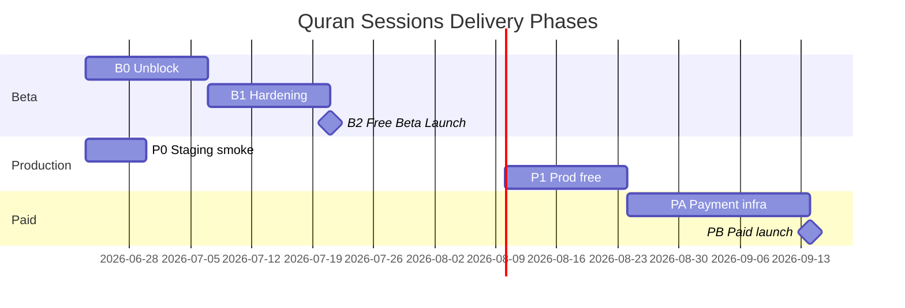
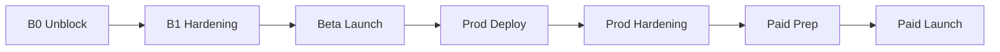

# Implementation Roadmap — Quran Sessions

**Product:** MeMuslim / أنا مسلم — Quran Sessions  
**Horizon:** Free Beta → Production (free) → Paid sessions  
**Last aligned with codebase:** 2026-06-23

---

## Phase overview

---

## Phase B0 — Beta unblock (2 weeks)

**Goal:** End-to-end free booking works on staging with real auth, real teachers, minimal ops.

| # | Task | Exit criteria | Beta |
|---|------|---------------|------|
| B0-1 | Enable `quranSessionsBookingEnabled` on **staging** only | Book succeeds on staging | ✅ |
| B0-2 | Seed ≥5 approved public teachers (EG market) | Visible in teacher list | ✅ |
| B0-3 | Display `meetingLink` on session detail + My Sessions | Manual QA join | ✅ |
| B0-4 | Complete cancel reason UX → `SessionCommandGateway` | Reason required; actor correct | ✅ |
| B0-5 | Wire booking confirmation FCM | Push received on book | ✅ |
| B0-6 | Session reminder T-24h job | Push before session | ✅ |
| B0-7 | Report concern UI → `reportSessionConcern` | Report in admin/events | ✅ |
| B0-8 | Deploy CF + rules to staging | smoke script passes | ✅ |
| B0-9 | Run backfill lifecycle + consistency | 0 ambiguous rows | ✅ |
| B0-10 | `ValidateBookingEligibilityUseCase` tests | 12 cases green | ✅ |

**Go/No-Go gate B0:**
- [ ] Staging smoke 10/10 ([production-readiness-p0.md](../030-quran-sessions-domain/production-readiness-p0.md))
- [ ] `flutter test packages/quran_sessions` green
- [ ] `npm run test:integration` green

---

## Phase B1 — Beta hardening (2 weeks)

**Goal:** Reschedule, dispute, admin actions, edge cases covered.

| # | Task | Exit criteria |
|---|------|---------------|
| B1-1 | Reschedule E2E (request + confirm) | CF + UI wired |
| B1-2 | Open dispute UI | Student can open from completed |
| B1-3 | Admin session actions QA | Cancel, no-show, resolve dispute |
| B1-4 | Admin reports/disputes queue screens | A-10, A-11 |
| B1-5 | Filter bar UI (specialization/language) | Teacher list filter works |
| B1-6 | ARB migration for session strings | No hardcoded AR in screens |
| B1-7 | ProfileCompletionBlocTest | P0 coverage |
| B1-8 | Widget tests: booking, session detail | WS-01, WS-03 |
| B1-9 | Edge case test sweep E01–E56 | Matrix rows mapped |
| B1-10 | Ops runbook published | Admin checklist signed |

**Go/No-Go gate B1 (Free Beta Launch):**
- [ ] 20 internal users complete book → join → complete flow
- [ ] <5% booking failure rate (excl. user errors)
- [ ] Admin can resolve dispute within 48h SLA
- [ ] Kill switch tested (`quranSessionsBookingEnabled=false`)

---

## Phase P0 — Staging → Production (free)

**Goal:** Production free sessions with monitoring.

| # | Task | Exit criteria |
|---|------|---------------|
| P0-1 | Production deploy CF + rules | Version tagged |
| P0-2 | Production backfill | Clean audit |
| P0-3 | Enable booking flag prod (limited rollout) | Feature flag % rollout |
| P0-4 | Sentry alerts on CF errors | Alert policy |
| P0-5 | Metrics dashboard v0 | Cancellation/no-show counts |
| P0-6 | Teacher supply onboarding pipeline | Weekly application review |
| P0-7 | L10n EN for sessions | app_en.arb complete |

**Go/No-Go production free:**
- [ ] 7 days staging stable
- [ ] Zero P0 bugs open
- [ ] Legal/safety copy approved (child, gender policies)

---

## Phase P1 — Production hardening (ongoing)

| # | Task | When |
|---|------|------|
| P1-1 | Guardian linking flow | Before child marketing |
| P1-2 | Teacher mark student no-show UI | After grace policy verified |
| P1-3 | In-app call (Agora V2) | Optional |
| P1-4 | Teacher earnings preview (non-paid) | Optional |
| P1-5 | Maestro E2E in CI | Quality |
| P1-6 | Auto-suspend on metrics thresholds | Configurable |

---

## Phase PA — Paid sessions prep (3 weeks)

**Goal:** Payment capture, refund automation, teacher payout ledger.

| # | Task | Exit criteria | Paid |
|---|------|---------------|------|
| PA-1 | Select PSP (Tap/Stripe) for EG | Contract + sandbox | ✅ |
| PA-2 | Implement `PaymentProvider` | charge + refund | ✅ |
| PA-3 | `pendingPayment` UX + soft lock | TTL expiry works | ✅ |
| PA-4 | Paid booking in `createSessionBooking` | Removes payment_provider_unavailable | ✅ |
| PA-5 | Automated refund on early cancel | PSP + ledger | ✅ |
| PA-6 | Admin financial ledger UI | A-12 | ✅ |
| PA-7 | Teacher pricing self-serve | T-12 | ✅ |
| PA-8 | Teacher payout batch job | PO-* rules | ✅ |
| PA-9 | Commission calculation | market platformCommissionPercent | ✅ |
| PA-10 | Paid E2E staging | book → pay → complete → payout record | ✅ |

**Go/No-Go paid launch:**
- [ ] PCI scope review complete (tokenized only)
- [ ] Refund idempotency proven
- [ ] Finance sign-off on manual_pending → settled workflow
- [ ] Paid teacher supply ≥10 teachers

---

## Phase PB — Subscription & scale (future)

- Subscription pricing model (SUB-* rules)
- Multi-market expansion beyond EG
- Call provider webhooks for no-show
- OTP teacher verification (ADR-003)
- Recurring session packages

---

## Beta vs Paid feature matrix

| Feature | Free Beta | Prod Free | Paid |
|---------|-----------|-----------|------|
| Browse teachers | ✅ | ✅ | ✅ |
| Free booking | ✅ | ✅ | ✅ |
| Paid booking | ❌ | ❌ | ✅ |
| External meeting | ✅ | ✅ | ✅ |
| In-app A/V | ❌ | ❌ | Optional |
| FCM confirm/reminder | ✅ | ✅ | ✅ |
| Session credit compensation | ✅ | ✅ | ✅ |
| Money refund | manual | manual | auto |
| Teacher payout | ❌ | ❌ | ✅ |
| Disputes | ✅ | ✅ | ✅ |
| Guardian flow | ❌ | ☐ | ✅ |
| Subscriptions | ❌ | ❌ | Future |

---

## Go / No-Go criteria summary

### Free Beta — **Conditional Go**

| Criterion | Required |
|-----------|----------|
| Domain + CF tests green | Yes |
| Staging smoke 10/10 | Yes |
| ≥5 public teachers | Yes |
| meetingLink visible | Yes |
| Cancel + notify working | Yes |
| Admin session moderation | Yes |
| Payment | **Must be off** |
| Known gaps documented | Yes |

### Production (free) — **Go after Beta soak**

7-day Beta metrics review + kill switch drill.

### Paid — **No-Go until PA complete**

Payment E2E + refund automation + ledger reconciliation required.

---

## Risk register (delivery)

| Risk | Phase | Mitigation |
|------|-------|------------|
| Low teacher supply | B0 | Seed + recruit before flag on |
| CF deploy regression | P0 | Integration tests in CI |
| Policy misconfiguration | B1 | Config validation script |
| Refund fraud | PA | Idempotency + admin approval threshold |
| Scope creep (Agora) | P1 | Defer unless Beta feedback demands |

---

## Dependencies

**Parallel tracks:**
- Admin panel (A-10, A-11) can run during B1
- L10n migration can run during B0–B1
- Eligibility tests (B0-10) block Beta launch

---

## Success metrics

| Metric | Beta target | Paid target |
|--------|-------------|-------------|
| Booking success rate | >95% | >98% |
| Session completion rate | >80% | >85% |
| Teacher cancel rate | <10% | <5% |
| Dispute rate | <3% | <2% |
| Median dispute resolution | <48h | <24h |
| NPS (sessions users) | baseline | +10 |

---

## Related documents

- [README.md](./README.md) — executive summary
- [docs/quran_sessions_roadmap.md](../../docs/quran_sessions_roadmap.md) — living tracker
- [specs/030-quran-sessions-domain/plan.md](../030-quran-sessions-domain/plan.md) — domain implementation phases
- [production-readiness-p0.md](../030-quran-sessions-domain/production-readiness-p0.md) — staging smoke

**Next action:** Execute Phase B0 tasks; run staging smoke; decision meeting for Beta launch date.
