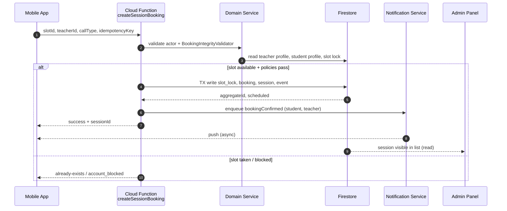
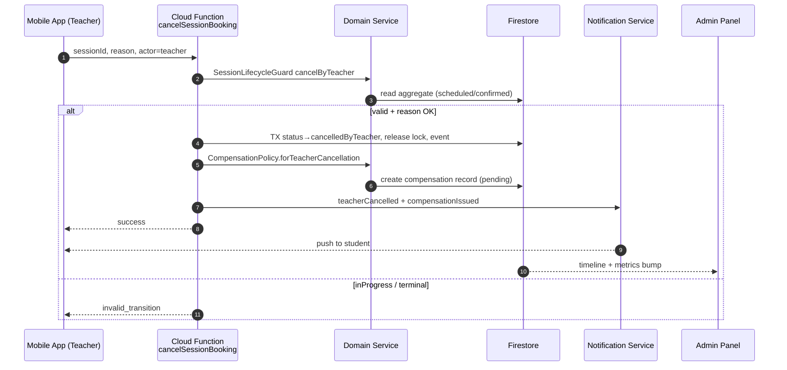
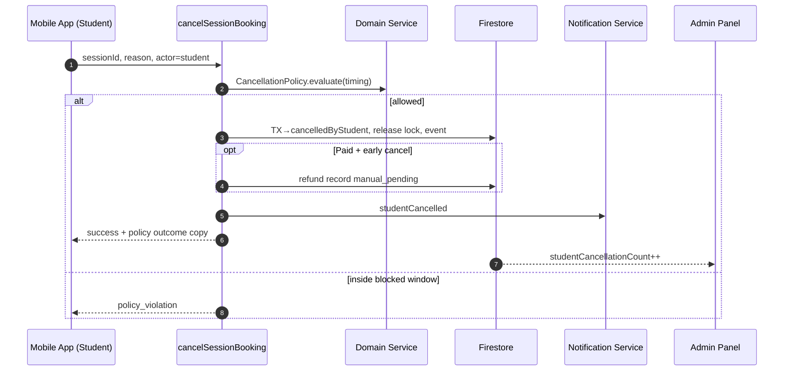
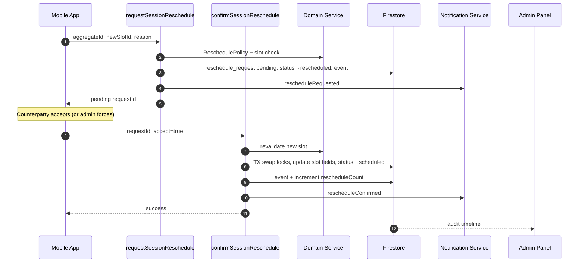
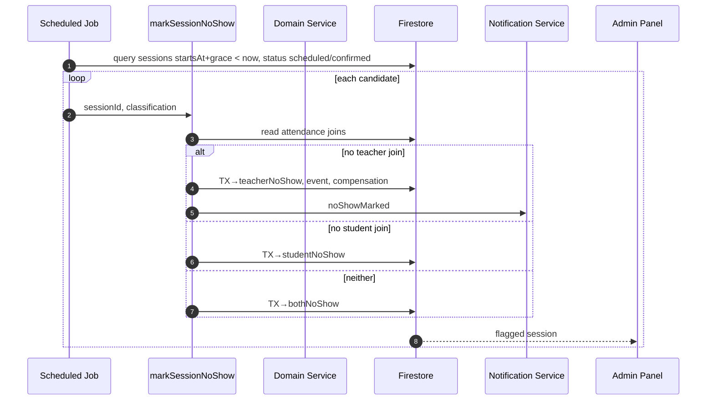
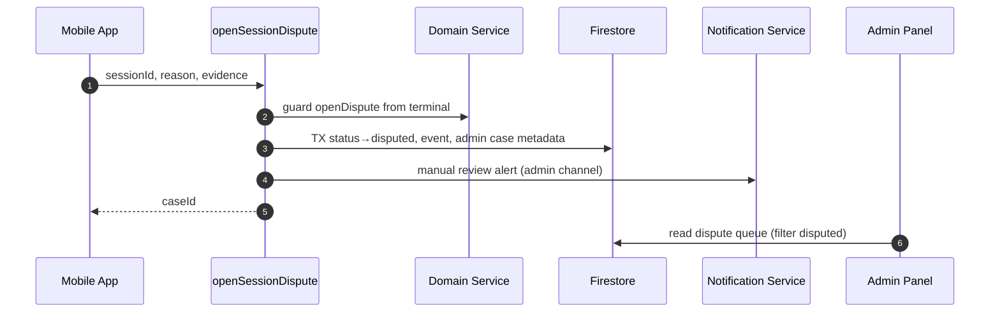
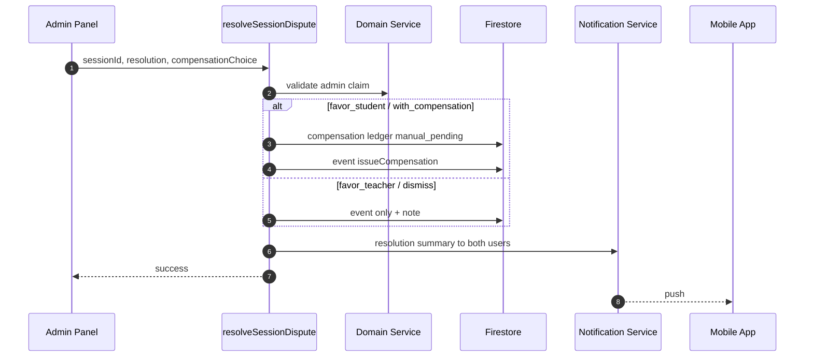
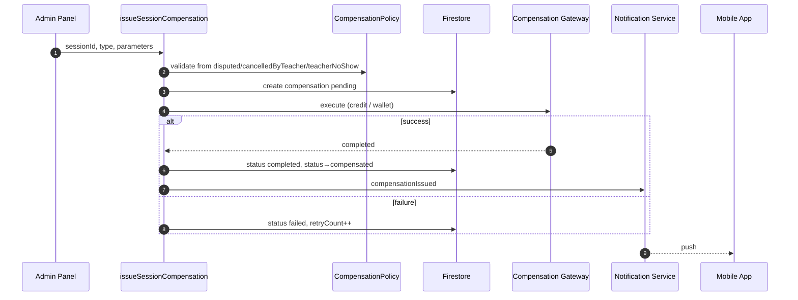
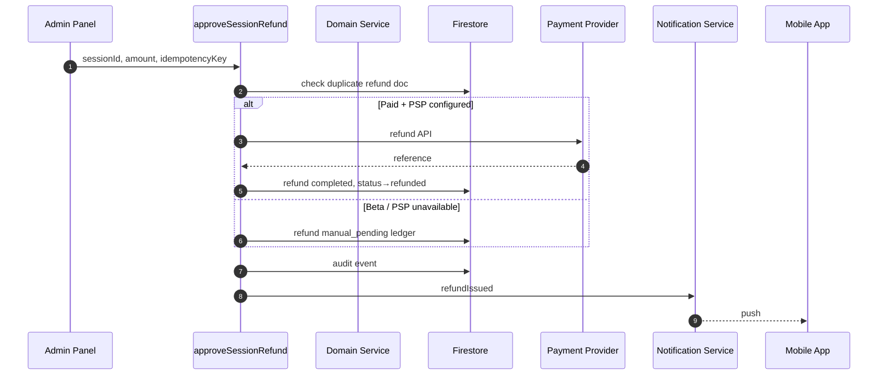
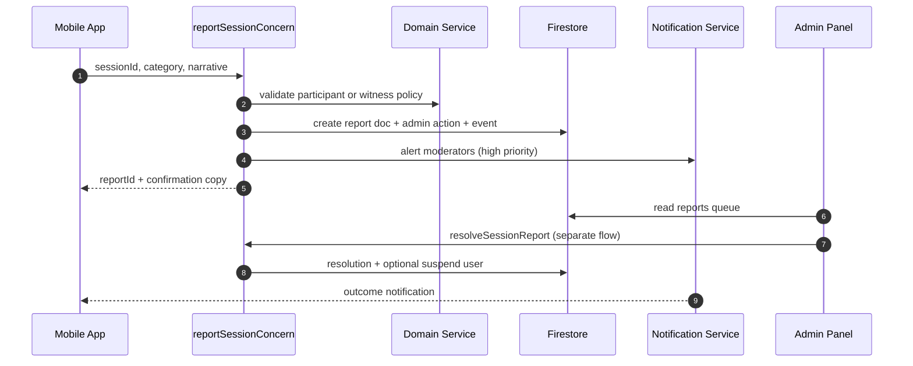

# Sequence Diagrams — Quran Sessions

Cross-system actors:
- **Mobile App** — Flutter (`apps/tilawa`, `packages/quran_sessions`)
- **Cloud Function/API** — Firebase callables (`functions/src/quranSessions/`)
- **Domain Service** — lifecycle + policy layer (TS + Dart mirror)
- **Firestore** — persistence
- **Notification Service** — outbox + FCM delivery
- **Admin Panel** — Angular (`apps/tilawa_admin`)

---

## 1. Create booking (free Beta)

**Idempotency:** Same key → same bookingId without duplicate docs (P0 smoke #4).

---

## 2. Cancel by teacher

---

## 3. Cancel by student

---

## 4. Reschedule (request + confirm)

**Invariant:** Old slot released only after new slot lock succeeds.

---

## 5. Mark no-show (system job)

---

## 6. Open dispute

**Gap:** Mobile dispute UI not implemented; CF exists.

---

## 7. Resolve dispute (admin)

---

## 8. Issue compensation

**Beta:** Gateway executes session credit only; no PSP.

---

## 9. Issue refund / manual pending

**Idempotency:** P0 smoke #6 — duplicate key → one ledger doc.

---

## 10. Report safety concern

**Gap:** Report UI missing on mobile; admin reports queue UI partial.

---

## Sequence index

| # | Flow | Primary CF | Beta |
|---|------|------------|------|
| 1 | Create booking | createSessionBooking | ✅ free |
| 2 | Teacher cancel | cancelSessionBooking | ✅ |
| 3 | Student cancel | cancelSessionBooking | ✅ |
| 4 | Reschedule | request + confirm | ✅ |
| 5 | No-show | markSessionNoShow | ✅ |
| 6 | Open dispute | openSessionDispute | UI gap |
| 7 | Resolve dispute | resolveSessionDispute | ✅ |
| 8 | Compensation | issueSessionCompensation | ✅ credit |
| 9 | Refund | approveSessionRefund | manual |
| 10 | Safety report | reportSessionConcern | UI gap |
