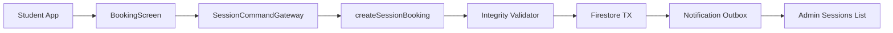
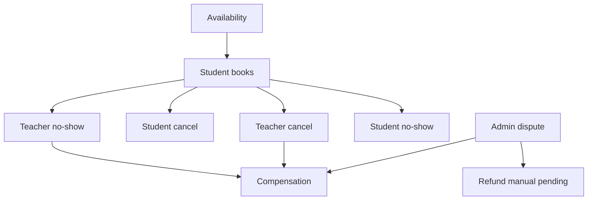

# Service Blueprints — Quran Sessions

Service blueprint format: **Front-stage** (user-visible) → **Back-stage** (systems) → **Failure points**.

Actors: Student (S), Teacher (T), Admin (A), System (Y).

---

## Blueprint 1 — Student books session

| Layer | Detail |
|-------|--------|
| **Front-stage** | S browses teacher → selects slot + call type → confirms booking |
| **App UI** | `BookingScreen`, `BookingBloc`, eligibility inline errors, success snackbar |
| **Backend** | `createSessionBooking` CF → `BookingIntegrityValidator` → `SessionLifecycleService` |
| **Firestore** | TX: `quran_slot_locks`, `quran_bookings`, `quran_sessions`, `quran_session_events`, `quran_session_notifications` |
| **Notifications** | `bookingConfirmed` → student + teacher outbox |
| **Admin visibility** | New row in sessions list; audit event |
| **Failure points** | Slot race (`already-exists`); blocked account; gender/age policy; teacher suspended; idempotency replay; payment unavailable `[Paid]` |

**Beta note:** Free path only; `confirmFreeBooking` transition.

**Challenge existing:** Feature flag `quranSessionsBookingEnabled: false` blocks UI submit even when CF ready.

---

## Blueprint 2 — Teacher cancels session

| Layer | Detail |
|-------|--------|
| **Front-stage** | T opens upcoming session → Cancel → enters reason → confirms |
| **App UI** | `SessionDetailScreen` teacher mode, `cancel_session_sheet.dart` |
| **Backend** | `cancelSessionBooking` CF, actor=teacher → `cancelByTeacher` |
| **Firestore** | Update booking+session lifecycleStatus; release slot lock; append event; create compensation record |
| **Notifications** | `teacherCancelled` → student immediate |
| **Admin visibility** | Timeline event; increment `teacherCancellationCount` on metrics |
| **Failure points** | Session inProgress (blocked); missing reason; already terminal; compensation gateway failure (retry queue) |

**Policy:** Auto-compensate student per `compensationPolicy.teacherCancel`.

---

## Blueprint 3 — Student cancels session

| Layer | Detail |
|-------|--------|
| **Front-stage** | S opens My Sessions → Cancel → reason → policy summary shown |
| **App UI** | `MySessionsBloc`, cancel sheet with policy copy (early vs late) |
| **Backend** | `cancelSessionBooking` actor=student → `cancelByStudent` |
| **Firestore** | Status update; slot release; optional refund record `[Paid]` |
| **Notifications** | `studentCancelled` → teacher |
| **Admin visibility** | Event + student cancellation metric |
| **Failure points** | Inside non-cancellable window; pendingPayment with capture in flight; network retry with idempotency |

**Challenge existing:** Legacy code always used `cancelled_by_student` — fixed in domain but verify all gateways pass actor.

---

## Blueprint 4 — Teacher no-show

| Layer | Detail |
|-------|--------|
| **Front-stage** | S waits past grace → sees "Teacher didn't join" → optional report CTA |
| **App UI** | Session detail status banner; student passive |
| **Backend** | Scheduled job OR admin mark → `markSessionNoShow` type=teacher |
| **Firestore** | lifecycleStatus=teacherNoShow; attendance.classification; compensation pending |
| **Notifications** | `noShowMarked` → both parties |
| **Admin visibility** | Flagged session; auto-compensation job |
| **Failure points** | False positive if teacher joined via unlogged channel; late join vs no-show classification |

**Detection priority:** System job at `startsAt + gracePeriodMinutes` without `teacherJoinedAt`.

---

## Blueprint 5 — Student no-show

| Layer | Detail |
|-------|--------|
| **Front-stage** | T waits in meeting → marks no-show OR system auto-marks |
| **App UI** | Teacher session detail → "Student didn't join" `[Beta]` |
| **Backend** | `markSessionNoShow` type=student |
| **Firestore** | studentNoShow; apply student policy (credit consumed) |
| **Notifications** | To student with policy explanation |
| **Admin visibility** | studentNoShowCount metric |
| **Failure points** | Teacher marks too early; student joined but late (lateJoin sub-state) |

---

## Blueprint 6 — Admin resolves dispute

| Layer | Detail |
|-------|--------|
| **Front-stage** | A opens dispute queue → reviews timeline → selects resolution |
| **App UI** | Admin `session-detail.component` resolution panel `[Beta fix]` |
| **Backend** | `resolveSessionDispute` CF |
| **Firestore** | Update status; may create compensation + refund ledger docs |
| **Notifications** | Resolution summary to both parties |
| **Admin visibility** | Full audit; ledger entry |
| **Failure points** | Partial financial resolution; duplicate resolve (idempotency); ambiguous prior status |

**Resolutions:** favor_student, favor_teacher, with_compensation, dismiss.

---

## Blueprint 7 — Student compensation (non-monetary Beta)

| Layer | Detail |
|-------|--------|
| **Front-stage** | S receives "You received a free session credit" |
| **App UI** | Notification + wallet/history `[Future]` |
| **Backend** | `issueSessionCompensation` or auto on teacher cancel/no-show |
| **Firestore** | `quran_session_compensations` status pending→completed |
| **Notifications** | `compensationIssued` |
| **Admin visibility** | Compensation tab on session detail |
| **Failure points** | Gateway retry; duplicate compensation (idempotent by aggregateId+type) |

**Beta types:** `restoreSessionCredit`, `grantReplacementSession` only.

---

## Blueprint 8 — Teacher availability management

| Layer | Detail |
|-------|--------|
| **Front-stage** | T sets weekly hours → adds vacation → sees generated slots |
| **App UI** | `weekly_availability_screen.dart`, override sheets, dashboard sync |
| **Backend** | Client writes to `availability_config` + `availability_overrides` (rules allow teacher owner) |
| **Firestore** | Config docs; no session mutation |
| **Notifications** | `[Future]` notify booked students if vacation deletes future sessions |
| **Admin visibility** | Read teacher schedule in admin teacher detail `[Partial]` |
| **Failure points** | Vacation overlaps existing bookings (must block or force admin reschedule); timezone DST edges; slot generator performance |

**Policy on vacation with bookings:** Block save until teacher cancels/reschedules conflicting sessions OR admin override.

---

## Cross-blueprint dependencies

---

## Notification types per blueprint

| Blueprint | Types |
|-----------|-------|
| Book | bookingConfirmed |
| Teacher cancel | teacherCancelled, compensationIssued |
| Student cancel | studentCancelled |
| No-show | noShowMarked |
| Dispute resolve | compensationIssued, refundIssued |
| Availability conflict | `[Future]` adminCancelled batch |

---

## Admin ops touchpoints

| Blueprint | Admin action available |
|-----------|------------------------|
| Book | View only |
| Cancels | View timeline; override compensation |
| No-show | Manual mark; reverse `[Future]` |
| Dispute | Resolve |
| Compensation | Manual issue / retry failed |
| Availability | View; force hide teacher |

See [admin-flow.md](./admin-flow.md).
