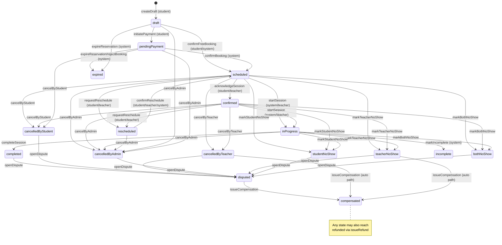

# Session State Machine — Quran Sessions

**Canonical enum:** `SessionLifecycleStatus`  
**Implementation:** `packages/quran_sessions/lib/src/domain/lifecycle/session_transition_table.dart`  
**Guard:** `SessionLifecycleGuard` — throws `InvalidTransitionFailure` on illegal moves.

---

## State diagram

---

## Phase grouping

| Phase | States | `isSlotBlocking` |
|-------|--------|------------------|
| **reservation** | draft, pendingPayment | pendingPayment only |
| **active** | scheduled, confirmed, inProgress, rescheduled | all |
| **terminal** | all others | false |

---

## Complete transition table

| # | Action | From | To | Actor(s) | Reason required | Side effects |
|---|--------|------|-----|----------|-----------------|--------------|
| 1 | createDraft | ∅ | draft | student | No | — |
| 2 | initiatePayment | draft | pendingPayment | student | No | softHoldSlotTtl |
| 3 | confirmBooking | pendingPayment | scheduled | system | No | capturePayment, hardLockSlot, createSessionDocument, notifyBothParties |
| 4 | confirmFreeBooking | draft | scheduled | student, system | No | hardLockSlot, createSessionDocument, notifyBothParties |
| 5 | acknowledgeSession | scheduled | confirmed | student, teacher | No | scheduleReminder |
| 6 | startSession | scheduled, confirmed | inProgress | system, teacher | No | openCallRoom |
| 7 | completeSession | inProgress | completed | system, teacher, student | No | promptReview |
| 8 | requestReschedule | scheduled, confirmed | rescheduled | student, teacher | **Yes** | notifyCounterparty |
| 9 | confirmReschedule | rescheduled | scheduled | student, teacher, system | **Yes** | swapSlotAtomically, releaseOldSlot, lockNewSlot |
| 10 | adminForceReschedule | scheduled, confirmed | scheduled | admin | **Yes** | appendAuditTrail, notifyBothParties |
| 11 | cancelByStudent | scheduled, confirmed, pendingPayment | cancelledByStudent | student | **Yes** | applyCancellationPolicy |
| 12 | cancelByTeacher | scheduled, confirmed | cancelledByTeacher | teacher | **Yes** | autoCompensateStudent |
| 13 | cancelByAdmin | draft, pendingPayment, scheduled, confirmed, inProgress, rescheduled | cancelledByAdmin | admin | **Yes** | adminChooseCompensation |
| 14 | markTeacherNoShow | scheduled, confirmed, inProgress | teacherNoShow | admin, system | No | autoCompensateStudent |
| 15 | markStudentNoShow | scheduled, confirmed, inProgress | studentNoShow | admin, system, teacher | No | applyCancellationPolicy |
| 16 | markBothNoShow | scheduled, confirmed, inProgress | bothNoShow | system | No | markAttendanceFromJoinLogs |
| 17 | markIncomplete | inProgress | incomplete | system | No | — |
| 18 | openDispute | completed, cancelledByStudent, cancelledByTeacher, cancelledByAdmin, teacherNoShow, studentNoShow, bothNoShow | disputed | student, teacher, admin | **Yes** | openManualReviewCase |
| 19 | issueCompensation | disputed, cancelledByTeacher, teacherNoShow | compensated | admin, system | **Yes** | executeCompensationPolicy |
| 20 | issueRefund | **all states** | refunded | admin, system | **Yes** | executePaymentRefund |
| 21 | expireReservation | draft, pendingPayment | expired | system | No | releaseSlot |
| 22 | rejectBooking | pendingPayment | expired | system | No | voidPayment |

**Note:** `incomplete` is implemented in code but omitted from user-request list — retained as system-only sub-outcome of abandoned inProgress sessions.

---

## Side effect catalog

| Side effect | Description | Collections / systems |
|-------------|-------------|----------------------|
| softHoldSlotTtl | Temporary slot reservation | `quran_slot_locks` soft + expiresAt |
| hardLockSlot | Exclusive slot lock | `quran_slot_locks` hard |
| releaseSlot | Delete or expire lock | slot_locks |
| capturePayment | PSP capture | payment gateway |
| voidPayment | Release auth | payment gateway |
| createSessionDocument | Mirror booking → session | `quran_sessions` |
| notifyBothParties | Enqueue notifications | `quran_session_notifications` |
| notifyCounterparty | Reschedule pending | notifications |
| scheduleReminder | T-24h, T-1h jobs | scheduled functions |
| openCallRoom | Provision meeting link | call provider |
| promptReview | Push/in-app review CTA | notifications |
| applyCancellationPolicy | Refund fraction, metrics | metrics, compensations |
| autoCompensateStudent | Policy-driven compensation | compensations |
| adminChooseCompensation | Admin-selected remediation | compensations |
| executeCompensationPolicy | Run gateway | compensations + ledger |
| executePaymentRefund | PSP refund | refunds ledger |
| appendAuditTrail | Immutable event | `quran_session_events` |
| swapSlotAtomically | Transactional slot change | locks + booking fields |
| markAttendanceFromJoinLogs | Derive no-show class | session.attendance |
| openManualReviewCase | Admin queue | admin actions |

Every transition MUST append audit event (enforced in use cases / CF layer).

---

## Invalid transitions (must reject)

| Attempt | Why invalid | Error |
|---------|-------------|-------|
| Any action from **terminal** except openDispute, issueCompensation, issueRefund | Terminal immutability | `InvalidTransitionFailure` |
| cancelByStudent from **inProgress** | Must complete or admin cancel | Invalid |
| cancelByTeacher from **inProgress** | Requires admin | Invalid |
| completeSession from **scheduled** (never started) | No attendance | Invalid (admin override `[Future]`) |
| confirmReschedule without valid new slot | Integrity | `SlotUnavailableFailure` |
| cancelByStudent inside **non-cancellable window** | Policy block | `PolicyViolationFailure` |
| Double markTeacherNoShow | Idempotent guard | Already terminal |
| initiatePayment when **pricingType=free** | Wrong path | Validation error |
| confirmBooking without captured payment | Payment guard | `PaymentDeclinedFailure` |
| openDispute from **draft** / **active** non-terminal | Disputes post-factum only | Invalid |
| issueCompensation from **completed** without disputed | Wrong remediation path | Invalid (use refund) |
| student cancel **pendingPayment** after capture started | Race | CF transaction guard |
| Teacher mark student no-show **before grace** | Policy | `PolicyViolationFailure` |
| Reschedule when **maxReschedules** exceeded | Policy | `PolicyViolationFailure` |
| Booking when teacher **suspended** | Eligibility | `TeacherNotVerifiedFailure` / blocked |

---

## Actor authorization matrix

| Action | student | teacher | admin | system |
|--------|---------|---------|-------|--------|
| createDraft / book | ✅ | ❌ | ❌ | ✅ free confirm |
| initiatePayment | ✅ | ❌ | ❌ | ❌ |
| acknowledgeSession | ✅ | ✅ | ❌ | ❌ |
| startSession | ❌ | ✅ | ❌ | ✅ |
| completeSession | ✅ | ✅ | ✅ | ✅ |
| requestReschedule | ✅ | ✅ | ❌ | ❌ |
| confirmReschedule | ✅ | ✅ | ❌ | ✅ |
| adminForceReschedule | ❌ | ❌ | ✅ | ❌ |
| cancelByStudent | ✅ | ❌ | ❌ | ❌ |
| cancelByTeacher | ❌ | ✅ | ❌ | ❌ |
| cancelByAdmin | ❌ | ❌ | ✅ | ❌ |
| markTeacherNoShow | ❌ | ❌ | ✅ | ✅ |
| markStudentNoShow | ❌ | ✅* | ✅ | ✅ |
| markBothNoShow | ❌ | ❌ | ❌ | ✅ |
| openDispute | ✅ | ✅ | ✅ | ❌ |
| issueCompensation | ❌ | ❌ | ✅ | ✅ auto |
| issueRefund | ❌ | ❌ | ✅ | ✅ |
| expireReservation | ❌ | ❌ | ❌ | ✅ |

\* Teacher mark student no-show only after grace; server validates.

---

## Legacy mapping (migration)

Existing code bridge: `legacy_status_lifecycle_mapper.dart`, `effectiveLifecycleStatus` on entities.

| Legacy booking.status | Legacy session.status | → lifecycleStatus |
|-----------------------|----------------------|-------------------|
| pending | — | pendingPayment |
| confirmed | scheduled | scheduled |
| confirmed | in_progress | inProgress |
| confirmed | completed | completed |
| confirmed | cancelled_by_student | cancelledByStudent |
| confirmed | cancelled_by_teacher | cancelledByTeacher |
| confirmed | no_show | teacherNoShow* |
| cancelled | * | cancelledByStudent* |
| refunded | * | refunded |

\* Ambiguous rows require backfill script review (`backfillBookingSessionConsistency`).

---

## Beta simplifications

| State / transition | Beta behavior |
|--------------------|---------------|
| pendingPayment | Unused (free only) — CF returns `payment_provider_unavailable` if paid |
| confirmed | Skipped — remain scheduled |
| issueRefund | Creates manual_pending ledger only |
| compensated | Session credit only |

---

## Verification

- Unit: `session_lifecycle_guard_test.dart` — exhaustive valid/invalid pairs
- CF: `sessionLifecycleService.test.ts`, `sessionLifecycleGuard.test.ts`
- Integration: each callable asserts guard before write

Target: **100% transition table coverage** in domain tests (see [test-matrix.md](./test-matrix.md)).
