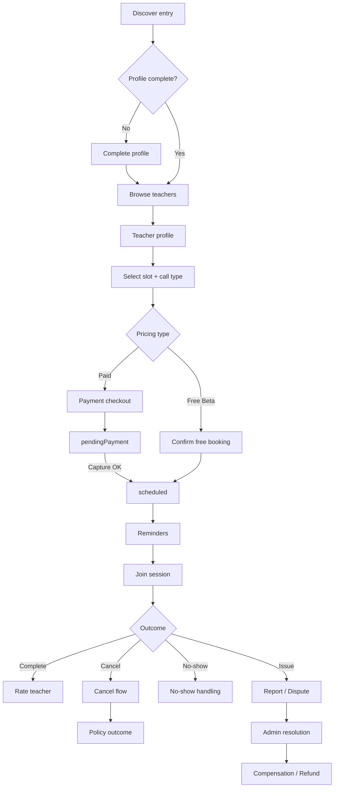
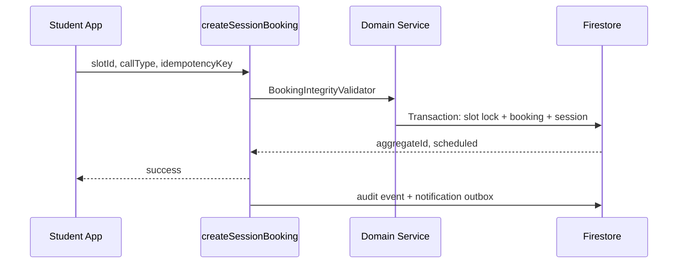
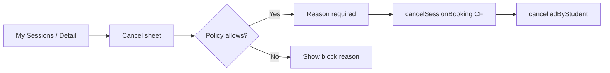

# Student Flow — Quran Sessions

**Actor:** Student (learner)  
**Product:** MeMuslim / أنا مسلم — Quran Sessions  
**Version tags:** `[Beta]` free sessions only · `[Paid]` payment + subscriptions · `[Prod]` production-hardened

---

## Journey overview

---

## Phase 1 — Discover & profile gate

### S1.1 Discover entry `[Beta]`

| Step | User action | Screen | Backend |
|------|-------------|--------|---------|
| 1 | Tap "Learn Quran" / sessions card | Home → `QuranSessionsHomeScreen` | — |
| 2 | See experimental badge + city context | Home sessions entry card | Read `users/{uid}.quranSessionsProfile` |
| 3 | Navigate to sessions hub | `/sessions` | Analytics: `onQuranSessionsOpened` |

**Existing:** `apps/tilawa/lib/features/home/presentation/widgets/home_sessions_entry_card.dart`, `quran_sessions_home_screen.dart`.

**Challenge:** Entry card visible when `quranSessionsEnabled=true` but booking may be disabled — copy must not promise instant booking.

### S1.2 Profile completion gate `[Beta]`

| Step | User action | Screen | Backend |
|------|-------------|--------|---------|
| 1 | Hit gate at entry or booking | `ProfileCompletionScreen` | `GetUserProfileUseCase` |
| 2 | Select gender, DOB, country, city | Form | `CompleteStudentProfileUseCase` → Firestore `quranSessionsProfile` |
| 3 | Return to intended destination | Router pop `true` | `profileCompleted: true` |

**Required fields:** gender, dateOfBirth, countryCode, cityId (see `UserProfile.isComplete`).

**Edge cases:**
- User changes city mid-flow → re-run eligibility on booking screen.
- Blocked account → `AccountBlockedFailure`; show support CTA, not profile form.
- Child student (`ageGroup == child`) → `[Paid]` guardian link required before booking (currently failure only).

---

## Phase 2 — Browse & select teacher

### S2.1 Browse teachers `[Beta]`

| Step | Screen | Data source |
|------|--------|---------------|
| List all / abbreviated on hub | `TeacherListScreen` | `GetTeachersUseCase` → `quran_teacher_profiles` where `isPubliclyVisible=true` |
| Filter by specialization/language | Filter chips `[Should]` | `TeacherListBloc` already accepts params — UI missing per roadmap |
| Search by name | `[Post-Beta]` | Not implemented |

### S2.2 Teacher profile `[Beta]`

| Element | Source |
|---------|--------|
| Display name, bio, rating, badges | `TeacherProfile` / `QuranTeacher` |
| Price (market-resolved) | `resolveTeacherPrice(countryCode, cityId)` → `PriceFormatter` |
| Call types offered | `SessionCallType` on profile |
| Availability preview | Next N days from `GetTeacherAvailabilityUseCase` |

**Screen:** `teacher_profile_screen.dart` → route `/sessions/teachers/:teacherId`.

**Challenge:** Reviews list on profile not built; rating shown but no review history UI.

---

## Phase 3 — Availability & slot selection

### S3.1 View availability `[Beta]`

| Step | UI | Logic |
|------|-----|-------|
| Open booking | `BookingScreen` | Profile gate + `ValidateBookingEligibilityUseCase` (8-step chain) |
| Load slots | `DateGroupedSlotPicker` | `SlotGenerator` + overrides + booked slot exclusion |
| Show inline eligibility errors | `_EligibilityBlockedView` | Gender, age, market, teacher verified, pricing |

**Policy inputs:** `schedulingPolicy.minNoticeMinutes`, `maxHorizonDays`, vacation overrides.

**Backend read:** generated slots from weekly schedule + `availability_overrides`; booked starts from active aggregates.

### S3.2 Select slot & call type `[Beta]`

| Field | Validation |
|-------|------------|
| Slot | Not in past; not booked; not in vacation |
| Call type | `[Beta]` all types if policy allows; `[Paid]` enforce `videoCallAllowedForChildren` |

---

## Phase 4 — Booking confirmation

### S4.1 Free booking `[Beta]`

| Step | User sees | Backend state |
|------|-----------|---------------|
| Tap confirm | Loading | — |
| Success | Snackbar + navigate My Sessions | `lifecycleStatus: scheduled` |
| Failure | Inline error (slot taken, blocked, etc.) | No partial write |

**Transition:** `confirmFreeBooking`: draft → scheduled (or direct create without draft in mobile UX).

**Existing gap:** `quranSessionsBookingEnabled: false` in production config — booking CF exists but feature gated.

### S4.2 Paid booking `[Paid]`

| Step | State | Notes |
|------|-------|-------|
| Initiate checkout | draft → pendingPayment | Soft slot lock + TTL |
| Payment success webhook | pendingPayment → scheduled | `PaymentProvider.capture` |
| Payment fail / timeout | → expired | Release slot |

**Existing:** `DisabledPaymentProvider` in `apps/tilawa/lib/features/quran_sessions/data/disabled_payment_provider.dart` — returns `payment_provider_unavailable`.

---

## Phase 5 — Post-booking & reminders

### S5.1 Confirmation `[Beta]`

| Channel | Trigger | Status |
|---------|---------|--------|
| In-app | Immediate | Snackbar ✅ |
| Push | `bookingConfirmed` | `[Beta fix]` not wired |
| Email | `[Post-Beta]` | — |

### S5.2 Reminders `[Beta]`

| Timing | Notification type | Job |
|--------|-------------------|-----|
| T-24h | `sessionReminder` | Scheduled CF / worker |
| T-1h | `sessionReminder` | Config: `reminderPolicy.hoursBefore` |

**Screen:** My Sessions upcoming list — `my_sessions_screen.dart`.

---

## Phase 6 — Join session

### S6.1 Pre-join `[Beta]`

| Step | Screen | Data |
|------|--------|------|
| Open session | `SessionDetailScreen` | `GetStudentSessionsUseCase` |
| View time, teacher, call type | Detail header | — |
| Tap join | External browser / future in-app | `meetingLink` or `callRoomId` |

**Critical gap:** `meetingLink` not displayed in My Sessions (roadmap P0).

**Transition:** `startSession` at window open (system) → `inProgress`; `null teacher manual start.

### S6.2 In session `[Beta]`

| Call type | Behavior |
|-----------|----------|
| externalMeeting | Open URL; attendance via link click timestamp `[Future]` |
| voiceCall / videoCall | `[Paid/V2]` Agora stub — `UnimplementedError` |

---

## Phase 7 — Complete & rate

### S7.1 Session complete `[Beta]`

| Actor | Transition | Trigger |
|-------|------------|---------|
| System | inProgress → completed | End time + grace |
| Teacher | inProgress → completed | Manual complete |
| Student | `[Optional]` confirm complete | — |

**Side effects:** `promptReview`, update metrics, notify both parties.

### S7.2 Rate teacher `[Beta]`

| Step | UI | Backend |
|------|-----|---------|
| Prompt after completed | Bottom sheet / session detail | — |
| Submit 1–5 + comment | Review form | `SubmitReviewUseCase` → booking/session review subcollection |

**Gap:** Prompt timing and UI not fully specified in code; use case exists.

---

## Phase 8 — Cancel, reschedule, dispute

### S8.1 Student cancel `[Beta]`

| Window | Policy outcome `[Configurable]` |
|--------|--------------------------------|
| Early (>24h default) | Full credit / free rebook |
| Late (<24h) | Credit consumed; no refund `[Paid]` |
| Inside 1h | Block unless admin `[Default]` |

**UI:** `cancel_session_sheet.dart` — must collect reason min length.

**Backend:** `CancelSessionUseCase` → actor-aware cancel (fixed from legacy always-student cancel).

### S8.2 Reschedule `[Beta]`

| Step | Actor | State |
|------|-------|-------|
| Request new slot + reason | Student | scheduled → rescheduled |
| Counterparty accepts | Teacher | rescheduled → scheduled |
| Reject / expire | Either | Return to original scheduled |

**Screen:** `reschedule_session_screen.dart` — E2E CF wiring incomplete per roadmap.

**Limits:** `reschedulePolicy.maxReschedules` (default 1), `minHoursBeforeSession`.

### S8.3 Report safety concern `[Beta fix]`

| Step | UI | Backend |
|------|-----|---------|
| Session detail → Report | Form: category + narrative | `reportSessionConcern` CF |
| Confirmation | Case ID | Admin queue + audit |

**Gap:** CF exists; **no mobile UI**.

### S8.4 Open dispute `[Beta]`

| From states | Actor | To |
|-------------|-------|-----|
| completed, cancelled*, noShow* | Student | disputed |

**UI needed:** Post-session dispute form with reason + optional evidence.

**Backend:** `openSessionDispute` CF → manual review case.

### S8.5 Compensation / refund `[Paid partial in Beta]`

| Outcome | Student sees | State |
|---------|--------------|-------|
| Session credit restored | In-app wallet / free rebook | compensated |
| Manual refund pending | "Under review" status | refunded + ledger `manual_pending` |
| Admin denies | Explanation notification | disputed → closed |

---

## Screen map (student)

| Screen | Route | Phase |
|--------|-------|-------|
| Sessions home | `/sessions` | Discover |
| Teacher list | `/sessions/teachers` | Browse |
| Teacher profile | `/sessions/teachers/:id` | Browse |
| Profile completion | `/sessions/profile/complete` | Gate |
| Booking | `/sessions/book/:teacherId` | Book |
| My sessions | `/sessions/mine` | Manage |
| Session detail | `/sessions/session/:id` | Join / cancel / report |
| Reschedule | `/sessions/session/:id/reschedule` | Reschedule |
| Review | Modal on session detail | Rate |

Full inventory: [screen-inventory.md](./screen-inventory.md).

---

## Backend actions summary

| User action | Callable / use case | Collections touched |
|-------------|---------------------|---------------------|
| Complete profile | Client write (rules) | `users.quranSessionsProfile` |
| Book free | `createSessionBooking` | booking, session, slot_lock, events, notifications |
| Cancel | `cancelSessionBooking` | booking, session, events, metrics |
| Reschedule request | `requestSessionReschedule` | reschedule_requests, booking |
| Reschedule confirm | `confirmSessionReschedule` | slot locks swap |
| Report | `reportSessionConcern` | admin queue, events |
| Dispute | `openSessionDispute` | booking/session status |
| Rate | Client or CF `[TBD]` | reviews subcollection |

---

## Edge cases (student-specific)

See [edge-cases-matrix.md](./edge-cases-matrix.md). Highlights:

- Double-tap book → idempotency key prevents duplicate.
- Slot taken between load and confirm → `SlotUnavailableFailure`.
- Teacher suspended after book → session continues; new bookings blocked.
- Student suspended → cancel allowed? `[Policy]` read-only past sessions.
- Timezone display → show in student local + teacher timezone footnote.
- Offline at join time → show meeting link for external calls.

---

## Beta vs Paid vs Production

| Capability | Beta | Paid | Prod |
|------------|------|------|------|
| Free booking | ✅ | ✅ | ✅ |
| Paid booking | ❌ | ✅ | ✅ |
| External meeting link | ✅ | ✅ | ✅ |
| In-app A/V | ❌ | Optional | ✅ |
| Push reminders | ✅ target | ✅ | ✅ |
| Dispute UI | ✅ target | ✅ | ✅ |
| Auto refund | ❌ | ✅ | ✅ |
| Guardian flow | ❌ | ✅ | ✅ |
| Subscription packs | ❌ | ✅ | ✅ |
