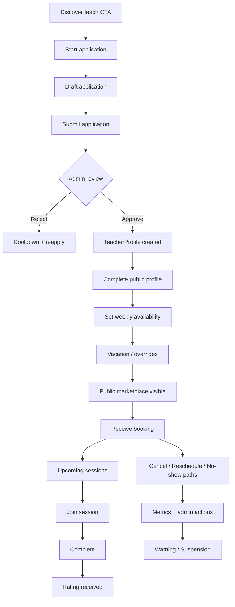
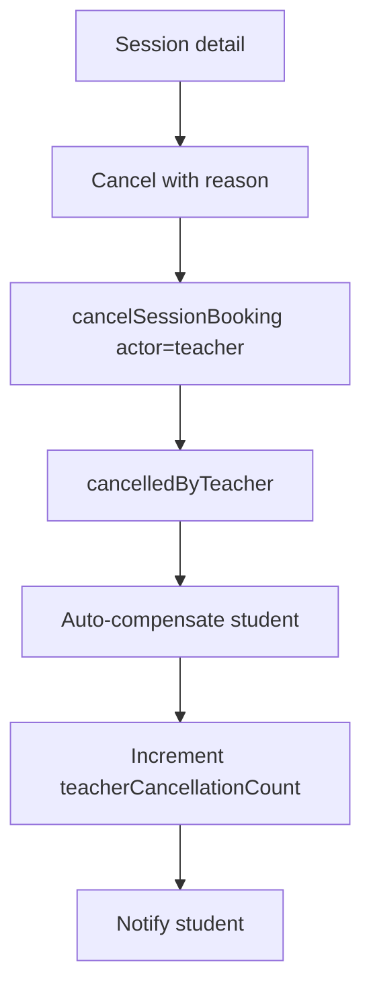

# Teacher Flow — Quran Sessions

**Actor:** Teacher (verified Quran instructor)  
**Product:** MeMuslim / أنا مسلم — Quran Sessions  
**Principle:** Teacher is a **verified profile**, not a user role (ADR-003).

---

## Journey overview

---

## Phase 1 — Apply & onboarding

### T1.1 Entry points `[Beta]`

| Entry | Location | Flag |
|-------|----------|------|
| Sessions home empty-state CTA | `QuranSessionsHomeScreen` | `teacherApplicationEnabled` |
| Profile settings section | Settings teacher capability | `profileAndEmptyState` discoverability |
| Direct route | `/sessions/teacher/apply` | — |

**Navigation resolver:** `navigateForTeacherCapability()` in `quran_sessions_nav.dart` routes by `TeacherCapability`.

### T1.2 Application form `[Beta]`

| Field | Validation | Storage |
|-------|------------|---------|
| Phone (E.164) | `PhoneNormalizer` country rules | `quran_teacher_applications` **only** — never public profile |
| Languages, specializations | Min 1 each | Application doc |
| Bio | Min length | Application doc |
| Public display name | Optional | Application → profile on approve |

**Screens:** `teacher_application_screen.dart`, `teacher_application_status_screen.dart`.

**Use cases:** `StartTeacherApplicationUseCase`, `SaveTeacherApplicationDraftUseCase`, `SubmitTeacherApplicationUseCase`.

### T1.3 Application status `[Beta]`

| Status | User sees | Can edit? |
|--------|-----------|-----------|
| draft | Continue application | Yes |
| pending | Waiting message + SLA copy | No |
| approved | Link to complete profile / dashboard | Profile only |
| rejected | Reason + reapply date (30d cooldown) | After cooldown |
| revoked | Permanent ban message | No |

**Existing:** `TeacherApplicationBloc` + CF `reviewTeacherApplication`.

**Gap:** Admin review UI deferred — MVO scripts (`functions/scripts/reviewTeacherApplicationAdmin.ts`) used for Beta.

---

## Phase 2 — Admin review (teacher perspective)

### T2.1 Approval `[Beta]`

On approve:
1. `TeacherProfile` created in `quran_teacher_profiles/{teacherId}`.
2. `profileCompleteness: incomplete` until public profile saved.
3. `isPubliclyVisible: false` until completeness + availability set.

**Teacher notification:** `[Beta fix]` email/push on approve — not wired.

### T2.2 Rejection `[Beta]`

- Mandatory `rejectionReason` (admin ops checklist).
- 30-day re-application cooldown enforced in domain.

---

## Phase 3 — Public profile & marketplace activation

### T3.1 Complete public profile `[Beta]`

| Field | Screen |
|-------|--------|
| Public bio, specializations, languages, call types, pricing type | `complete_teacher_public_profile_screen.dart` |
| Gender (for eligibility matching) | Profile |
| Photo / avatar | `[Post-Beta]` upload |

**Use case:** `CompleteTeacherProfileUseCase`, `SaveTeacherPublicProfileUseCase`.

**Gate:** Dashboard blocked until `profileCompleteness == complete` (`TeacherCapabilityNavigationTarget.completeTeacherProfile`).

### T3.2 Pricing configuration `[Beta free / Paid]`

| pricingType | Beta | Paid |
|-------------|------|------|
| free | ✅ default for Beta supply | ✅ optional |
| fixedPerSession | Display only if market price set | ✅ + payment |
| subscription | ❌ | `[Future]` |

**Market price:** `teachers/{id}/pricing/{marketId}` or denormalized on profile — admin sets for paid.

**Challenge:** Teacher self-serve price edit not built; admin/script only.

### T3.3 Public visibility `[Beta]`

Teacher appears in student list when ALL true:
- `verificationStatus == verified`
- `isPubliclyVisible == true`
- `profileCompleteness == complete`
- Not suspended
- Has ≥1 bookable slot in horizon

**CF:** `syncTeacherProfileVisibility` maintains visibility flags.

---

## Phase 4 — Availability management

### T4.1 Weekly schedule template `[Beta]`

| Step | Screen | Backend |
|------|--------|---------|
| Set working hours per weekday | `weekly_availability_screen.dart` | `availability_config/{teacherId}` |
| Save | — | `GetWeeklyScheduleUseCase` / save schedule repo |

**Slot generation:** `SlotGenerator` produces rolling window (default 14 days).

### T4.2 Vacation & overrides `[Beta]`

| Override type | UI | Effect |
|---------------|-----|--------|
| Vacation (multi-day) | `availability_vacation_dialogs.dart` | Blocks all slots in range |
| Single-day block | `availability_override_sheet.dart` | Removes specific intervals |
| Extra hours | `[Future]` | Adds ad-hoc availability |

**Validation:** `VacationOverrideValidator` prevents overlapping invalid ranges.

### T4.3 Dashboard overview `[Beta]`

**Screen:** `teacher_dashboard_screen.dart`

| Section | Actions |
|---------|---------|
| Upcoming sessions | View, join link, cancel `[Beta]` |
| Availability summary | Edit schedule, add override |
| Metrics snapshot | `[Post-Beta]` cancellation rate |

**Gap:** Slot toggle on dashboard edits overrides but weekly template UX still maturing.

---

## Phase 5 — Receive & manage bookings

### T5.1 Booking notification `[Beta fix]`

| Event | Teacher receives |
|-------|------------------|
| New booking | Push + in-app (upcoming list refresh) |
| Student cancel | Push with reason |
| Reschedule request | Push + accept/decline |

**Existing:** Notification outbox schema; delivery TBD.

### T5.2 Upcoming sessions `[Beta]`

| Data | Source |
|------|--------|
| Session list | `GetTeacherSessionsUseCase` |
| Filter upcoming / past | Client-side by `startsAt` |
| Session detail | Shared `session_detail_screen.dart` (teacher mode) |

---

## Phase 6 — Deliver session

### T6.1 Join `[Beta]`

| Step | Teacher action |
|------|----------------|
| T-15m | Reminder notification |
| At start | Open session detail → Join (same `meetingLink` as student) |
| In progress | `[Beta]` external meeting; attendance manual/system |

**Transition:** `startSession` — system at window or teacher initiates.

### T6.2 Complete `[Beta]`

| Actor | Action | Result |
|-------|--------|--------|
| Teacher | Mark complete (if student still connected) | `completed` |
| System | Auto-complete at end + grace | `completed` or `incomplete` |

**Use case:** `CompleteSessionUseCase` → CF `completeSession`.

---

## Phase 7 — Cancel, reschedule, no-show (teacher-initiated)

### T7.1 Teacher cancel `[Beta]`

| Rule | Default |
|------|---------|
| Reason required | Yes, min 20 chars |
| Allowed from | scheduled, confirmed — **not** inProgress without admin |
| Student compensation | Config: `restoreSessionCredit` |
| Teacher penalty | Metric only in Beta; auto-suspend `[Paid]` after N cancels |

**Use case:** `CancelSessionUseCase` with `ActorRole.teacher`.

### T7.2 Teacher-initiated reschedule `[Beta]`

Same flow as student-initiated (see [student-flow.md](./student-flow.md)); actor = teacher.

**Policy:** Counterparty (student) must accept unless admin force.

### T7.3 Mark student no-show `[Beta]`

| Condition | Actor | Transition |
|-----------|-------|------------|
| Student not joined after grace | Teacher, system, admin | studentNoShow |
| Evidence | Join logs | Optional teacher attestation |

**Use case:** `MarkNoShowUseCase` → CF `markSessionNoShow`.

**Abuse guard:** Teacher cannot mark no-show before grace period ends (server enforced).

---

## Phase 8 — Ratings & reputation

### T8.1 Receive rating `[Beta]`

| Event | Display |
|-------|---------|
| Student submits review | Updates aggregate rating on `TeacherProfile` |
| Teacher views history | `[Post-Beta]` review history screen |

**Existing:** Review submission on student side; teacher history UI missing.

---

## Phase 9 — Admin warning & suspension

### T9.1 Warning `[Beta]`

| Trigger | Admin action | Teacher sees |
|---------|--------------|--------------|
| High cancellation rate | Warning note in admin | `[Future]` in-app banner |
| Safety report upheld | Suspension | Account restricted message |

### T9.2 Suspension levels `[Beta]`

| Level | Effect |
|-------|--------|
| `acceptBookings: false` | Profile visible but not bookable |
| Profile hidden | `isPubliclyVisible: false` |
| Full suspend | `SuspendTeacherProfileUseCase` + application status |
| Revoke | Permanent — `RevokeTeacherProfileUseCase` |

**Admin CFs:** `moderateTeacherProfile`, existing moderation gateway.

**Teacher dashboard:** Show suspended state with appeal/support link.

---

## Screen map (teacher)

| Screen | Route | Status |
|--------|-------|--------|
| Application | `/sessions/teacher/apply` | ✅ |
| Application status | `/sessions/teacher/status` | ✅ |
| Complete public profile | `/sessions/teacher/profile/complete` | ✅ |
| Weekly availability | `/sessions/teacher/availability` | ✅ |
| Dashboard | `/sessions/teacher/dashboard` | ✅ |
| Session detail (teacher mode) | `/sessions/session/:id` | ✅ shared |
| Earnings | `/sessions/teacher/earnings` | `[Paid]` |
| Review history | `/sessions/teacher/reviews` | `[Post-Beta]` |

---

## Backend actions summary

| Action | Callable | Side effects |
|--------|----------|--------------|
| Submit application | Client write (rules) + validation | Application doc |
| Save availability | Client write to config/overrides | Slot regen |
| Cancel session | `cancelSessionBooking` | Compensation, metrics |
| Request reschedule | `requestSessionReschedule` | Notification |
| Confirm reschedule | `confirmSessionReschedule` | Slot swap |
| Mark no-show | `markSessionNoShow` | Policy, metrics |
| Complete session | `completeSession` | Review prompt |

---

## Implementation challenges (existing code)

| Issue | Path | Blueprint fix |
|-------|------|---------------|
| Dashboard route hardcoded teacher | `quran_sessions_nav.dart` | Auth-aware teacherId from profile |
| No booking notification | notification outbox | Wire FCM delivery |
| Teacher cancel UI incomplete | session detail | Reason sheet + policy copy |
| Paid pricing self-serve missing | admin only | Post-Beta teacher price editor |
| OTP not verified | ADR-003 deferred | Document trust boundary for Beta |

---

## Beta vs Paid

| Capability | Beta | Paid |
|------------|------|------|
| Free teacher listing | ✅ | ✅ |
| Teacher sets paid price | Admin only | Self-serve |
| Earnings dashboard | ❌ | ✅ |
| Auto payout | ❌ | ✅ |
| Cancel penalty auto-suspend | ❌ | Configurable |
| In-app video teaching | ❌ | Optional |
