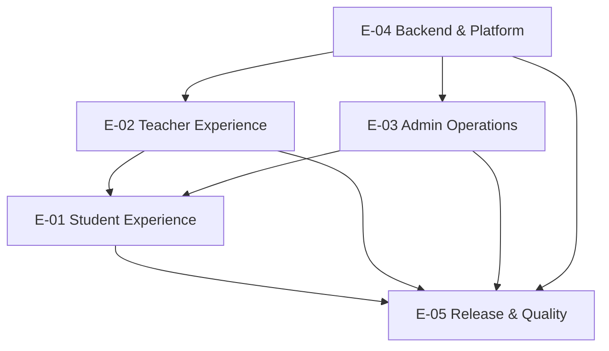

# Epics — Quran Sessions Delivery

**Plan:** `032-quran-session-delivery-plan`  
**Stories:** [user-stories.md](./user-stories.md)  
**Sprints:** [sprint-plan.md](./sprint-plan.md)

---

## Epic overview

| Epic ID | Name | Owner | Sprint range | Story IDs | P0 count |
|---------|------|-------|--------------|-----------|----------|
| E-01 | Student Experience | Mobile / product | 4–6 | US-001–US-018 | 12 |
| E-02 | Teacher Experience | Mobile / product | 2–5 | US-019–US-032 | 9 |
| E-03 | Admin Operations | Admin / ops | 2, 6 | US-033–US-044 | 8 |
| E-04 | Backend & Platform | Backend / mobile | 1, 5–7 | US-045–US-060 | 11 |
| E-05 | Release & Quality | QA / release | 7–8 | US-061–US-072 | 6 |

**Total epics:** 5  
**Total stories:** 72

---

## E-01 — Student Experience

**Goal:** Student can discover verified free teachers, complete profile gate, book a slot, join via meeting link, manage upcoming sessions, cancel/reschedule per policy, report concerns, and open disputes.

**Key paths:**
- `packages/quran_sessions/lib/src/presentation/screens/`
- `apps/tilawa/lib/features/quran_sessions/`

**Dependencies:** E-04 (CF booking, FCM), E-02 (teacher supply + availability), E-03 (dispute resolution)

| Theme | Stories | Beta |
|-------|---------|------|
| Discovery & profile | US-001–US-005 | ✅ |
| Booking | US-006–US-009 | ✅ |
| Session management | US-010–US-014 | ✅ |
| Safety & disputes | US-015–US-018 | ✅ |

**Success criteria:**
- Fresh Google sign-in → profile gate → book → My Sessions shows link → join works
- Cancel with reason; reschedule request when policy allows
- Report/dispute reach admin queue

---

## E-02 — Teacher Experience

**Goal:** Teacher applies, gets approved, completes public profile, manages availability, receives bookings, runs sessions, cancels/reschedules per policy, marks student no-show.

**Key paths:**
- `teacher_application_screen.dart`, `weekly_availability_screen.dart`, `teacher_dashboard_screen.dart`
- `functions/src/quranSessions/teacherProfileApproval.ts`

**Dependencies:** E-03 (approval), E-04 (slot generation CF, notifications)

| Theme | Stories | Beta |
|-------|---------|------|
| Onboarding & application | US-019–US-022 | ✅ |
| Profile & availability | US-023–US-027 | ✅ |
| Session delivery | US-028–US-032 | ✅ |

**Success criteria:**
- Apply → admin approve → complete profile → set weekly schedule → receive booking notification
- Dashboard shows upcoming sessions; vacation override blocks slots

---

## E-03 — Admin Operations

**Goal:** Admin moderates teacher applications, inspects sessions/bookings, resolves reports/disputes, records manual_pending compensation/refunds, blocks users.

**Key paths:**
- `apps/tilawa_admin/src/app/features/quran-sessions/`
- CF: `reviewTeacherApplication`, `resolveSessionDispute`, `resolveSessionReport`, `issueSessionCompensation`

**Dependencies:** E-04 (CF + rules deployed)

| Theme | Stories | Beta |
|-------|---------|------|
| Teacher moderation | US-033–US-036 | ✅ |
| Session inspection | US-037–US-039 | ✅ |
| Reports & disputes | US-040–US-042 | ✅ |
| Ledger & user moderation | US-043–US-044 | ✅ |

**Success criteria:**
- Pending application reviewed in <24h during Beta
- Dispute resolved with ledger record visible in admin
- Session actions (cancel, no-show, force reschedule) work via CF facade

---

## E-04 — Backend & Platform

**Goal:** Server-authoritative lifecycle, secure Firestore rules, feature flags, notifications, backfill, monitoring — all backend-agnostic at domain boundary.

**Key paths:**
- `packages/quran_sessions/lib/src/domain/lifecycle/`
- `functions/src/quranSessions/`
- `apps/tilawa/lib/features/quran_sessions/data/firebase/`

**Dependencies:** Sprint 0 scope freeze; blocks E-01, E-02, E-03

| Theme | Stories | Beta |
|-------|---------|------|
| Data & security | US-045–US-049 | ✅ |
| Lifecycle CF wiring | US-050–US-054 | ✅ |
| Notifications & jobs | US-055–US-057 | ✅ |
| Flags & config | US-058–US-060 | ✅ |

**Success criteria:**
- Staging smoke 10/10 passes
- Client cannot mutate `quran_bookings` / `quran_sessions` directly
- `quranSessionsBookingEnabled` controllable per environment

---

## E-05 — Release & Quality

**Goal:** QA sign-off, Beta cohort, Google Play rollout, rollback drill, production monitoring.

**Key paths:**
- `apps/tilawa/` release config
- Firebase Remote Config / feature flags
- Play Console

**Dependencies:** E-01–E-04 complete for Beta scope

| Theme | Stories | Beta |
|-------|---------|------|
| Test automation | US-061–US-064 | ✅ |
| Staging & performance | US-065–US-067 | ✅ |
| Play release | US-068–US-070 | ✅ |
| Monitoring & rollback | US-071–US-072 | ✅ |

**Success criteria:**
- Device matrix QA signed off
- Internal + trusted Beta ≥20 successful book→join flows
- Staged Play rollout with kill switch tested

---

## Epic dependency graph

---

## Postponed epic extensions (Paid Sessions)

Not in sprint 0–8 scope. Tracked as future stories US-P01–US-P08 in [user-stories.md](./user-stories.md#paid-sessions-postponed).

| Extension | Epic |
|-----------|------|
| Payment checkout & refunds | E-04 + E-01 |
| Teacher earnings & payout | E-02 + E-03 |
| Subscription billing | E-04 |
| In-app A/V (Agora) | E-01 + E-02 |
