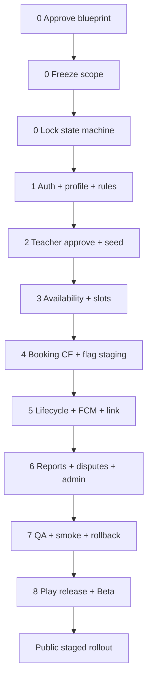

# Implementation Order — Quran Sessions

Dependency-aware execution sequence for solo/small team.  
**Sprints:** [sprint-plan.md](./sprint-plan.md) · **Stories:** [user-stories.md](./user-stories.md)

---

## Phase 0 — Governance (Sprint 0)

| Step | Action | Verify | Stories |
|------|--------|--------|---------|
| 0.1 | Approve blueprint `031` | Sign-off doc | — |
| 0.2 | Freeze Free Beta scope (this plan `032`) | IN/OUT list agreed | — |
| 0.3 | Lock state machine — no enum changes without ADR | `SessionLifecycleStatus` stable | — |
| 0.4 | Provision staging Firebase + test accounts | student, teacher, admin login | — |
| 0.5 | Assign risk owners | risk-register filled | — |
| 0.6 | Groom Sprint 1 backlog | Estimates on P0 | US-045–064 |

**Exit:** Sprint 1 start authorized.

---

## Phase 1 — Foundation (Sprint 1)

| Step | Action | Verify | Stories |
|------|--------|--------|---------|
| 1.1 | Plumb real auth UID everywhere | No `student_mvp` in prod module | US-045 |
| 1.2 | `UserProfileRepositoryImpl` + auto-create | Firestore doc on sign-in | US-046 |
| 1.3 | Deploy Firestore rules (deny client booking writes) | `test:rules` green | US-047 |
| 1.4 | Wire `ConfigurableCancellationPolicy` etc. | Policies from config | US-048 |
| 1.5 | `MarketConfigRepositoryImpl` on staging | EG market loads | US-059 |
| 1.6 | Lifecycle backfill dry-run | Report reviewed | US-060 |
| 1.7 | `ValidateBookingEligibilityUseCase` 12 tests | CI green | US-061 |
| 1.8 | `ProfileCompletionBloc` tests | CI green | US-064 |
| 1.9 | CF integration + rules in CI | PR gate | US-063 |

**Exit:** Auth + profile + rules + P0 tests — **blocks all booking work**.

---

## Phase 2 — Supply side (Sprint 2–3)

| Step | Action | Verify | Stories |
|------|--------|--------|---------|
| 2.1 | Verify teacher application mobile flow | Apply → pending | US-019, US-020 |
| 2.2 | Admin approve via `tilawa_admin` | Teacher profile created | US-033 |
| 2.3 | Seed ≥5 verified free teachers EG | List count ≥5 | US-034 |
| 2.4 | Complete public teacher profiles | Marketplace cards visible | US-022 |
| 2.5 | Weekly availability UI + save | Slots in Firestore | US-023 |
| 2.6 | Server slot generation + integrity validator | BI tests pass | US-049 |
| 2.7 | Fix teacher dashboard auth UID | Not `teacher_1` | US-025 |
| 2.8 | Vacation/overrides (if time) | Blocked day no slots | US-024 |

**Exit:** Student can see teachers + slots on staging (booking still off).

---

## Phase 3 — Demand side booking (Sprint 4)

| Step | Action | Verify | Stories |
|------|--------|--------|---------|
| 3.1 | Profile gate + completion flow QA | Gate once | US-001, US-004 |
| 3.2 | Teacher list + profile screens on Firestore data | Pagination works | US-002, US-003 |
| 3.3 | Booking eligibility inline errors | 8-step chain UI | US-005 |
| 3.4 | `createSessionBooking` CF E2E on staging | Smoke #4, #5, #10 | US-050 |
| 3.5 | Session/booking Firestore read repos | My Sessions shows book | US-051 |
| 3.6 | `meetingLink` populated at create | Field in Firestore doc | US-052 |
| 3.7 | Enable `quranSessionsBookingEnabled` **staging only** | Book succeeds | US-058, US-006 |

**Exit:** First real staging booking end-to-end.

---

## Phase 4 — Lifecycle completeness (Sprint 5)

| Step | Action | Verify | Stories |
|------|--------|--------|---------|
| 4.1 | Display `meetingLink` in session detail + My Sessions | Join CTA works | US-008, US-031 |
| 4.2 | Wire FCM delivery (`deliverSessionNotification`) | Push on device | US-055 |
| 4.3 | Booking confirmation notification | US-009 | |
| 4.4 | T-24h reminder job | US-013, US-057 | |
| 4.5 | Cancel sheet + `cancelSessionBooking` CF | Reason required | US-010, US-053 |
| 4.6 | Teacher cancel + compensation ledger | manual_pending | US-028, US-056 |
| 4.7 | Reschedule request + confirm E2E | Happy path | US-011, US-054 |
| 4.8 | No-show mark + system job | After grace | US-030, US-057 |
| 4.9 | Session detail actions polish | US-014 | |

**Exit:** Book → notify → join → cancel/reschedule demonstrated.

---

## Phase 5 — Trust & safety ops (Sprint 6)

| Step | Action | Verify | Stories |
|------|--------|--------|---------|
| 5.1 | Mobile report concern UI → CF | Admin queue | US-015, US-040 |
| 5.2 | Mobile open dispute UI → CF | Admin queue | US-016, US-041 |
| 5.3 | Admin reports + disputes screens | A-10, A-11 | |
| 5.4 | Admin session actions via CF | Cancel, no-show | US-039 |
| 5.5 | Admin sessions list/detail QA | US-037, US-038 | |
| 5.6 | Block user moderation | Smoke #2–3 | US-036, US-044 |
| 5.7 | manual_pending compensation records | Smoke #7–8 | US-042 |
| 5.8 | Ops runbook draft | 48h dispute SLA | — |

**Exit:** Full moderation loop on staging.

---

## Phase 6 — Hardening (Sprint 7)

| Step | Action | Verify | Stories |
|------|--------|--------|---------|
| 6.1 | Full QA device matrix | qa-test-plan sign-off | — |
| 6.2 | Staging smoke 10/10 | production-readiness-p0 | US-065 |
| 6.3 | Performance slow network + low-end | US-066 | |
| 6.4 | Widget tests (capacity) | US-062 | |
| 6.5 | Sentry + CF alerts | US-071 | |
| 6.6 | Rollback drill | <15 min | US-072 |
| 6.7 | Production backfill dry-run | Ops sign-off | US-067 |
| 6.8 | Production CF + rules deploy | Release checklist | — |
| 6.9 | Zero P0 bugs | Issue tracker | — |

**Exit:** Beta launch authorized.

---

## Phase 7 — Release (Sprint 8)

| Step | Action | Verify | Stories |
|------|--------|--------|---------|
| 7.1 | Build signed AAB | Release build | — |
| 7.2 | Play internal track upload | Core team install | US-068 |
| 7.3 | Closed Beta cohort 20+ users | beta-testing-plan | US-069 |
| 7.4 | Metrics vs success table | README metrics | — |
| 7.5 | Enable prod booking flag (staged cohort) | Remote Config | US-058 |
| 7.6 | Play staged rollout 5% → … | google-play-release-plan | US-070 |
| 7.7 | Free Beta Go/No-Go meeting | Update README verdict | — |

**Exit:** Free Beta live or deliberate No-Go with date.

---

## Post-Beta (not in Sprints 0–8)

| Order | Action | Phase |
|-------|--------|-------|
| 8.1 | Guardian linking flow | Production |
| 8.2 | Filter bar + EN l10n complete | Production |
| 8.3 | 7-day soak metrics review | Production free |
| 8.4 | PSP selection + PaymentProvider | Paid Sessions |
| 8.5 | Paid booking + automated refund | Paid Sessions |
| 8.6 | Teacher payout + A-12 ledger UI | Paid Sessions |
| 8.7 | Agora in-app calls (optional) | Paid/V2 |

---

## Dependency diagram

---

## Parallel work streams (if 2+ people)

| Stream | Phases | Owner |
|--------|--------|-------|
| Mobile | 3–5 UI stories | Flutter dev |
| Backend | 1, 3–5 CF/FCM | Backend dev |
| Admin | 2, 5 A-10/A-11 | Angular dev |
| QA | 6–7 continuous | QA |

**Solo:** Execute strictly top-to-bottom; skip P2 stories in Sprints 6–7.

---

## Do-not-start-before gates

| Work | Blocked until |
|------|---------------|
| Enable prod booking flag | Smoke 10/10 + rollback drill |
| Paid stories US-P* | Free Beta Go + finance sign-off |
| Public child marketing | Guardian flow (Production) |
| In-app video calls | Beta feedback + Agora scope |
| iOS sessions release | Android Beta stable (out of scope) |

---

## Sync with living roadmap

After each phase, update [docs/quran_sessions_roadmap.md](../../docs/quran_sessions_roadmap.md) checkboxes to prevent plan/code drift.
