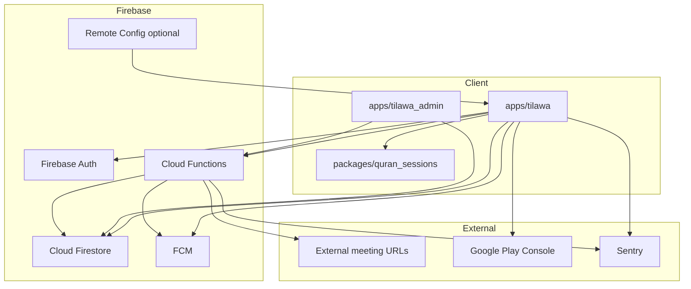

# Technical Dependencies — Quran Sessions

**Plan:** `032-quran-session-delivery-plan`  
**Architecture:** [backend-agnostic-architecture.md](../031-quran-session-blueprint/backend-agnostic-architecture.md)

---

## Dependency graph (high level)



---

## Internal code dependencies

| Component | Depends on | Blocks |
|-----------|------------|--------|
| `SessionCommandGateway` (app) | CF callables deployed | US-006, US-010, US-011 |
| `UserProfileRepositoryImpl` | Firestore rules, Auth UID | US-001, US-004, US-005 |
| `TeacherRepository` Firestore | Seed teachers, market config | US-002, US-006 |
| `BookingBloc` | Gateway + eligibility + flags | US-006 |
| `session_detail_screen` | Session read repo + meetingLink CF | US-008 |
| `cancel_session_sheet` | `cancelSessionBooking` CF | US-010 |
| Admin reports/disputes UI | CF report/dispute callables | US-040, US-041 |
| FCM delivery | `fcmTokenService`, app `FcmService` | US-009, US-013, US-026 |
| Feature flags | `quran_sessions_feature_flags.dart`, optional RC | US-058 |

### Critical path

```
S0 scope → Auth UID (US-045) → Profile Firestore (US-046) → Rules (US-047)
→ Teachers seeded (US-034) → Availability (US-023) → createSessionBooking (US-050)
→ meetingLink (US-052) → FCM (US-055) → Admin queues (US-040/041) → Smoke (US-065) → Play (US-068)
```

---

## External services

| Service | Purpose | Beta required | Owner |
|---------|---------|---------------|-------|
| Firebase Auth (Google Sign-In) | User identity | Yes | Platform |
| Cloud Firestore | Data store | Yes | Backend |
| Cloud Functions | Server-authoritative lifecycle | Yes | Backend |
| FCM | Push notifications | Yes | Mobile + Backend |
| Firebase Remote Config | Kill switch / rollout (optional) | Recommended | Mobile |
| External meeting (Zoom/Google Meet URLs) | Session join | Yes | Teachers supply URL |
| Google Play Console | Distribution | Yes | Release |
| Sentry | Crash/error monitoring | Recommended | Mobile + Backend |
| Firestore Emulator + JDK 21 | CI integration tests | Yes (CI) | Backend |

### Deferred (Paid / Production)

| Service | Purpose | Phase |
|---------|---------|-------|
| Tap Payments / Stripe | Payment capture + refund | Paid Sessions |
| Agora RTC | In-app voice/video | Paid / V2 |
| Email provider (admin alerts) | Dispute alert NT-03 | Production |

---

## Firestore collections (dependency for stories)

| Collection | Stories depending |
|------------|-------------------|
| `users/{uid}.quranSessionsProfile` | US-004, US-046, US-005 |
| `quran_session_market_configs/{cc}` | US-059, US-004 |
| `quran_teacher_profiles/{id}` | US-002, US-034 |
| `quran_teacher_applications/{uid}` | US-019–020, US-033 |
| `quran_bookings/{id}` | US-006, US-051 |
| `quran_sessions/{id}` | US-007, US-008, US-037 |
| `quran_session_reports/{id}` | US-015, US-040 |
| `quran_session_disputes/{id}` | US-016, US-041 |
| `quran_session_refunds/{id}` | US-056 (manual_pending) |
| `quran_session_compensations/{id}` | US-042, US-028 |

Schema: [docs/quran_sessions_firestore_data_model.md](../../docs/quran_sessions_firestore_data_model.md)

---

## Cloud Functions inventory

Path: `functions/src/quranSessions/`

| Callable / Job | Story |
|----------------|-------|
| `createSessionBooking` | US-050 |
| `cancelSessionBooking` | US-053 |
| `requestSessionReschedule` | US-054 |
| `confirmSessionReschedule` | US-054 |
| `markSessionNoShow` | US-030, US-057 |
| `completeSession` | US-012 |
| `issueSessionCompensation` | US-042 |
| `approveSessionRefund` | US-056 (Paid prep) |
| `openSessionDispute` / `resolveSessionDispute` | US-016, US-041 |
| `reportSessionConcern` / `resolveSessionReport` | US-015, US-040 |
| `reviewTeacherApplication` | US-033 |
| `expirePendingReservations` | US-057 |
| `deliverSessionNotification` | US-055 |
| `sessionReminders` (scheduled) | US-013 |

---

## Team / role dependencies

| Role | Responsibilities | Sprint load |
|------|------------------|-------------|
| Mobile dev (Flutter) | E-01, E-02 stories, gateway wiring | S1–S6 primary |
| Backend dev (CF/rules) | E-04 CF, backfill, FCM | S1, S4–S5 |
| Admin dev (Angular) | E-03 A-10, A-11, session actions | S2, S6 |
| QA | Device matrix, smoke, Beta | S7–S8 |
| Product/Ops | Teacher recruitment, dispute SLA, Go/No-Go | S0, S2, S8 |
| Design (optional) | Empty states, report/dispute modals | S5–S6 |

**Solo developer mode:** Execute critical path sequentially; defer US-017, US-018, US-062 to S7 buffer; use admin scripts for US-040/041 if Angular capacity tight (MVO scripts exist in `functions/scripts/` as interim).

---

## Infrastructure prerequisites

| Prerequisite | Verify by |
|--------------|-----------|
| Staging Firebase project | Sprint 0 |
| Admin custom claim on test account | Sprint 2 |
| Play Console app created (MeMuslim) | Sprint 7 |
| Signing keystore for release AAB | Sprint 7 |
| Sentry DSN in app + functions | Sprint 7 |
| CI: functions emulator tests | Sprint 1 |
| Seed script for market config EG | Sprint 1 |

---

## Package / version dependencies

| Package | Location | Notes |
|---------|----------|-------|
| `quran_sessions` | `packages/quran_sessions/` | Domain + presentation |
| `core` | `packages/core/` | Failures, analytics constants |
| `ui_kit` | `packages/ui_kit/` | TilawaCard, tokens |
| `cloud_firestore`, `firebase_auth` | `apps/tilawa/` only | Not in domain package |
| `flutter_bloc` | presentation | Cubit/BLoC |
| `get_it` | `apps/tilawa/lib/core/di/` | DI modules |
| `go_router` | app router | Session routes in `quranSessionsRoutes` |

---

## Cross-spec dependencies

| Artifact | Dependency |
|----------|------------|
| ADR-002 | Backend-agnostic architecture |
| ADR-003 | Teacher application lifecycle |
| ADR-004 | Teacher intake IA |
| spec 030 | Domain lifecycle, data model |
| spec 031 | Blueprint flows, business rules |
| `docs/quran_sessions_roadmap.md` | Living completion tracker — update when stories land |
