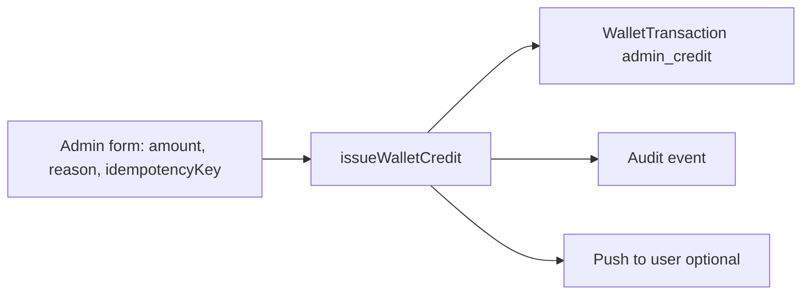

# Admin Operations — Financial & Wallet

**Blueprint:** `036`  
**Pattern:** All mutations via Cloud Functions — **never direct Firestore balance edits**  
**Free Beta (035):** Disputes queue read-only; financial execution deferred

---

## Principles

1. **Read** via admin repositories (Angular facades) — same as session-reports/disputes pattern.
2. **Write** only through authenticated callables with `isAdmin()` + role permissions.
3. **Wallet balance** is derived from ledger — admin cannot PATCH `availableBalance`.
4. **Every financial action** creates audit event + optional notification.
5. **Idempotency** required on approve/issue actions.

---

## Capability matrix

| Capability | Free Beta | Paid v1 | Callable (existing / new) |
|------------|-----------|---------|---------------------------|
| View session payment snapshot | Partial | ✅ | Read booking aggregate |
| View disputes queue | ✅ Read-only | ✅ | Read `quran_session_disputes` |
| Resolve dispute (refund/comp) | ❌ | ✅ | `resolveSessionDispute` |
| View refunds queue | Firestore console | ✅ Admin UI | Read `quran_session_refunds` |
| Approve refund | CF only | ✅ | `approveSessionRefund` |
| View compensations | Firestore console | ✅ | Read `quran_session_compensations` |
| Issue compensation | CF only | ✅ | `issueSessionCompensation` |
| View user wallet | ❌ | ✅ | Read `user_wallets` + transactions |
| View wallet transactions | ❌ | ✅ | Read `wallet_transactions` |
| Issue admin credit | ❌ | ✅ | `issueWalletCredit` (new) |
| Reverse transaction | ❌ | ✅ | `reverseWalletTransaction` (new) |
| Freeze / unfreeze wallet | ❌ | ✅ | `setWalletStatus` (new) |
| Export ledger CSV | ❌ | ✅ | `exportFinancialLedger` (new) |
| Payment status override | **Never** | **Never** | — |
| Direct balance edit | **Never** | **Never** | — |

---

## Workflows

### 1. View wallet (user support)

**Path:** Admin → Users → Wallet (or session detail → student wallet link)

| Display | Source |
|---------|--------|
| Available / held balance | `user_wallets/{walletId}` |
| Status (active/frozen) | wallet doc |
| Transaction list (paginated) | `wallet_transactions` where `userId` |
| Linked bookings | `sourceId` on transactions |

**Actions:** Freeze, issue credit, export — not edit balance.

### 2. Issue credit (goodwill / ops correction)

| Field required | Reason min 20 chars, amount > 0, category enum |
| Approval | Single admin Paid v1; dual approval optional Phase 5+ |
| User visibility | Shows in wallet history with `description` |

### 3. Reverse transaction

| Rule | Detail |
|------|--------|
| Target | Posted credit only (not pending) |
| Mechanism | New `admin_reversal` debit — not delete |
| Insufficient balance | Block or partial with finance flag |
| Audit | `reversalOfTransactionId` link |

### 4. Freeze wallet

| Effect | Credits may still post (refunds); debits blocked |
| Use case | Fraud investigation, chargeback |
| Unfreeze | Admin with reason |

### 5. Refund approval queue

Filter: `status == manual_pending` on `quran_session_refunds`

| Step | Action |
|------|--------|
| 1 | Open refund + linked booking |
| 2 | Verify policy (amount, reason) |
| 3 | Approve → CF posts wallet credit → `executed` |
| 4 | Fail → `failed` + admin note |

Aligns with `financialExecutionStatus()` when provider off.

### 6. Dispute financial outcome

**Enable admin resolve UI** (035 intentionally omitted):

| Resolution | Financial |
|------------|-----------|
| `with_refund` | `issueRefundRecord` → wallet |
| `with_compensation` | `issueCompensationRecord` → wallet if type `wallet_credit` |
| `dismissed` | No ledger |

Pre-check: dispute status `open`; booking lifecycle allows transition.

### 7. Payment status inspection

Session detail shows **read-only**:

- `paymentStatus`, `paymentProvider`, `paymentReference` (masked)
- `providerTransactionId`
- Amount, currency, platformFee, teacherAmount, tax
- Link to PSP dashboard (admin external link)

**No admin override** of payment status — reconcile via PSP + support, not Firestore patch.

### 8. Export

| Export | Fields |
|--------|--------|
| Refunds | date range, bookingId, amount, status, actor |
| Compensations | type, policyRuleId, amount, status |
| Wallet transactions | userId, type, direction, amount, sourceType, sourceId |

CSV download via callable generating signed URL or inline response — no PII in logs.

---

## Admin roles (recommended)

| Permission | Operations |
|------------|------------|
| `quran_sessions_read` | View sessions, disputes, reports |
| `quran_sessions_moderate` | Lifecycle actions (cancel, no-show) |
| `quran_financial_read` | View wallet, refunds, compensations |
| `quran_financial_write` | Approve refund, resolve dispute financial, issue credit |
| `quran_financial_admin` | Reversal, freeze, export |

**Owner review:** Map to existing `isAdmin()` custom claims vs granular RBAC.

---

## UX requirements (admin)

| Screen | Elements |
|--------|----------|
| Refunds queue | Table: bookingId, student, amount, status, createdAt; filter `manual_pending` |
| Refund detail | Policy rule, reason, approve/reject buttons, idempotency on submit |
| Compensations queue | Same pattern |
| Wallet detail | Balance cards, freeze toggle, transaction table, issue credit modal |
| Dispute detail (extend 035) | Resolve actions with financial preview ("Will credit X EGP to wallet") |
| Session detail | Payment snapshot section + links to refund/compensation records |
| Audit trail | Timeline from `quran_session_audit_events` |

Mirror patterns from `session-disputes/`, `session-reports/` (035).

---

## Anti-patterns (explicitly forbidden)

| Action | Why |
|--------|-----|
| Firestore console edit `availableBalance` | Breaks audit |
| Delete `WalletTransaction` | Immutable ledger |
| Resolve dispute without idempotency | Double credit risk |
| Approve refund without booking context | Wrong amount |
| Show full PSP secrets in UI | Security |

---

## Free Beta admin SOP

1. Triage disputes/reports read-only.
2. Log financial intent in external spreadsheet if needed.
3. Do **not** call `resolveSessionDispute` with refund until wallet Phase 1 + training.
4. Document `manual_pending` records for backfill after Paid prep.

---

## Cross-references

- [031/admin-flow.md](../031-quran-session-blueprint/admin-flow.md)
- [data-model.md](./data-model.md)
- [refund-to-wallet-policy.md](./refund-to-wallet-policy.md)
- 035 disputes UI: `apps/tilawa_admin/.../session-disputes/`
