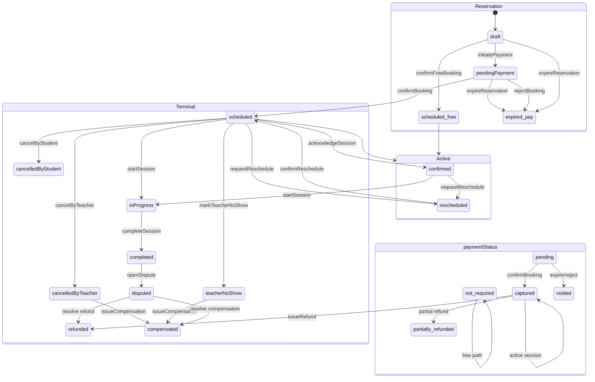
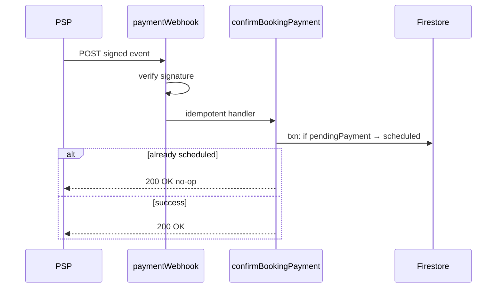

# Booking + Payment State Machine

**Blueprint:** `036`  
**Session lifecycle authority:** [031/session-state-machine.md](../031-quran-session-blueprint/session-state-machine.md)  
**Payment status:** Orthogonal enum on booking — see [payment-flow.md](./payment-flow.md)

---

## Combined state diagram

---

## Payment states (canonical list)

| # | `paymentStatus` | Description |
|---|-----------------|-------------|
| 1 | `not_required` | Free session |
| 2 | `pending` | PSP intent or wallet hold in progress |
| 3 | `authorized` | Funds held, not captured (optional PSP feature) |
| 4 | `captured` | Payment complete |
| 5 | `partially_refunded` | Wallet credit < captured amount |
| 6 | `refunded` | Full wallet credit or reversal |
| 7 | `failed` | Decline or insufficient wallet |
| 8 | `voided` | Intent cancelled before capture |

---

## Session lifecycle states (payment-relevant subset)

| State | Payment relevance |
|-------|-------------------|
| `draft` | Price quoted |
| `pendingPayment` | Slot soft-held; payment must complete |
| `scheduled` | Payment captured or free confirmed |
| `confirmed` | No payment change |
| `inProgress` | No payment change |
| `cancelledByStudent` | Refund policy evaluation |
| `cancelledByTeacher` | Auto compensation |
| `teacherNoShow` | Auto compensation |
| `expired` | Void payment |
| `refunded` | Terminal financial |
| `compensated` | Terminal financial |
| `disputed` | Financial outcome pending |

Full 22 transitions: [031 transition table](../031-quran-session-blueprint/session-state-machine.md#complete-transition-table).

---

## Transition specification (payment-aware)

Each row: actor, trigger, callable/webhook, Firestore, ledger, audit, notification, idempotency, failure.

### Reservation phase

| Transition | Actor | Trigger | Callable / webhook | Firestore | Ledger | Audit | Notification | Idempotency | Failure |
|------------|-------|---------|-------------------|-----------|--------|-------|--------------|-------------|---------|
| `draft` → `pendingPayment` | Student | Tap "Book & Pay" | `createSessionBooking` (paid) | Booking + session docs; soft slot lock; `paymentStatus: pending` | Create `PaymentIntent` | `create_booking` | — | `idempotencyKey` on request | `payment_provider_unavailable`, slot taken |
| `draft` → `scheduled` (free) | Student | Confirm free | `createSessionBooking` (free) | `paymentStatus: not_required` | — | `create_booking` | `bookingConfirmed` | idempotency key | Eligibility failures |
| `pendingPayment` → `scheduled` | System | PSP success | Webhook `payment_intent.succeeded` → `confirmBookingPayment` | `lifecycleStatus: scheduled`; hard lock; `paymentStatus: captured` | `PaymentTransaction` capture row | `confirm_payment` | `bookingConfirmed` | Webhook event id | Duplicate webhook → no-op |
| `pendingPayment` → `scheduled` (wallet) | Student | Wallet pay | `confirmWalletBooking` | Debit wallet + scheduled | `WalletTransaction` debit | `wallet_booking_debit` | `bookingConfirmed` | `wallet_debit:booking:{id}` | Insufficient balance |
| `pendingPayment` → `expired` | System | TTL job | `expirePendingReservations` | `lifecycleStatus: expired`; release slot | Void PSP / release hold | `expire_reservation` | optional | Job booking id | — |
| `pendingPayment` → `expired` | System | PSP fail | Webhook fail or polling | `paymentStatus: failed` → expire | Void intent | `payment_failed` | — | event id | — |

### Cancellation (refund triggers)

| Transition | Actor | Trigger | Callable | Firestore | Ledger | Audit | Notification | Idempotency | Failure |
|------------|-------|---------|----------|-----------|--------|-------|--------------|-------------|---------|
| → `cancelledByStudent` | Student | Cancel + reason | `cancelSessionBooking` | Lifecycle update | `RefundRecord` + wallet credit if paid | `cancel_student` | cancel + refund copy | cancel idempotency | Policy block window |
| → `cancelledByTeacher` | Teacher | Cancel + reason | `cancelSessionBooking` | Lifecycle | `CompensationRecord` wallet | `cancel_teacher` | compensation | idempotency | — |
| → `refunded` | Admin/system | Refund action | `approveSessionRefund` / policy | `refunded` | `quran_session_refunds` + `WalletTransaction` | `issue_refund` | `refundApproved` | `approve_refund:booking:idem` | `manual_pending` if wallet down |

### Dispute

| Transition | Actor | Trigger | Callable | Firestore | Ledger | Audit | Notification | Idempotency | Failure |
|------------|-------|---------|----------|-----------|--------|-------|--------------|-------------|---------|
| → `disputed` | Student/teacher | Open dispute | `openSessionDispute` | Dispute doc | — | `open_dispute` | admin queue | dispute idempotency | Wrong lifecycle |
| `disputed` → `refunded` | Admin | Resolve refund | `resolveSessionDispute` | Dispute resolved | `issueRefundRecord` + wallet | `resolve_dispute_refund` | `refundApproved` | resolve idempotency | Already resolved |
| `disputed` → `compensated` | Admin | Resolve compensation | `resolveSessionDispute` | Dispute resolved | `issueCompensationRecord` + wallet | `resolve_dispute_compensation` | `compensationIssued` | idempotency | — |

### No-show / complete

| Transition | Payment side effect |
|------------|---------------------|
| `teacherNoShow` → `compensated` | Auto wallet credit per CP-* |
| `studentNoShow` | No refund (CN-04) or partial per policy |
| `completed` | No payment change; dispute still allowed |

---

## Webhook handling (PSP)

| Failure | Response |
|---------|----------|
| Bad signature | 401, alert |
| Unknown paymentReference | 404, log |
| Booking not pendingPayment | 200 idempotent skip |
| Firestore txn conflict | 500, PSP retry |

---

## Idempotency keys (financial)

| Operation | Key format | Store |
|-----------|------------|-------|
| Create booking | Client `idempotencyKey` | `quran_idempotency_keys` |
| PSP webhook | `psp_event:{eventId}` | idempotency collection |
| Refund approve | `approve_refund:{bookingId}:{idem}` | existing `buildOperationKey` |
| Wallet credit | `wallet_credit:refund:{refundId}` | wallet txn |
| Dispute resolve | `resolve_dispute:{disputeId}:{resolution}` | idempotency |

---

## `manual_pending` bridge (Free Beta → Paid v1)

When `PAYMENT_PROVIDER_ENABLED=false` or wallet service unavailable:

- `financialExecutionStatus()` returns `manual_pending` (current code)
- Lifecycle may still transition (`refunded`, `compensated`)
- Admin queue shows pending execution
- Phase 3: worker or resolve action posts wallet and flips to `executed`

---

## Actor summary

| Actor | Payment actions |
|-------|-----------------|
| Student | Initiate payment, wallet pay, cancel (triggers refund policy) |
| Teacher | Cancel (triggers compensation) — no payment access |
| Admin | Refund approve, dispute resolve, manual credit, freeze wallet |
| System | TTL expire, webhook confirm, auto compensation jobs |
| PSP | Webhooks only — no Firestore direct write |

---

## Alignment with existing CF

| Callable | Payment role |
|----------|--------------|
| `createSessionBooking` | Free path live; paid gated |
| `expirePendingReservations` | Queries `pending_payment` |
| `approveSessionRefund` | `issueRefundRecord` |
| `issueSessionCompensation` | `issueCompensationRecord` |
| `resolveSessionDispute` | Refund or compensation branch |
| *(new)* `confirmBookingPayment` | Webhook handler |
| *(new)* `postWalletCredit` | Execute pending refunds |
