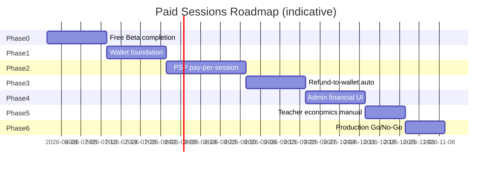
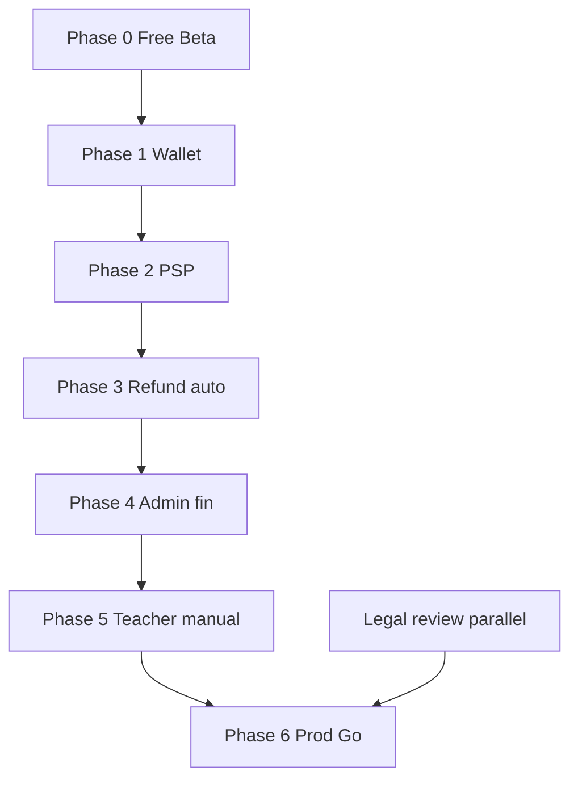

# Implementation Roadmap — Paid Sessions + Wallet

**Blueprint:** `036`  
**Prerequisite:** Free Beta gates from [035/report.md](../035-quran-session-staging-validation-sprint/report.md) and [032](../032-quran-session-delivery-plan/README.md)  
**Not authorized:** Enabling paid in production until **Phase 6 Go**

---

## Phase overview

---

## Phase 0 — Free Beta completion

**Goal:** Close 035 blockers; stable free loop before any paid work.

### Stories

| ID | Story | Exclusion |
|----|-------|-----------|
| 0-1 | Manual 16-step E2E on devices | No paid UI |
| 0-2 | `seed:staging-teachers:apply` | — |
| 0-3 | FCM confirm + T-24h device proof | — |
| 0-4 | Admin reports + disputes read QA | No financial resolve |
| 0-5 | Staging smoke 12/12 maintained | — |
| 0-6 | Play Internal prep (optional) | No payment data safety yet |

### Tests

- 035 smoke 12/12
- `app_launch_staging_flags_test.dart`
- Manual book→join→complete

### Risks

| Risk | Mitigation |
|------|------------|
| Skipping manual E2E | Block Phase 1 start |
| Scope creep to paid | US-P* frozen |

### Go/No-Go gate

| Criterion | Required |
|-----------|----------|
| ≥1 full manual teacher→student→admin pass | ✅ |
| Smoke 12/12 green | ✅ |
| ≥5 seeded teachers | ✅ |
| Payment provider remains off | ✅ |

**Verdict target:** Free Beta **GO** for closed cohort — not Paid.

---

## Phase 1 — Wallet foundation

**Goal:** Wallet aggregate + ledger CF; no PSP; admin read-only wallet view.

### Stories

| ID | Story |
|----|-------|
| 1-1 | `user_wallets` + `wallet_transactions` schema |
| 1-2 | `postWalletCredit` / `getWallet` callables |
| 1-3 | Idempotency on wallet writes |
| 1-4 | Link `walletTransactionId` on refund/compensation execute |
| 1-5 | Firestore rules emulator suite |
| 1-6 | Admin wallet read UI (no issue credit yet) |
| 1-7 | Flutter wallet screen (read-only) |

### Exclusions

- PSP integration
- Wallet debit at checkout
- Admin credit issue
- Auto refund on cancel

### Tests

- CF-13, CF-14, R-01–03
- INT-09 partial (manual credit via CF only)

### Risks

| Risk | Mitigation |
|------|------------|
| Balance drift | Txn-only updates; reconciliation script |
| Legal wallet classification | Parallel legal review |

### Go/No-Go gate

- Wallet credit E2E in emulator
- Rules deny client writes
- Admin can view test user wallet

---

## Phase 2 — PSP pay-per-session

**Goal:** Sandbox card capture; `pendingPayment` → `scheduled`; still **staging only**.

### Stories

| ID | Story |
|----|-------|
| 2-1 | PSP selection sign-off (Tap/Stripe EG) |
| 2-2 | `PaymentProvider` implementation (replace `DisabledPaymentProvider` behind flag) |
| 2-3 | `createSessionBooking` paid path + `PaymentIntent` |
| 2-4 | Webhook handler `confirmBookingPayment` |
| 2-5 | `BookingPaymentSnapshot` on capture |
| 2-6 | Flutter checkout sheet (staging flag) |
| 2-7 | Extend smoke #15–16 |

### Exclusions

- Wallet checkout (Phase 4)
- Subscriptions
- Production PSP keys
- Teacher payout

### Tests

- CF-10–12, INT-03, FL-01–04
- Sandbox only

### Risks

| Risk | Mitigation |
|------|------------|
| Webhook delivery failures | Polling fallback + idempotency |
| PCI scope creep | SDK-only card entry |
| Accidental prod enable | Env default false |

### Go/No-Go gate

- Sandbox paid book→join on staging
- Smoke paid checks pass
- Rollback: flag off + provider env false

---

## Phase 3 — Refund-to-wallet automation

**Goal:** Cancel/dispute/admin refund posts wallet credit automatically.

### Stories

| ID | Story |
|----|-------|
| 3-1 | Wire `issueRefundRecord` → wallet post |
| 3-2 | Auto compensation `wallet_credit` on teacher cancel/no-show |
| 3-3 | `resolveSessionDispute` financial UI enabled admin |
| 3-4 | Execute backlog `manual_pending` SOP |
| 3-5 | Notifications with balance in payload |
| 3-6 | Cancellation UX copy (wallet credit) |

### Exclusions

- Card reversal automation
- Mixed payment

### Tests

- INT-04, INT-05, INT-06, D-03–06, FL-07
- Smoke #17–19

### Risks

| Risk | Mitigation |
|------|------------|
| Double credit | Idempotency keys |
| Wrong refund amount | Snapshot from booking |

### Go/No-Go gate

- Cancel paid session → wallet balance correct
- Dispute refund E2E on staging
- No `manual_pending` stuck without admin path

---

## Phase 4 — Admin financial operations

**Goal:** Full ops UI — approve, credit, freeze, export.

### Stories

| ID | Story |
|----|-------|
| 4-1 | Refunds queue + approve (US-P06) |
| 4-2 | Compensations queue |
| 4-3 | `issueWalletCredit` admin UI |
| 4-4 | `reverseWalletTransaction` |
| 4-5 | Freeze/unfreeze wallet |
| 4-6 | CSV export |
| 4-7 | Dispute resolve financial (extend 035) |
| 4-8 | Wallet checkout optional (if balance ≥ price) |

### Exclusions

- Teacher automated payout
- Subscription billing

### Tests

- A-01–10, INT-09, FL-05–06

### Risks

| Risk | Mitigation |
|------|------------|
| Admin misuse | Reason required + audit |
| RBAC gaps | Granular claims |

### Go/No-Go gate

- Finance ops dry-run on staging
- Export reconciles with PSP sandbox

---

## Phase 5 — Teacher economics (manual)

**Goal:** Teacher sees earnings summary; ops manual payout off-platform.

### Stories

| ID | Story |
|----|-------|
| 5-1 | Teacher dashboard earnings read-only |
| 5-2 | Admin teacher earnings report |
| 5-3 | Payout SOP document (external bank transfer) |
| 5-4 | Commission report from `platformFee` snapshots |

### Exclusions

- Payout batch job (US-P05 postponed automation)
- Teacher pricing self-serve (US-P04 can slip before launch if admin sets price)

### Tests

- Report accuracy vs booking snapshots
- No bank details in app

### Risks

| Risk | Mitigation |
|------|------------|
| Teacher payout disputes | Clear off-platform SOP |

### Go/No-Go gate

- Sample month reconciliation sign-off (finance)

---

## Phase 6 — Production Go/No-Go (Paid v1)

**Goal:** Limited paid launch single market (EG); **not** "ready" until all gates pass.

### Stories

| ID | Story |
|----|-------|
| 6-1 | Legal sign-off checklist complete |
| 6-2 | Play data safety + privacy update |
| 6-3 | Prod PSP keys + monitoring |
| 6-4 | `QURAN_SESSIONS_PAYMENT_PROVIDER_ENABLED=true` prod (controlled) |
| 6-5 | App flag `allowPaidBooking` market EG |
| 6-6 | Support playbook + rollback drill |
| 6-7 | Staged rollout 5% → 25% → 100% |
| 6-8 | Post-launch smoke + wallet reconciliation daily (week 1) |

### Exclusions

- Subscriptions (US-P07)
- Agora (US-P08)
- Multi-market
- Auto card refund

### Tests

- Full [test-matrix.md](./test-matrix.md) P0 set
- Smoke 20/20
- Chargeback tabletop exercise

### Risks

| Risk | Severity |
|------|----------|
| Legal wallet classification | High |
| Play rejection | Medium |
| Chargeback vs wallet policy | Medium |
| Support volume | Medium |

### Go/No-Go gate (all required)

| # | Gate |
|---|------|
| 1 | Phase 0–5 complete |
| 2 | [security-compliance-checklist.md](./security-compliance-checklist.md) items reviewed — ⚠️ items have owner sign-off |
| 3 | Sandbox + staging paid E2E recorded |
| 4 | Rollback tested (flag off < 15 min) |
| 5 | Finance reconciliation procedure |
| 6 | No open P0 financial bugs |
| 7 | Free Beta users notified before paid teachers appear |
| 8 | Executive **explicit GO** — blueprint alone insufficient |

**If any fail:** **NO-GO** — remain Free Beta or staging-only paid.

---

## Postponed explicitly (all phases)

| Item | Reference |
|------|-----------|
| Student/teacher/platform subscriptions | [subscription-model.md](./subscription-model.md) |
| Mixed wallet + card checkout | [payment-flow.md](./payment-flow.md) Option C |
| Automated PSP card refund | [refund-to-wallet-policy.md](./refund-to-wallet-policy.md) |
| Teacher payout automation | US-P05 |
| Tax invoicing | security checklist X-02 |
| Wallet top-up (card → wallet) | Future |
| Cross-app wallet spend beyond eligible services | Product |

---

## Dependency graph

---

## Mapping to 032 postponed stories

| US | Phase |
|----|-------|
| US-P01 Checkout UI | 2 |
| US-P02 PaymentProvider | 2 |
| US-P03 Auto refund | 3 (wallet not card) |
| US-P04 Teacher pricing | 5 or 2 (admin interim) |
| US-P05 Teacher payout | 5 manual; automation post-6 |
| US-P06 Admin ledger | 4 |
| US-P07 Subscriptions | Postponed beyond 6 |
| US-P08 Agora | Postponed beyond 6 |

---

## Success metrics (Paid v1 — first 30 days)

| Metric | Target |
|--------|--------|
| Paid booking success rate | >95% |
| Webhook processing p99 | <30s |
| Wallet credit accuracy | 100% reconcile |
| `manual_pending` age | <24h |
| Chargeback rate | <1% (monitor) |
| Support tickets / 100 paid sessions | Baseline TBD |

---

## Rollback

| Trigger | Action |
|---------|--------|
| PSP outage | Disable `allowPaidBooking`; free teachers only |
| Wallet bug | Freeze wallet debits; card-only if Phase 4 wallet checkout on |
| Double credit | Freeze wallet + reversal SOP |
| Accidental prod charge | 032 Scenario D + PSP void |

See [032/rollback-plan.md](../032-quran-session-delivery-plan/rollback-plan.md).
