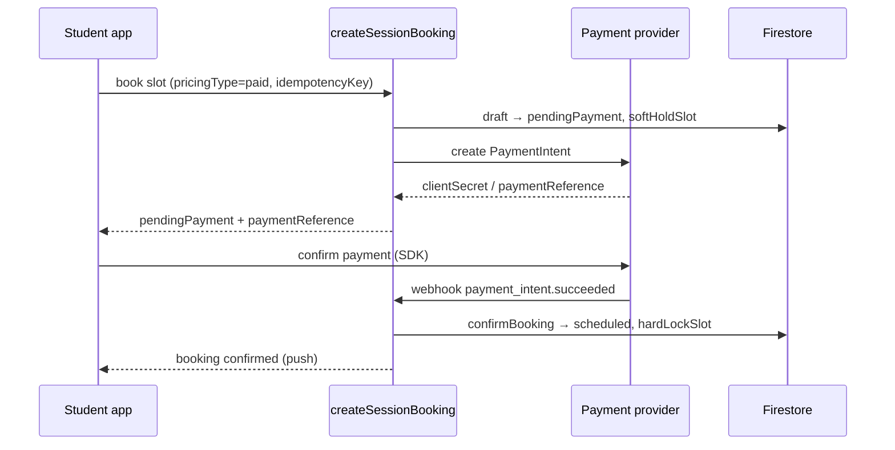
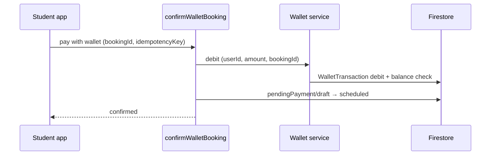

# Payment Flow — Quran Sessions

**Blueprint:** `036`  
**Lifecycle authority:** [031/session-state-machine.md](../031-quran-session-blueprint/session-state-machine.md)  
**Status:** Design — not ready to ship

---

## Overview

Payment is a **reservation-phase concern**: money moves (or wallet debits) while the booking is in `draft` or `pendingPayment`. Successful capture transitions to `scheduled` via `confirmBooking`. Failed, expired, or voided payment returns slot to pool via `expireReservation` or `rejectBooking`.

Free Beta skips this entire flow (`confirmFreeBooking` from `draft` → `scheduled`).

---

## Payment options

### Option A — Card / PSP (primary for Paid v1)

| Aspect | Design |
|--------|--------|
| When | Student confirms slot on paid teacher |
| Provider | External PSP (Tap Payments or Stripe Egypt — selection gate Phase 2) |
| Client role | Present payment sheet / redirect; receive client secret or charge token |
| Server role | Create `PaymentIntent`, confirm capture, store opaque references |
| Idempotency | `idempotencyKey` on `createSessionBooking` + PSP idempotency header |
| Beta | **Blocked** — `assertPaidBookingAllowed` throws `payment_provider_unavailable` |

**Sequence:**



### Option B — Wallet (secondary; Phase 4+)

| Aspect | Design |
|--------|--------|
| When | Student selects "Pay with wallet" and `availableBalance >= sessionPrice` |
| Flow | Debit wallet ledger atomically in same transaction as `confirmBooking` |
| No PSP | No card charge; `paymentProvider: wallet` |
| Refund path | Credit back to wallet (same ledger) |
| Paid v1 launch | **Optional** — can launch card-only first if wallet only used for refunds |



### Option C — Mixed wallet + card (postponed)

| Aspect | Design |
|--------|--------|
| Example | Session 100 EGP; wallet 30 EGP; card 70 EGP |
| Complexity | Two settlement paths, partial refund rules, reconciliation |
| Status | **POSTPONED** — document for future only |
| YAGNI | Do not implement until wallet-only and card-only paths stable |

---

## Payment fields (canonical)

Stored on **booking aggregate** (snapshot) and **PaymentTransaction** / **PaymentIntent** records. Align naming with existing `paymentReference` on `SessionAggregate`.

| Field | Type | Owner | Description |
|-------|------|-------|-------------|
| `paymentStatus` | enum | Server | Lifecycle of money for this booking (see below) |
| `paymentProvider` | enum | Server | `none`, `tap`, `stripe`, `wallet`, `manual` |
| `paymentReference` | string | Server | Opaque PSP or wallet correlation ID (already on aggregate) |
| `providerTransactionId` | string? | Server | PSP charge/capture ID (not card PAN) |
| `amount` | Money | Server | Gross session price charged |
| `currency` | ISO 4217 | Server | e.g. `EGP` |
| `platformFee` | Money | Server | Marketplace commission (config %; 0 in Beta) |
| `teacherAmount` | Money | Server | `amount - platformFee - tax` (informational until payout) |
| `tax` | Money | Server | VAT if applicable; 0 until tax engine |
| `pricingType` | enum | Server | `free` \| `paid` (existing) |
| `amountPaidUsd` | number? | Server | Legacy normalization field in CF refunds — migrate to `amount` + `currency` |

### `paymentStatus` enum (booking-scoped)

Distinct from `SessionLifecycleStatus` but correlated:

| Value | Meaning | Typical lifecycle |
|-------|---------|-------------------|
| `not_required` | Free booking | `scheduled` from `draft` |
| `pending` | Intent created, not captured | `pendingPayment` |
| `authorized` | Hold placed (if PSP supports) | `pendingPayment` |
| `captured` | Money collected or wallet debited | `scheduled`+ |
| `partially_refunded` | Wallet credit or partial reversal | terminal cancel/dispute |
| `refunded` | Full refund executed | `refunded` |
| `failed` | PSP decline or wallet insufficient | `expired` or stay `pendingPayment` until TTL |
| `voided` | Intent cancelled before capture | `expired` |

---

## Relation to booking lifecycle

| Lifecycle state | Payment expectation |
|-----------------|---------------------|
| `draft` | No charge; price displayed |
| `pendingPayment` | Intent active; soft slot hold; TTL running |
| `scheduled`, `confirmed`, `inProgress` | `paymentStatus: captured` |
| `cancelledByStudent` | Policy → wallet credit fraction per CN-* |
| `cancelledByTeacher` | Full wallet credit (compensation) |
| `teacherNoShow` | Wallet credit per CP-* |
| `expired` | Void intent; no capture |
| `refunded` | Refund ledger + wallet credit |
| `compensated` | Compensation ledger (may include wallet credit) |
| `disputed` | Payment frozen for resolution; no second capture |

### Side effects (from 031, payment-aware)

| Action | Payment side effect |
|--------|---------------------|
| `initiatePayment` | Create PSP intent; set `paymentStatus: pending` |
| `confirmBooking` | Capture charge or wallet debit → `captured` |
| `confirmFreeBooking` | `paymentStatus: not_required` |
| `cancelByStudent` | Evaluate refund fraction → wallet credit callable |
| `cancelByTeacher` | Auto compensation → wallet credit |
| `expireReservation` | Void PSP intent; `voided` |
| `rejectBooking` | Void intent; `voided` |
| `issueRefund` | Wallet credit; `refunded` |
| `issueCompensation` | Wallet credit or session credit per type |

---

## Platform fee and teacher amount

**Paid v1:** Compute at booking time from `pricingPolicy` in market config (031 business rules PO-*). Store snapshot on booking — **do not recompute** on refund.

```
platformFee = round(amount * commissionRate, currency)
teacherAmount = amount - platformFee - tax
```

Teacher payout is **informational** in Paid v1; actual transfer is manual off-platform.

---

## Failure handling

| Failure | User message | System action |
|---------|--------------|---------------|
| `payment_provider_unavailable` | "Paid sessions not available" | No `pendingPayment`; block paid teachers in Beta |
| Card declined | Localized decline reason | Stay in `pendingPayment` until TTL or retry |
| Webhook delay | "Confirming payment…" | Poll booking doc or wait push |
| Duplicate webhook | — | Idempotent `confirmBooking` |
| TTL expiry | "Reservation expired" | `expireReservation`, void intent |
| Insufficient wallet | "Add funds via…" (refund credits only) | Reject wallet debit |

---

## Configuration gates

| Flag / env | Effect |
|------------|--------|
| `pricingType: free` | Skip payment entirely |
| `QURAN_SESSIONS_PAYMENT_PROVIDER_ENABLED=false` | Reject paid bookings (current) |
| `allowPaidBooking` (market config BK-08) | Market-level enable |
| `quranSessionsBookingEnabled` (app flag) | Master booking switch |

---

## UX copy requirements (paid)

- Pre-checkout: price, currency, **refund-to-wallet policy** link  
- `pendingPayment`: countdown timer aligned with BK-05  
- Receipt: amount, date, `paymentReference` last 4 chars, support link  
- No display of full PSP tokens or card numbers

---

## Out of scope (this document)

- Subscription recurring charges — [subscription-model.md](./subscription-model.md)  
- Teacher payout batch — [implementation-roadmap.md](./implementation-roadmap.md) Phase 5  
- Tax invoice generation — compliance checklist
