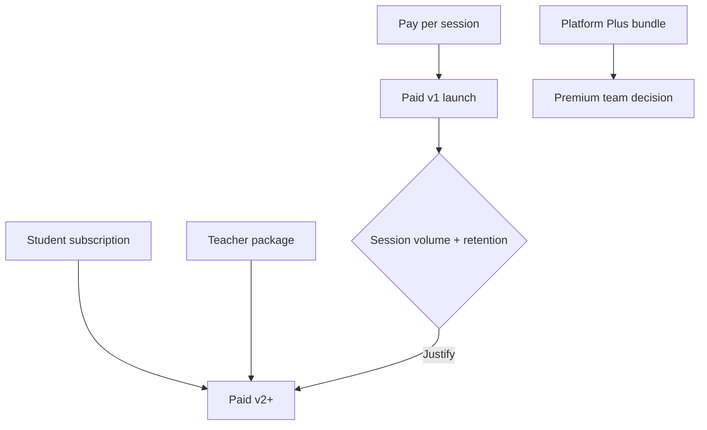

# Subscription Model — YAGNI Analysis

**Blueprint:** `036`  
**Recommendation:** **Do not build subscriptions for Paid v1**

---

## Context

[031/business-rules.md](../031-quran-session-blueprint/business-rules.md) defines `subscriptionPolicy` in market config. Domain includes `extend_subscription` compensation type and entity placeholders. [032 US-P07](..//032-quran-session-delivery-plan/user-stories.md) marks subscription packages as **P2 postponed**.

Paid v1 should prove: PSP capture, wallet ledger, refund-to-wallet, dispute financial resolution — without recurring billing complexity.

---

## Model comparison

### 1. Pay-per-session (recommended Paid v1)

| Aspect | Assessment |
|--------|------------|
| Description | Student pays per booked slot at checkout |
| User value | Simple, aligns with marketplace mental model |
| Engineering | Reuses `pendingPayment` → `confirmBooking` path |
| Ops | Refund per booking; wallet credits map 1:1 |
| Revenue | Per-transaction commission |
| **YAGNI** | **Build now** — minimum viable monetization |

### 2. Student subscription (platform)

| Aspect | Assessment |
|--------|------------|
| Description | Monthly fee for N sessions or unlimited tier |
| User value | Predictable cost for heavy users |
| Engineering | Recurring PSP billing, proration, renewal failures, grace periods |
| Ops | Partial month refunds, session bank accounting |
| Revenue | MRR; churn management |
| **YAGNI** | **Postpone** — needs billing engine, dunning, App Store rules if IAP |

### 3. Teacher package (prepaid bundle)

| Aspect | Assessment |
|--------|------------|
| Description | Student buys 5/10 sessions with one teacher at discount |
| User value | Loyalty to teacher |
| Engineering | Session credit pool, expiry, teacher-specific ledger |
| Ops | Split refunds across unused credits |
| **YAGNI** | **Postpone** — overlaps wallet + session credits; confuses refund policy |

### 4. Platform subscription (MeMuslim Plus)

| Aspect | Assessment |
|--------|------------|
| Description | App-wide premium (exists in `apps/tilawa/features/premium/`) |
| User value | Cross-feature benefits |
| Engineering | Separate from Quran Sessions billing; cross-entitlement rules |
| Ops | Different refund/chargeback path |
| **YAGNI** | **Postpone for Quran Sessions** — integrate only if explicit product bundles Quran sessions into Plus |

---

## Decision matrix

| Model | Paid v1 | Paid v2+ | Free Beta |
|-------|---------|----------|-----------|
| Pay-per-session | ✅ Primary | ✅ | ✅ (free price) |
| Student subscription | ❌ | Evaluate | ❌ |
| Teacher package | ❌ | Evaluate | ❌ |
| Platform sub + sessions | ❌ | Evaluate | ❌ |

---

## If subscriptions are built later (design hooks only)

Keep these **entity placeholders** in [data-model.md](./data-model.md) without implementation:

- `SubscriptionPlan` — catalog
- `Subscription` — user entitlement
- `subscriptionId` on booking optional
- Compensation `extend_subscription` — extends period

**Do not** implement:

- Renewal webhooks
- Session bank decrement
- Proration engine

Until pay-per-session + wallet metrics justify recurring revenue investment.

---

## Pricing interaction (future)

---

## Recommendation summary

| Question | Answer |
|----------|--------|
| Subscriptions needed now? | **No** |
| Paid v1 pricing | **Pay-per-session only** |
| Config `subscriptionPolicy` | Leave defaults; ignore in CF |
| US-P07 | Remains postponed |
| Wallet role | Refund/compensation store; not subscription session bank |

Cross-reference: [payment-flow.md](./payment-flow.md), [implementation-roadmap.md](./implementation-roadmap.md) Phase 6+.
