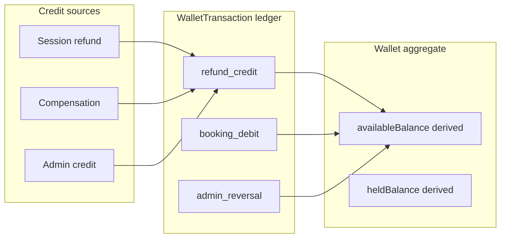

# Wallet Model — User Wallet

**Blueprint:** `036`  
**Principle:** No balance without transaction; no negative balance; full audit trail

---

## Purpose

The **User Wallet** holds spendable credit for:

1. Refunds from cancelled Quran sessions (default destination)
2. Compensation from disputes, teacher cancel, teacher no-show
3. Admin-issued promotional or goodwill credits
4. (Future) Top-up or eligible MeMuslim service purchases

Wallet credit is **not cash** unless legal classification says otherwise — treat as platform stored value / promotional balance until legal review ([security-compliance-checklist.md](./security-compliance-checklist.md)).

---

## Aggregate: `Wallet`

| Field | Type | Mutable | Description |
|-------|------|---------|-------------|
| `walletId` | string | No | Deterministic: `wallet_{userId}` |
| `userId` | string | No | Owner (student account; guardian rules TBD) |
| `currency` | string | No | Single currency per wallet (EGP at launch) |
| `status` | enum | Yes (CF) | `active`, `frozen`, `closed` |
| `availableBalance` | Money | **Derived** | Sum of posted credits minus debits minus holds |
| `heldBalance` | Money | **Derived** | Sum of `hold` transactions not released |
| `lastTransactionAt` | timestamp | Derived | Max `createdAt` of transactions |
| `createdAt` | timestamp | No | |
| `updatedAt` | timestamp | Yes | Metadata only — not used for balance |
| `frozenAt` | timestamp? | Yes | Admin freeze |
| `frozenReason` | string? | Yes | Audit |
| `version` | int | Yes | Optimistic concurrency on status changes |

### Invariants

1. **`availableBalance` is never written directly** — only updated as side effect of `WalletTransaction` insert in same Firestore transaction.
2. **`availableBalance >= 0`** — debit rejected if insufficient funds.
3. **`heldBalance` ≤ sum of credits** — holds cannot exceed available.
4. **One wallet per user per currency** — multi-currency = multiple wallet docs (postponed; single EGP wallet at launch).
5. **Frozen wallet** — reject debits; allow credits (refunds still land).

---

## Immutable ledger: `WalletTransaction`

Append-only. **No updates** except `status` transition on pending entries (`pending` → `posted` | `failed` | `reversed`).

| Field | Type | Description |
|-------|------|-------------|
| `transactionId` | string | Deterministic or UUID; see idempotency |
| `walletId` | string | Parent wallet |
| `userId` | string | Denormalized for queries |
| `type` | enum | See transaction types |
| `direction` | enum | `credit` \| `debit` |
| `amount` | Money | Always positive; direction implies sign |
| `currency` | string | Must match wallet |
| `status` | enum | `pending`, `posted`, `failed`, `reversed` |
| `balanceAfter` | Money | Snapshot after post (audit) |
| `idempotencyKey` | string | Unique per logical operation |
| `sourceType` | enum | `refund`, `compensation`, `booking_payment`, `admin_credit`, `admin_reversal`, `promo` |
| `sourceId` | string? | `refundId`, `bookingId`, etc. |
| `description` | string | User-visible summary |
| `descriptionAr` | string? | Localized |
| `actorId` | string | `system`, admin uid, or user uid |
| `actorRole` | enum | `system`, `admin`, `user` |
| `metadata` | map | PSP ref, policy rule id, dispute id |
| `createdAt` | timestamp | Server |
| `postedAt` | timestamp? | When status → posted |
| `reversalOfTransactionId` | string? | Links reversal to original |

### Transaction types

| Type | Direction | Trigger |
|------|-----------|---------|
| `refund_credit` | credit | Cancellation / dispute refund |
| `compensation_credit` | credit | Teacher cancel, no-show, admin |
| `admin_credit` | credit | Manual goodwill |
| `promo_credit` | credit | Campaign (future) |
| `booking_debit` | debit | Pay session with wallet |
| `hold` | debit (held) | Reserve funds during `pendingPayment` wallet path |
| `hold_release` | credit | Cancel hold on expire/void |
| `admin_reversal` | debit | Reverse erroneous credit (paired entry) |
| `expiry_debit` | debit | Promotional credit expiry (future) |

---

## Balance computation

**Authoritative at write time:**

```text
on credit posted:
  availableBalance += amount

on debit posted:
  if availableBalance < amount: reject
  availableBalance -= amount

on hold:
  if availableBalance < amount: reject
  availableBalance -= amount
  heldBalance += amount

on hold_release:
  heldBalance -= amount
  availableBalance += amount
```

**Read path:** Client displays `availableBalance` from wallet doc (maintained by CF). Admin export may recompute from ledger for reconciliation jobs.

---

## Linking to existing ledger

Today CF writes:

- `quran_session_refunds` — `status: manual_pending | executed | failed`
- `quran_session_compensations` — types include `wallet_credit`

**Paid v1 migration:**

1. On refund/compensation `executed`, CF creates `WalletTransaction` (`refund_credit` / `compensation_credit`).
2. Update `quran_session_refunds.walletTransactionId` / `compensations.walletTransactionId`.
3. `executionStatus` remains until wallet post succeeds; then `executed`.

Free Beta: records stay `manual_pending` with **no wallet doc** until Phase 1.

---

## Idempotency

| Operation | Key pattern |
|-----------|-------------|
| Refund → wallet | `wallet_credit:refund:{refundId}` |
| Compensation | `wallet_credit:comp:{compensationId}` |
| Booking debit | `wallet_debit:booking:{bookingId}` |
| Admin credit | `admin_credit:{adminId}:{idempotencyKey}` |
| Reversal | `wallet_reversal:{originalTransactionId}` |

Duplicate key → return existing `transactionId` (no double credit).

---

## Auditability

Every wallet mutation appends:

1. `WalletTransaction` row  
2. `quran_session_audit_events` entry (existing pattern) with `walletTransactionId`  
3. For financial disputes: link `disputeId`, `refundId`, `compensationId`

Admin **never** patches `availableBalance`. Admin **freeze** changes `Wallet.status` only.

---

## Student UX

| Element | Content |
|---------|---------|
| Balance card | Available balance + currency |
| History list | Chronological transactions; tap → source booking/refund |
| Empty state | "Credits appear when refunds are processed" |
| Frozen state | "Wallet temporarily unavailable — contact support" |
| Low balance | No top-up in Paid v1 — copy explains credits from refunds |

---

## Access control (summary)

| Actor | Read wallet | Read transactions | Mutate |
|-------|-------------|-------------------|--------|
| Owner | Own | Own | Debit via booking CF only |
| Admin | Any (permission) | Any | Credit, reversal, freeze via CF |
| Teacher | No | No | No |
| Client direct Firestore write | No | No | **Denied** |

Details: [data-model.md](./data-model.md), [security-compliance-checklist.md](./security-compliance-checklist.md).

---

## Diagram


